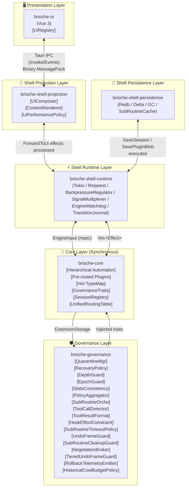
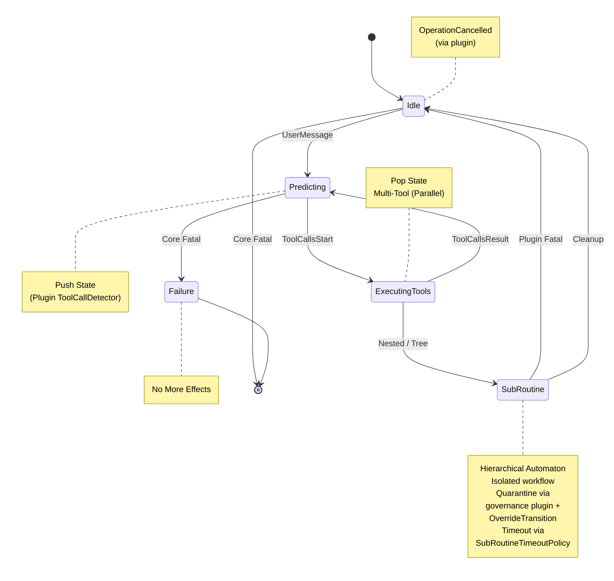
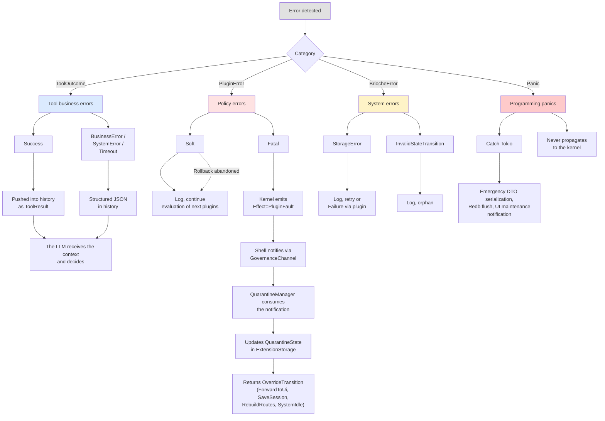

# Project Brioche: Architectural Specifications

> **Canonical Version** — Single, definitive specification of the secure monolithic SDK for language model orchestration. This document materializes the five-layer architecture with interface contracts, system invariants, and extension components.

---

## Table of Contents

- [BOOK I — THE CORE BOOK](#book-i--the-core-book)
  - [Chapter 1: Foundations](#chapter-1-foundations)
    - [1.1 Vision and guiding principles](#11-vision-and-guiding-principles)
    - [1.2 Global topology](#12-global-topology)
    - [1.3 Security model and system invariants](#13-security-model-and-system-invariants)
    - [1.4 Separate channels, deterministic drainage, and system signals](#14-separate-channels-deterministic-drainage-and-system-signals)
    - [1.5 Error taxonomy](#15-error-taxonomy)
  - [Chapter 2: Fundamental types](#chapter-2-fundamental-types)
    - [2.1 Session and automaton](#21-session-and-automaton)
    - [2.2 Messages and descriptors](#22-messages-and-descriptors)
    - [2.3 Engine inputs](#23-engine-inputs)
    - [2.4 Declarative effects](#24-declarative-effects)
    - [2.5 Streaming](#25-streaming)
  - [Chapter 3: ExtensionStorage and extension types](#chapter-3-extensionstorage-and-extension-types)
    - [3.1 Architecture](#31-architecture)
    - [3.2 Compile-time verification proc-macro](#32-compile-time-verification-proc-macro)
    - [3.3 Standard extension types](#33-standard-extension-types)
  - [Chapter 4: Plugin interface](#chapter-4-plugin-interface)
    - [4.1 Capabilities and routing](#41-capabilities-and-routing)
    - [4.2 Policy decisions](#42-policy-decisions)
    - [4.3 Plugin error handling](#43-plugin-error-handling)
  - [Chapter 5: Transition algorithm](#chapter-5-transition-algorithm)
    - [5.1 Main function](#51-main-function)
    - [5.2 Auxiliary functions](#52-auxiliary-functions)
    - [5.3 Path of an input through the engine](#53-path-of-an-input-through-the-engine)
  - [Chapter 6: Limits of the Core layer](#chapter-6-limits-of-the-core-layer)
    - [6.1 What this layer does not do](#61-what-this-layer-does-not-do)
    - [6.2 Interface contract with the Governance layer](#62-interface-contract-with-the-governance-layer)
    - [6.3 Interface contract with Shell](#63-interface-contract-with-shell)

- [BOOK II — THE GOVERNANCE BOOK](#book-ii--the-governance-book)
  - [Chapter 1: Governance principles](#chapter-1-governance-principles)
  - [Chapter 2: Fundamental traits](#chapter-2-fundamental-traits)
    - [2.1 EpochInterceptor](#21-epochinterceptor)
    - [2.2 SubRoutineHandler](#22-subroutinehandler)
    - [2.3 ConsistencyVerifier](#23-consistencyverifier)
    - [2.4 DecisionAggregator](#24-decisionaggregator)
    - [2.5 SignalDrainOrder](#25-signaldrainorder)
    - [2.7 HookEffectConstraint](#27-hookeffectconstraint)
    - [2.8 CycleRollbackPolicy](#28-cyclerollbackpolicy)
    - [2.9 SubRoutineLifecycleGuard](#29-subroutinelifecycleguard)
    - [2.10 GovernanceFailoverHandler](#210-governancefailoverhandler)
    - [2.11 CowBudgetPolicy](#211-cowbudgetpolicy)
  - [Chapter 3: Registry and lifecycle](#chapter-3-registry-and-lifecycle)
  - [Chapter 4: Separate channels and deterministic drainage](#chapter-4-separate-channels-and-deterministic-drainage)
  - [Chapter 5: Governance plugins](#chapter-5-governance-plugins)
    - [5.1 EpochGuard](#51-epochguard)
    - [5.2 StateConsistencyGuard](#52-stateconsistencyguard)
    - [5.3 PolicyAggregator](#53-policyaggregator)
    - [5.4 SubRoutineOrchestrator](#54-subroutineorchestrator)
    - [5.5 ToolCallDetector](#55-toolcalldetector)
    - [5.6 JsonArgumentAccumulator](#56-jsonargumentaccumulator)
    - [5.7 ToolResultFormatter](#57-toolresultformatter)
    - [5.8 CpuTaskTracker](#58-cputasktracker)
    - [5.9 ToolExecutionTracker](#59-toolexecutiontracker)
    - [5.10 QuarantineManager](#510-quarantinemanager)
    - [5.11 RecoveryPolicy](#511-recoverypolicy)
    - [5.12 DepthGuard](#512-depthguard)
    - [5.13 TransitionConflictLogger](#513-transitionconflictlogger)
    - [5.14 SubRoutineTimeoutPolicy](#514-subroutinetimeoutpolicy)
    - [5.15 UndoFrameGuard](#515-undoframeguard)
    - [5.16 SubRoutineCleanupGuard](#516-subroutinecleanupguard)
    - [5.17 LexicographicDecisionAggregator](#517-lexicographicdecisionaggregator)
    - [5.18 NoopCycleRollbackPolicy](#518-noopcyclerollbackpolicy)
    - [5.19 SystemFailoverGuard](#519-systemfailoverguard)
    - [5.20 AdaptiveUndoFrameGuard](#520-adaptiveundoframeguard)
    - [5.21 PermissiveHookEffectConstraint](#521-permissivehookeffectconstraint)
    - [5.22 NegotiationBroker](#522-negotiationbroker)
    - [5.23 TreeDecisionAggregator](#523-treedecisionaggregator)
    - [5.24 TieredUndoFrameGuard](#524-tieredundoframeguard)
    - [5.25 RollbackTelemetryEmitter](#525-rollbacktelemetryemitter)
    - [5.26 HistoricalCowBudgetPolicy](#526-historicalcowbudgetpolicy)
  - [Chapter 6: Integration into the engine](#chapter-6-integration-into-the-engine)
    - [6.1 Complete BriocheEngine](#61-complete-briocheengine)
    - [6.2 Complete transition algorithm](#62-complete-transition-algorithm)
    - [6.3 Initialization](#63-initialization)
  - [Chapter 7: Trait compatibility matrix](#chapter-7-trait-compatibility-matrix)
  - [Chapter 8: Limits of the Governance layer](#chapter-8-limits-of-the-governance-layer)
    - [8.1 What this layer does not do](#81-what-this-layer-does-not-do)
    - [8.2 Interface contract with Shell](#82-interface-contract-with-shell)
    - [8.3 Interface contract with Core](#83-interface-contract-with-core)
  - [Chapter 9: brioche-governance-default](#chapter-9--brioche-governance-default)

- [BOOK III-A — THE SHELL RUNTIME BOOK](#book-iii-a--the-shell-runtime-book)
  - [Chapter 1: Event loop and orchestration](#chapter-1-event-loop-and-orchestration)
  - [Chapter 2: BackpressureRegulator](#chapter-2-backpressureregulator)
  - [Chapter 3: SignalMultiplexer](#chapter-3-signalmultiplexer)
  - [Chapter 4: EngineWatchdog](#chapter-4-enginewatchdog)
  - [Chapter 5: Limits of the Shell Runtime layer](#chapter-5-limits-of-the-shell-runtime-layer)

- [BOOK III-B — THE SHELL PERSISTENCE BOOK](#book-iii-b--the-shell-persistence-book)
  - [Chapter 1: Redb schema and tables](#chapter-1-redb-schema-and-tables)
  - [Chapter 2: Sub-routine cache (L1 Visible / L2 LRU)](#chapter-2-sub-routine-cache-l1-visible--l2-lru)
  - [Chapter 3: Save protocol (Delta & Flattening)](#chapter-3-save-protocol-delta--flattening)
  - [Chapter 4: Loading and rehydration](#chapter-4-loading-and-rehydration)
  - [Chapter 5: Opportunistic Garbage Collection](#chapter-5-opportunistic-garbage-collection)
  - [Chapter 6: Limits of the Shell Persistence layer](#chapter-6-limits-of-the-shell-persistence-layer)

- [BOOK III-C — THE SHELL PROJECTION BOOK](#book-iii-c--the-shell-projection-book)
  - [Chapter 1: Extensibility contract (UiRegistry)](#chapter-1-extensibility-contract-uiregistry)
  - [Chapter 2: Streaming rendering engine (ContentRenderer)](#chapter-2-streaming-rendering-engine-contentrenderer)
  - [Chapter 3: UiComposer](#chapter-3-uicomposer)
  - [Chapter 4: Tauri and IPC integration](#chapter-4-tauri-and-ipc-integration)
  - [Chapter 5: Sub-routine management](#chapter-5-sub-routine-management)
  - [Chapter 6: UiPerformancePolicy](#chapter-6-uiperformancepolicy)
  - [Chapter 7: Limits of the Shell Projection layer](#chapter-7-limits-of-the-shell-projection-layer)

- [BOOK IV — THE ECOSYSTEM BOOK](#book-iv--the-ecosystem-book)
  - [Chapter 1: Standard plugins](#chapter-1-standard-plugins)
  - [Chapter 2: Extending the ecosystem](#chapter-2-extending-the-ecosystem)
  - [Chapter 3: Development tools](#chapter-3-development-tools)
  - [Chapter 4: Limits of the Ecosystem layer](#chapter-4-limits-of-the-ecosystem-layer)

- [BOOK V — THE INVARIANTS](#book-v--the-invariants)
  - [Chapter 1: Fundamental invariants (Core)](#chapter-1-fundamental-invariants-core)
  - [Chapter 2: Governance invariants](#chapter-2-governance-invariants)
  - [Chapter 3: Composition invariants](#chapter-3-composition-invariants)
  - [Chapter 4: Operational invariants (Shell Runtime)](#chapter-4-operational-invariants-shell-runtime)
  - [Chapter 5: Persistence invariants (Shell Persistence)](#chapter-5-persistence-invariants-shell-persistence)
  - [Chapter 6: Projection invariants (Shell Projection)](#chapter-6-projection-invariants-shell-projection)
  - [Chapter 7: Integrity invariants (Ecosystem)](#chapter-7-integrity-invariants-ecosystem)
  - [Chapter 8: Error management matrix](#chapter-8-error-management-matrix)
  - [Chapter 9: Panic-fallback restoration strategy](#chapter-9-panic-fallback-restoration-strategy)
  - [Chapter 10: Verification strategy](#chapter-10-verification-strategy)
  - [Chapter 11: Compilation modes](#chapter-11-compilation-modes)
  - [Chapter 12: Determinism and replay](#chapter-12-determinism-and-replay)
  - [Chapter 13: Glossary and invariant reference](#chapter-13-glossary-and-invariant-reference)

---

---

# BOOK I — THE CORE BOOK

---

## Chapter 1: Foundations

---

### 1.1 Vision and guiding principles

Brioche is a secure monolithic SDK for language model orchestration. It resolves the fragility of current asynchronous middlewares by encapsulating orchestration logic within a deterministic and synchronous software kernel. The final application is distributed as a high-performance native backend monolith, guaranteeing memory isolation and total isolation of security policies. The user interface is an interchangeable frontend shell, not included within the backend monolith scope.

**Fundamental principles:**

* **Control inversion by effects (Pure Core / Impure Shell):** The kernel never produces side effects. It receives a typed state and event, purely computes the next state, and returns a list of declarative intentions (*Effects*). The asynchronous shell is the only entity authorized to interact with the operating system, network, persistence, and graphical interface.

* **Mechanism vs Policy Separation:** The mechanism (kernel) provides transition structures: automaton, stack, state hierarchy, plugin memory management, stream pipeline, and extension hooks (`on_input`, `before_prediction`, `on_stream_event`, `after_prediction`, `on_error`, `on_tool_calls`, `on_tool_result`). Policy (standard ecosystem and governance) defines business rules via static plugins wired onto kernel hooks. A business rule revision never modifies the kernel.

* **Extension over Modification:** Policy complexity (safeguards, quarantine, failure recovery, depth limits, timeout bounds, volume management, cycle budget, cycle rollback, hook effect constraint, sub-routine timeout, sub-routine lifecycle) never modifies simple mechanical components. It is added through composition of new plugins or extension crates that register onto the hooks, events, or public interfaces of the simple component. In particular, no policy state (quarantine, degradation) may appear in the fundamental `AgentState` enum; any degradation is materialized by a governance plugin that forces the automaton toward a proper mechanical state (typically `Idle`) via `OverrideTransition`.

* **Materialized governance hierarchy:** Fundamental governance plugins (`EpochInterceptor`, `SubRoutineHandler`, `ConsistencyVerifier`, `DecisionAggregator`, `HookEffectConstraint`, `CycleRollbackPolicy`, `SubRoutineLifecycleGuard`) are dedicated traits, called sequentially by the kernel outside the generic pre-routing system. This separation materializes governance semantic layers without modifying the `BriochePlugin` interface or injecting magic priorities into routing vectors.

* **Strict determinism:** Two kernel executions from the same initial state and same event sequence produce the same effect sequence and the same final state. Plugin evaluation order is guaranteed by a declared total order (`priority` + `name`). No source of randomness is tolerated in effects emitted by the core. Plugin state types and data structures passing through hooks use ordered collections (`BTreeMap`, `BTreeSet`, `IndexMap`). Persisted `Vec`s must be fed deterministically (insertion controlled by hooks, not by unordered async results). The use of `HashMap` or `HashSet` in persisted states or hooks is prohibited by the SDK. This prohibition is mechanized by a derived proc-macro `BriocheExtensionType` that raises a compilation error if a persisted field contains these types. Plugins may use `HashMap` in purely transient and non-persisted caches (internal memory not exposed via `ExtensionStorage`).

* **Security by design:** No unsafe code block is tolerated in session extension access. Inter-plugin memory sharing relies on compiler type safety. Temporal invalidation by epochs guarantees the absence of state races between synchronous and asynchronous code.

* **Session !Send:** The `Session` structure is marked `!Send` and `!Sync`. A single thread (the engine's synchronous thread) owns it. Events from separate channels (`SystemSignal`, `AsyncTaskResult`, `GovernanceNotification`) are drained between transition cycles by an explicit polling phase, preserving the total absence of concurrent mutation on `ExtensionStorage`.

* **Governance through profiles:** The `brioche-governance-default` crate provides predefined governance profiles (`Permissive`, `Standard`, `Strict`) that encapsulate selection and configuration of fundamental and optional traits. These profiles are a configuration abstraction, not a kernel modification. A profile is injected via `BriocheEngineBuilder::with_profile()`; the kernel remains agnostic of the notion of profile.

<br>

---

### 1.2 Global topology

The system is divided into five watertight architectural layers, interconnected only by typed message channels. Policy complexity lives in extension crates that register onto mechanism hooks.



<br>

**Event flow:**

1. The user triggers an action on the UI.

2. The shell translates this action into an `EngineInput` message.

3. System events (network failure, cancellation, asynchronous results) transit through separate channels (`SystemSignal`, `AsyncTaskResult`, `GovernanceNotification`) that are consumed by governance plugins via adapters that drain queues between kernel transition cycles, without modifying the `EngineInput` enum. Drainage is orchestrated by a `SignalDrainOrder` component whose implementation is mandatory at kernel initialization.

4. The engine executes end-to-end synchronous evaluation via its transition function: epoch interception by the `EpochInterceptor` trait, sub-routine management by the `SubRoutineHandler` trait, hook effect validation by the `HookEffectConstraint` trait, `on_input` hook for policy override, sequential evaluation of pre-routed plugins, consistency verification by the `ConsistencyVerifier` trait, recursive sub-routine management if necessary.

5. The engine modifies the `Session` structure and returns a vector of `Vec<Effect>` instructions. If the state becomes `Idle`, the `SystemIdle` effect is emitted.

6. The shell consumes the effects and launches asynchronous background tasks: parallel tool execution with temporal isolation and cancellation token, outsourced CPU computation tasks, opportunistic Garbage Collection process on disk, IPC debouncing system notification in case of multiplexed textual streaming by trace identifier, and route recalculation if a `RebuildRoutes` is emitted.

<br>

---

### 1.3 Security model and system invariants

**Hot/Cold memory isolation:**

The automaton's `ExtensionStorage` is strictly reserved for lightweight metadata (Hot State). Heavy data (Cold State, vectors, blobs) is persisted via a dedicated asynchronous effect (`SavePluginBlob`) so as not to slow down engine saves.

<br>

**Automaton predictability:**

A transition can never panic. Any invalid behavior produces a transition to an immutable failure state (`Failure`) or controlled degradation orchestrated by a governance plugin via `OverrideTransition` (forcing the mechanical state to `Idle` with UI notification). External tool errors are downgraded to simple data (JSON context) to prevent automaton collapse. The automaton includes a `SubRoutine` state allowing the flow to be suspended to resolve an isolated secondary task without breaking stack logic.

<br>

**O(1) index pre-routing:**

The `on_stream_event` hook runs on the engine's synchronous thread. Plugins declare their needs via a bitmask (`PluginCapabilities`). At initialization, the engine pre-routes them into a `UnifiedRoutingTable`. The streaming loop contains no conditional branching for mask verification and filters subscribers in constant time. Routes can be recalculated dynamically on demand (`RebuildRoutes`) without restarting the engine.

<br>

**CPU-bound delegation:**

If a plugin requires heavy processing on the stream (e.g., PII detection), it emits a delegation request (`OffloadTask`) via an effect. The shell executes this computation on a separate thread pool so as never to block the automaton. Alternatively, the plugin can use a spatial heuristic (micro-buffering: fragment accumulation and evaluation at end of sentence) to stay in the synchronous hot path.

<br>

**Hot path memory budget:**

Streaming fragments transit via the `bytes` crate with a strict per-chunk budget (`MAX_INLINE_CHUNK: usize = 4096`). SSE payloads exceeding this size are segmented into independent 4 KB fragments before injection into the kernel, guaranteeing the absence of heap allocation in the synchronous hot path for plugins in `Pass` or `Hold` mode.

<br>

**Temporal isolation by Epochs (Epoch Pattern):**

The kernel makes no trust in the shell's execution time. The epoch is maintained in `ExtensionStorage` via `EpochState` (`EpochGuard` plugin). Every asynchronous task (network, tool, CPU) is stamped with this number. If the kernel receives a result bearing a past epoch, the fundamental `EpochInterceptor` trait returns `Block`, causing silent rejection of the input (orphan). The epoch is incremented by the `EpochGuard` plugin at each new user intention, cancellation, or network failure, via `MutateHistory` or `OverrideTransition`.

<br>

**Synchronous cycle rollback (`CycleRollbackPolicy` trait):**

The kernel exposes an optional governance trait `CycleRollbackPolicy`. Before each monitored hook, the kernel calls `cycle_rollback_policy.begin_hook()`; for each first mutation of an extension via `get_mut`, the trait's `on_mutation()` is called with the VTable `clone_box`. At end of hook, the kernel calls `commit_hook()` if no anomaly occurred, or `rollback_hook()` if the policy decides to abandon the frame (e.g., cumulative snapshot weight exceeds `max_cow_bytes_per_hook`). The `UndoFrameGuard` implementation provides a granular COW (Copy-On-Write) snapshot mechanism: only actually mutated extensions are cloned via the VTable `clone_box` at the time of first write. The `TieredUndoFrameGuard` implementation extends this mechanism with grading by criticality tier (`Critical`, `Standard`, `BestEffort`), guaranteeing that `#[brioche(critical_state)]` types are always restored independently of the `max_cow_bytes_per_hook` threshold, while standard and best-effort types are subject to differentiated thresholds. The `UndoFrameGuard` implementation exposes a configurable per-type snapshot strategy (`SnapshotStrategy`) and a cost threshold (`max_cow_bytes_per_hook`) beyond which rollback is abandoned in favor of a `PluginFault` without state restoration for non-critical tiers. The default implementation `NoopCycleRollbackPolicy` (provided by `brioche-governance-default`) performs no operation, preserving the behavior without active injection. Without injection of this trait, the kernel emits the `PluginFault` without state restoration.

<br>

**Hook effect constraint (`HookEffectConstraint` trait):**

The kernel exposes a governance trait `HookEffectConstraint` called after decision aggregation and before effect execution. This trait returns, for each hook, the set of allowed `Effect`s in response to a `PolicyDecision::RequestEffect`. The `HookEffectConstraint` trait offers a fast bitmask validation interface (`is_allowed_fast`) for the hot path: a `u64` mask per indexed hook, enabling O(1) validation by lookup. A fallback by name (`is_allowed_fallback`) is available for non-standard effects or future extensions. If a plugin requires an effect not allowed on a given hook, the kernel replaces the required effect with `Effect::Error { code: StateInconsistency, message: "Effect not allowed on this hook" }`. This governance extension closes the Mechanism/Policy separation gap without modifying the `PolicyDecision` enum or the `BriochePlugin` interface. The fundamental mechanism remains simple; the constraint is an injected policy.

<br>

**Adaptive execution and timeouts:**

The system implements a global user timeout (absolute safeguard) applied by the `ToolTimeoutPolicy` plugin via the `on_tool_calls` hook. This plugin inspects and bounds each tool timeout before emission of the `ExecuteTools` effect. The timeout is carried directly in `ToolCallDescriptor.timeout_ms`. The kernel materializes this timeout in `ActiveToolCall.timeout_ms` after the hook. If a tool exceeds the allocated time, the shell interrupts the tool, captures partial data and returns it to the kernel as `TimeoutWithPartialData`. The AI receives this partial context and decides on next steps. For long tasks, the system supports a `Pending` pattern managed by the `PendingTaskManager` plugin via `ExtensionStorage`. The shell immediately returns a handle, and the LLM can check status later via a structured `UserMessage` intercepted by the plugin.

<br>

**Transition log (`TransitionTrace`):**

When a plugin returns `OverrideTransition`, the kernel writes an entry in the `TransitionTraceLog` ring buffer of `ExtensionStorage` before applying the decision. If multiple plugins on the same route attempt to emit an `OverrideTransition`, only the first one (according to priority order) is applied; subsequent ones are silently ignored and traced in `SupersededTransitionTraceLog`. The kernel maintains these buffers limited to 128 entries (FIFO). The `TransitionConflictLogger` plugin consumes these traces via its `after_prediction` hook for asynchronous archiving, guaranteeing complete traceability without bloating the Hot State.

<br>

**SessionRegistry and sub-routine isolation:**

The kernel maintains an internal `SessionRegistry` (`!Send`/`!Sync`) on the synchronous thread, indexing live `Session` instances of sub-routines by `SubRoutineHandle`. The shell and persistence manipulate only flattened `SessionHeadDTO`s and binary blobs. `AgentState::SubRoutine` contains only an opaque handle, eliminating I/O latency at `pop_state` time and preserving the `Session` `!Send` invariant. `SessionRegistry` cleanup on outgoing transition from `SubRoutine` is handled by the fundamental `SubRoutineLifecycleGuard` trait, called by the kernel after any outgoing transition from the `SubRoutine` state. This trait is mandatory; the kernel refuses to start without an injected implementation.

**Sub-routine lifecycle (`SubRoutineLifecycleGuard` trait):**

The kernel exposes a governance trait `SubRoutineLifecycleGuard` called whenever the automaton performs an outgoing transition from the `SubRoutine` state (to `Idle`, `Failure`, or any other mechanical state). This trait allows governance plugins to intervene on `SessionRegistry` cleanup, emergency persistence of orphan sub-routines, or release of associated resources. The `SubRoutineCleanupGuard` implementation removes the child from the `SessionRegistry` and emits `SaveSession`. This trait is injected as a fundamental component, on par with `EpochInterceptor`, `SubRoutineHandler`, `ConsistencyVerifier`, and `DecisionAggregator`.

<br>

---

### 1.4 Separate channels, deterministic drainage, and system signals

The kernel knows only one main input channel: `EngineInput` for high-level intentions and sub-routine hydration. System events, asynchronous results, and governance signals transit through separate channels that are consumed by plugins without modifying the `EngineInput` enum.

The `Session` is marked `!Send` and `!Sync`. The engine's synchronous thread is its sole owner. Channel adapters (`SystemSignalAdapter`, `AsyncTaskResultAdapter`, `GovernanceNotificationAdapter`) accumulate events in local lock-free SPSC queues. Between each transition cycle, the shell invokes `drain_pending_signals()` which empties these queues and transforms them into inputs for the next cycle. No concurrent mutation is possible on `ExtensionStorage`.

<br>

**Canonical drainage order:**

The kernel exposes a `SignalDrainOrder` trait that the shell must implement at initialization. The canonical order is invariant and declarative: `SystemSignal` first, then `GovernanceNotification`, then `AsyncTaskResult`. The shell provides this implementation via the `SignalMultiplexer` or a custom adapter, but the order is fixed by the kernel contract to guarantee cross-instance determinism. This component is a shell extension; it modifies neither channels, nor adapter interfaces, nor the kernel.

<br>

**System signals (`SystemSignal`):**

```rust
pub enum SystemSignal {
    NetworkUnavailable { reason: String },
    OperationCancelled,
    /// Periodic tick emitted by the shell for the SubRoutineTimeoutPolicy plugin.
    /// Does not modify the EngineInput enum; consumed via SystemSignalAdapter.
    Tick { elapsed_ms: u64 },
}
```

The shell emits `SystemSignal`s in a dedicated channel. Governance plugins (`RecoveryPolicy`, `EpochGuard`, `SubRoutineTimeoutPolicy`) consume these signals via their respective adapter and transform them into policy decisions (`OverrideTransition`, `MutateHistory`) injected into the main flow via standard hooks.

<br>

**Asynchronous task results (`AsyncTaskResult`):**

```rust
pub enum AsyncTaskResult {
    SummarizationDone { summary: ChatMessage, watermark: u32 },
    CpuTaskDone { task_id: String, result: Vec<u8> },
    ToolStatusCheck { task_id: String, status: ToolStatus },
}
pub enum ToolStatus {
    Running,
    Completed(ToolOutcome),
}
```

The shell emits asynchronous task results in a dedicated channel. Plugins (`CpuTaskTracker`, `PendingTaskManager`, `ContextOptimizer`) consume these results via their respective adapter, using `ExtensionStorage` and their dedicated hooks, without going through `EngineInput`.

<br>

**Governance channel (`GovernanceChannel`):**

```rust
pub enum GovernanceNotification {
    PluginFaulted { plugin_name: String, error: PluginError },
}
```

The shell notifies governance events (e.g., `PluginFault`) via a dedicated channel that governance plugins (`QuarantineManager`) consume via their respective adapter, without injection into `EngineInput`.

<br>

**Telemetry channel (`TelemetryChannel`):**

The kernel does not emit telemetry effects. Telemetry events transit through a separate `TelemetryChannel` that the shell consumes via its non-blocking subscriber. The kernel remains telemetry-agnostic.

<br>

**Summary table of separate channels:**

| Event Type | Channel | Consumer Plugin |
|---|---|---|
| Network failure | `SystemSignal::NetworkUnavailable` | `RecoveryPolicy`, `EpochGuard` |
| User cancellation | `SystemSignal::OperationCancelled` | `RecoveryPolicy`, `EpochGuard` |
| Periodic tick (sub-routine timeout) | `SystemSignal::Tick` | `SubRoutineTimeoutPolicy` |
| History compaction completed | `AsyncTaskResult::SummarizationDone` | `ContextOptimizer` |
| CPU task result | `AsyncTaskResult::CpuTaskDone` | `CpuTaskTracker` |
| Long task check | `AsyncTaskResult::ToolStatusCheck` | `PendingTaskManager` |
| Fatal plugin error | `GovernanceNotification::PluginFaulted` | `QuarantineManager` |

<br>

---

### 1.5 Error taxonomy

The system distinguishes four error families, handled by different layers:

<br>

**1. Tool business errors (`ToolOutcome`)**

Logical or system errors occurring during execution of an external tool. These are business data, not failures. The LLM receives them in its context and can react.

* `BusinessError` : business logic (file not found, invalid parameter).
* `SystemError` : external failure (connection refused).
* `TimeoutWithPartialData` : timeout exceeded with partial recovery.

<br>

**2. Policy errors (`PluginError`)**

Errors emitted by standard, third-party, or governance plugins.

* `Soft` : minor error. Logged, the next plugin is evaluated, the session continues.
* `Fatal` : structural plugin error. The kernel emits an `Effect::PluginFault`. It is a governance plugin (e.g., `QuarantineManager`) that decides on quarantine and requests a `RebuildRoutes` via the shell.

<br>

**3. System errors (`BriocheError`)**

Internal monolith failures (storage, invalid transition, global plugin corruption).

<br>

**4. Programming panics (`Panic`)**

Non-recoverable Rust errors in the shell. Caught by the Tokio runtime, they trigger an emergency fallback procedure (state serialization and disk flush) without ever corrupting the global local database.

<br>

---

---

## Chapter 2: Fundamental types

---

### 2.1 Session and automaton

The `Session` structure drives global state. The automaton never panics in the face of errors: it handles them as JSON context or performs deterministic stack cleanup. The mechanism is minimal: all governance policy (quarantine, recovery, safeguards, timeout, cycle budget, effect constraint, sub-routine lifecycle) lives in external plugins.

```rust
pub struct Session {
    pub id: String,
    pub history: Vec<ChatMessage>,
    /// Disk synchronization index for the Delta protocol (Redb).
    pub persisted_msg_count: usize,
    pub state: AgentState,
    pub state_stack: Vec<AgentState>,
    pub extensions: ExtensionStorage,
    /// Mechanical state: tools currently in execution.
    /// Managed exclusively by the kernel. Not modifiable by plugins.
    pub active_tools: Vec<ActiveToolCall>,
}

impl !Send for Session {}
impl !Sync for Session {}
```

<br>

**Sub-routine registry (`SessionRegistry`):**

The kernel maintains a `SessionRegistry` on the synchronous thread, strictly `!Send` and `!Sync`, which holds live `Session` instances of sub-routines.

```rust
pub struct SessionRegistry {
    sessions: BTreeMap<SubRoutineHandle, Session>,
    /// Outgoing transition counters per handle.
    /// Used by SubRoutineCleanupGuard for defensive cleanup.
    exit_counts: BTreeMap<SubRoutineHandle, u64>,
}
impl !Send for SessionRegistry {}
impl !Sync for SessionRegistry {}
```

<br>

**Lifecycle:**



<br>

**Stack operations:**

* `push_state(new_state)` : pushes current state and replaces with the new one.
* `pop_state()` : pops and restores. Error if stack is empty (returns `BriocheError::InvalidStateTransition`).

<br>

---

### 2.2 Messages and descriptors

```rust
pub enum ChatMessage {
    System { content: String },
    User { content: String },
    Assistant { content: String },
    ToolRequest { id: String, name: String, arguments: String },
    ToolResult { id: String, content: String }, // Serialized JSON of a ToolOutcome
}

/// Tool call descriptor (plugin interface).
pub struct ToolCallDescriptor {
    pub tool_id: String,
    pub tool_name: String,
    pub arguments: String,
    /// Timeout proposed by AI or mutated by policy plugins.
    /// The kernel materializes the final value in ActiveToolCall.timeout_ms.
    pub timeout_ms: Option<u64>,
}

/// Type internal to the kernel. Not constructible by plugins.
pub struct ActiveToolCall {
    pub tool_id: String,
    pub tool_name: String,
    pub arguments: String,
    /// Materialized by the kernel after on_tool_calls hook execution.
    pub timeout_ms: u64,
}

/// Canonical and unique conversion from interface type (plugin) to mechanical type (kernel).
/// Called immediately after `handle_tool_calls`. Any new field must be mapped
/// explicitly there; the Rust compiler forces exhaustive matching.
fn seal(descriptors: Vec<ToolCallDescriptor>) -> Vec<ActiveToolCall> {
    descriptors.into_iter().map(|d| ActiveToolCall {
        tool_id: d.tool_id,
        tool_name: d.tool_name,
        arguments: d.arguments,
        timeout_ms: d.timeout_ms.unwrap_or(0),
    }).collect()
}

pub enum ToolOutcome {
    Success(String),
    BusinessError(String),
    SystemError(String),
    TimeoutWithPartialData { partial_output: Option<String> },
}

pub struct ToolResultDTO {
    pub tool_id: String,
    pub tool_name: String,
    pub outcome: ToolOutcome,
}
```

<br>

---

### 2.3 Engine inputs

```rust
pub enum EngineInput {
    /// User message. Automatically triggers Idle -> Predicting transition.
    UserMessage(String),
    /// LLM stream fragments.
    LlmStream(StreamEvent),
    /// Tool execution results (parallelized by the shell).
    ToolCallsResult { generation_id: u64, results: Vec<ToolResultDTO> },
    /// Request to hydrate a sub-routine into the SessionRegistry.
    RestoreSubRoutine { handle: SubRoutineHandle, head_blob: Vec<u8> },
}
```

The following events do not transit through `EngineInput` but through separate channels consumed by plugins via dedicated adapters (see [Section 1.4](#14-separate-channels-deterministic-drainage-and-system-signals)).

<br>

---

### 2.4 Declarative effects

**Policy decisions (returned by plugins, applied by the core):**

```rust
pub enum PolicyDecision {
    Allow,
    Block { reason: String },
    MutateHistory(Vec<HistoryEdit>),
    /// Request to emit a mechanical effect. Required effects are validated
    /// by the HookEffectConstraint governance trait before execution.
    RequestEffect(Effect),
    OverrideTransition(Vec<Effect>),
}

pub enum HistoryEdit {
    Insert { index: usize, message: ChatMessage },
    Replace { index: usize, message: ChatMessage },
    Truncate { keep_last: usize },
}
```

<br>

**Effects emitted by the kernel (pure mechanism):**

```rust
pub enum Effect {
    CallLlmNetwork,
    ExecuteTools(Vec<ActiveToolCall>),
    ForwardToUi { widget_type: String, payload: serde_json::Value },
    Error { code: ErrorCode, message: String },
    SaveSession,
    SavePluginBlob { plugin_id: String, data: Vec<u8> },
    TriggerSummarization,
    ExecuteCpuTask { task_id: String, payload: Vec<u8> },
    TriggerGc,
    SystemIdle,
    PluginFault { plugin_name: String, error: PluginError },
    RebuildRoutes,
    SubRoutineRestored { handle: SubRoutineHandle },
}

pub enum ErrorCode {
    NetworkUnavailable,
    OperationCancelled,
    StateInconsistency,
    EpochMismatch,
    PluginFaulted,
}
```

<br>

---

### 2.5 Streaming

The `bytes::Bytes` type (zero-copy, ref-counted) is used for text fragments to avoid heap allocations in the synchronous hot path. SSE payloads are segmented according to the `MAX_INLINE_CHUNK: usize = 4096` budget: any fragment exceeding 4 KB is cut into independent sub-fragments before injection into the kernel.

```rust
pub struct ExecutionPath {
    pub nodes: Vec<String>,
}

pub enum StreamEvent {
    TextChunk { path: ExecutionPath, chunk: bytes::Bytes },
    ToolCallStart { path: ExecutionPath, id: String, name: String },
    ToolArgumentChunk { path: ExecutionPath, id: String, chunk: bytes::Bytes },
    ToolCallDone { path: ExecutionPath },
    Pass,
}

pub enum StreamAction {
    Pass,
    Hold,
    OffloadTask { task_id: String, payload: Vec<u8> },
}
```

<br>

---

---

## Chapter 3: ExtensionStorage and extension types

---

### 3.1 Architecture

Storage guarantees O(1) access by `TypeId` with binary persistence and individual per-plugin fallback. The use of `std::any::type_name` is prohibited in favor of static constants `EXT_ID`.

<br>

**Internal architecture:**

* `hot_map` : `BTreeMap<TypeId, Box<dyn Any + Send + Sync>>` — type-safe runtime access.
* `cold_snapshot` : `BTreeMap<String, Vec<u8>>` — binary persistence indexed by `EXT_ID`.
* `registry` : `BTreeMap<TypeId, ExtVTable>` — function table for (de)serialization, cloning, and default construction, populated at initialization.

<br>

**Procedures:**

* `insert<T>` : serializes to binary blob via VTable, stores in `cold_snapshot`, and places typed instance in `hot_map`.
* `get_mut<T>` : searches by `TypeId` in `hot_map`, safe downcast. If a `CycleRollbackPolicy` is injected, the VTable `clone_box` is invoked at the time of first mutation in a monitored hook (granular COW mechanism).
* `get_or_insert_default<T>` : if absent from `hot_map`, attempts to restore from `cold_snapshot` via VTable. In case of deserialization failure (corrupted plugin or incompatible version), injects the default value. Returns an infallible typed mutable reference.
* `hydrate_plugin` : attempts to restore a specific plugin from a raw blob. If failure, resets to the plugin's default value. Only the affected plugin is impacted; the global session remains intact.

<br>

**Extended VTable (`ExtVTable`):**

```rust
pub struct ExtVTable {
    pub serialize: fn(&dyn Any) -> Vec<u8>,
    pub deserialize: fn(&[u8]) -> Box<dyn Any>,
    pub clone_box: fn(&dyn Any) -> Box<dyn Any>,
    /// Estimated weight in bytes for COW snapshot decision.
    pub estimated_weight_bytes: fn(&dyn Any) -> usize,
    /// Recommended snapshot strategy for this type.
    pub snapshot_strategy: SnapshotStrategy,
    pub default_construct: fn() -> Box<dyn Any>,
}

pub enum SnapshotStrategy {
    /// Full clone (default for small types, < 1 KB)
    FullClone,
    /// No snapshot — rollback forbidden for this type.
    NoSnapshot,
    /// Incremental snapshot: only fields modified since last
    /// commit are cloned. Requires #[brioche(incremental_snapshot)].
    Incremental,
    /// Priority full clone — exempt from `max_cow_bytes_per_hook` threshold.
    /// Types annotated `#[brioche(critical_state)]` derive this strategy.
    /// UndoFrameGuard and TieredUndoFrameGuard always clone
    /// these types independently of current frame memory pressure.
    CriticalFullClone,
}
```

<br>

**Invariant:** Typed extension access is O(log n) by `TypeId` (n = registered types, typically < 20) and infallible after `get_or_insert_default`.

<br>

---

### 3.2 Compile-time verification proc-macro

The SDK provides a derived proc-macro `BriocheExtensionType` that mechanically guarantees extension compliance at compile-time, without runtime overhead.

<br>

**Static verifications:**

1. **Presence and uniqueness of `EXT_ID`**: the macro requires a constant `EXT_ID: &'static str` and verifies it respects the `crate::type_name` format.

2. **Prohibition of persisted `HashMap`/`HashSet`**: the macro recursively analyzes the structure's fields. If a field (or sub-field) uses `std::collections::HashMap` or `HashSet`, compilation fails with an explicit message. This check applies only to derived structures; non-annotated transient caches remain free.

3. **Absence of UI types**: the macro detects UI crate imports (e.g., `tauri`, `vue`, `dom`) and raises an error if a type from these crates appears in the structure.

4. **Determinism of persisted `Vec`s**: the macro emits a compilation warning (deny-by-default under feature flag `strict-determinism`) on any `Vec<T>` field not annotated with `#[brioche(deterministic_order)]`. This annotation certifies that the developer guarantees deterministic insertion order (fed by hooks in a fixed order). If order is not guaranteed, the developer must replace the `Vec` with a `BTreeMap<K, V>` or `IndexMap<K, V>` with an explicit sort key. `Vec`s used as stack (`state_stack`) or ring buffer (`TransitionTraceLog`) are exempt as their FIFO/LIFO semantics are intrinsically deterministic.

5. **`clone_box` generation**: the macro automatically generates the `clone_box` entry in the `ExtVTable` by deriving `Clone` on the annotated type. This clone function is used by `CycleRollbackPolicy` implementations for the granular COW mechanism. If the type cannot derive `Clone`, the macro raises a compilation error.

6. **`estimated_weight_bytes` generation**: the macro emits a function that estimates instance weight in bytes via binary serialization. This estimate is used by `UndoFrameGuard` and `TieredUndoFrameGuard` for the `max_cow_bytes_per_hook` COW threshold.

7. **`snapshot_strategy` generation**: the macro derives `SnapshotStrategy::FullClone` by default. The `#[brioche(no_snapshot)]` annotation forces `NoSnapshot`. The `#[brioche(incremental_snapshot)]` annotation forces `Incremental` if the type supports diff. The `#[brioche(critical_state)]` annotation forces `CriticalFullClone` — these types are always restorable by `CycleRollbackPolicy` independently of the `max_cow_bytes_per_hook` threshold.

8. **Sealed trait `BriocheExtensionType`**: the trait is sealed (sealed trait pattern). Only the SDK proc-macro `brioche-macro` can emit a conforming implementation. Any manual implementation attempt outside the SDK crate produces a compilation error. This closure guarantees that no plugin bypasses static checks through an opaque implementation.

9. **`#[brioche(critical_state)]` annotation**: the macro automatically derives `SnapshotStrategy::CriticalFullClone` for types carrying this annotation. Fundamental governance types (`EpochState`, `QuarantineState`, `DepthState`, `TransitionTraceLog`, `SupersededTransitionTraceLog`, `SubRoutineTimerState`, `HookEffectConstraintState`) carry this annotation natively. Standard business types do not carry it; the integrator can add it on their own extension types if their integrity during rollback is a priority.

<br>

**Usage:**

```rust
use brioche_macro::BriocheExtensionType;

#[derive(BriocheExtensionType)]
#[brioche(critical_state)]
pub struct EpochState {
    pub current_generation: u64,
}

#[derive(BriocheExtensionType)]
pub struct TokenTrackerState {
    pub total_input_tokens: u64,
}
```

*Justification:* This macro transforms a documentary rule into a compiler invariant. It is a toolchain extension; it does not modify the `ExtensionStorage` mechanism.

<br>

---

### 3.3 Standard extension types

The following states are managed via `ExtensionStorage` and do not pollute fundamental types:

```rust
/// Epoch state.
#[derive(BriocheExtensionType)]
#[brioche(critical_state)]
pub struct EpochState {
    pub current_generation: u64,
}

/// Ring buffer for traceability of applied OverrideTransitions (max 128 entries, FIFO).
#[derive(BriocheExtensionType)]
#[brioche(critical_state)]
pub struct TransitionTraceLog {
    pub entries: Vec<TransitionTrace>,
}
pub struct TransitionTrace {
    pub source_plugin: String,
    pub decision: PolicyDecision,
    pub epoch: u64,
}

/// Ring buffer of preempted OverrideTransitions (max 128 entries, FIFO).
#[derive(BriocheExtensionType)]
#[brioche(critical_state)]
pub struct SupersededTransitionTraceLog {
    pub entries: Vec<SupersededTransitionTrace>,
}
pub struct SupersededTransitionTrace {
    pub source_plugin: String,
    pub attempted_decision: PolicyDecision,
    pub preempted_by: String,
    pub epoch: u64,
}

/// Tracking of ongoing CPU tasks.
pub struct CpuTaskTrackerState {
    pub pending_tasks: BTreeSet<String>,
}
impl BriocheExtensionType for CpuTaskTrackerState {
    const EXT_ID: &'static str = "std::cpu_task_tracker";
}

/// Timeout table per tool (audit policy, not read by the kernel).
pub struct TimeoutTable {
    pub timeouts: BTreeMap<String, u64>, // tool_id -> timeout_ms
}
impl BriocheExtensionType for TimeoutTable {
    const EXT_ID: &'static str = "std::timeout_table";
}

/// Pending task state.
pub struct PendingTaskState {
    pub pending: BTreeMap<String, PendingTaskInfo>,
}
pub struct PendingTaskInfo {
    pub task_id: String,
    pub check_after_ms: u64,
}
impl BriocheExtensionType for PendingTaskState {
    const EXT_ID: &'static str = "std::pending_tasks";
}

/// Session state snapshot exposed to plugins.
pub struct SessionSnapshot {
    pub current_state: AgentStateTag,
    pub state_stack_depth: usize,
}
#[derive(PartialEq)]
pub enum AgentStateTag {
    Idle, Predicting, ExecutingTools, SubRoutine, Failure,
}
impl BriocheExtensionType for SessionSnapshot {
    const EXT_ID: &'static str = "core::session_snapshot";
}

/// Tool execution telemetry (policy, not mechanical state).
pub struct ToolExecutionTelemetry {
    pub completed_count: u64,
    pub failed_count: u64,
    pub total_duration_ms: u64,
}
impl BriocheExtensionType for ToolExecutionTelemetry {
    const EXT_ID: &'static str = "std::tool_execution_telemetry";
}

/// Sub-routine timeout state.
#[derive(BriocheExtensionType)]
#[brioche(critical_state)]
pub struct SubRoutineTimerState {
    /// Map handle -> (timestamp_start_ms, timeout_limit_ms).
    pub timers: BTreeMap<SubRoutineHandle, (u64, u64)>,
}

/// Hook effect constraint table.
#[derive(BriocheExtensionType)]
#[brioche(critical_state)]
pub struct HookEffectConstraintState {
    /// Map hook_index (compact u8) -> u64 bitmask of allowed effects.
    pub hook_masks: [u64; 8], // 8 hooks × 64 possible effects = O(1) lookup
}

/// Pre-allocated bits for each Effect variant.
pub enum EffectBit {
    CallLlmNetwork       = 1 << 0,
    ExecuteTools         = 1 << 1,
    ForwardToUi          = 1 << 2,
    Error                = 1 << 3,
    SaveSession          = 1 << 4,
    SavePluginBlob       = 1 << 5,
    TriggerSummarization = 1 << 6,
    ExecuteCpuTask       = 1 << 7,
    TriggerGc            = 1 << 8,
    SystemIdle           = 1 << 9,
    PluginFault          = 1 << 10,
    RebuildRoutes        = 1 << 11,
    SubRoutineRestored   = 1 << 12,
    // Bits 13-63 reserved for future extensions
}
```

<br>

**Note:** The `DecisionLog` type does not exist in `ExtensionStorage`. Intermediate plugin decisions are collected by the kernel in a local vector during the `before_prediction` hook, then passed directly to the `DecisionAggregator` trait. Individual plugins do not communicate with each other via `ExtensionStorage` for this phase.

<br>

---

---

## Chapter 4: Plugin interface

---

### 4.1 Capabilities and routing

```rust
pub trait BriochePlugin: Send + Sync {
    fn name(&self) -> &'static str;
    fn capabilities(&self) -> PluginCapabilities;

    /// Deterministic evaluation order. Low priority = evaluated first.
    fn priority(&self) -> i16 { 0 }

    /// Reserved keys in ExtensionStorage. Format: "plugin_name::state_name"
    fn owned_state_keys(&self) -> &'static [&'static str] { &[] }

    /// Serializes the default state into binary blob for resilient storage.
    fn default_state_blob(&self) -> Vec<u8> { vec![] }

    /// Attempts to deserialize a blob. On failure, the engine calls default_state_blob.
    fn deserialize_state(&self, raw: &[u8]) -> Result<Box<dyn BriocheExtension>, String> {
        Err("Not implemented".into())
    }

    /// Input interceptor hook. Allows a governance plugin to entirely replace
    /// the standard dispatch (OverrideTransition) without modifying the kernel.
    fn on_input(&self, _input: &EngineInput, _ext: &mut ExtensionStorage)
        -> PluginResult<PolicyDecision> { Ok(PolicyDecision::Allow) }

    fn before_prediction(&self, _history: &[ChatMessage], _ext: &mut ExtensionStorage)
        -> PluginResult<PolicyDecision> { Ok(PolicyDecision::Allow) }

    fn on_stream_event(&self, _event: &StreamEvent, _ext: &mut ExtensionStorage)
        -> PluginResult<StreamAction> { Ok(StreamAction::Pass) }

    fn after_prediction(&self, _ext: &mut ExtensionStorage)
        -> PluginResult<()> { Ok(()) }

    /// Hook called before emission of the ExecuteTools effect.
    fn on_tool_calls(&self, _calls: &mut Vec<ToolCallDescriptor>, _ext: &mut ExtensionStorage)
        -> PluginResult<()> { Ok(()) }

    /// Hook called before persistence of tool results in history.
    fn on_tool_result(&self, _results: &mut Vec<ToolResultDTO>, _ext: &mut ExtensionStorage)
        -> PluginResult<()> { Ok(()) }

    /// Hook called by the core when a plugin error is intercepted.
    fn on_error(&self, _error: &PluginError, _ext: &mut ExtensionStorage)
        -> PluginResult<PolicyDecision> { Ok(PolicyDecision::Allow) }
}
```

<br>

---

### 4.2 Policy decisions

```rust
pub enum PolicyDecision {
    Allow,
    Block { reason: String },
    MutateHistory(Vec<HistoryEdit>),
    /// Request to emit a mechanical effect. Required effects are validated
    /// by the HookEffectConstraint governance trait before execution.
    /// If an effect is not allowed on the current hook, the kernel replaces
    /// it with Effect::Error(StateInconsistency).
    RequestEffect(Effect),
    OverrideTransition(Vec<Effect>),
}

pub enum HistoryEdit {
    Insert { index: usize, message: ChatMessage },
    Replace { index: usize, message: ChatMessage },
    Truncate { keep_last: usize },
}
```

<br>

---

### 4.3 Plugin error handling

* `Soft` : internal log, the engine moves to the next plugin.
* `Fatal` : the kernel emits `Effect::PluginFault` containing the plugin name and the error. It does not quarantine directly. It is a governance plugin (e.g., `QuarantineManager`) that consumes this notification (via the `GovernanceChannel`), updates its internal state, and requests a `RebuildRoutes` via `OverrideTransition`. If the fatal error occurs in a `SubRoutine`, the parent absorbs it as an alert context and resumes its flow.

<br>

---

---

## Chapter 5: Transition algorithm

---

### 5.1 Main function

`BriocheEngine::transition(session, input) -> Vec<Effect>`

**Algorithm (pure mechanism):**

The kernel exposes `SessionSnapshot` in `ExtensionStorage` before each transition cycle, allowing plugins to access the current state without directly accessing `session.state`.

<br>

**1. Exposure of current state:**

The kernel injects `SessionSnapshot` into `ExtensionStorage` before each hook.

<br>

**2. Rollback preparation (`CycleRollbackPolicy` trait):**

If a `CycleRollbackPolicy` is injected, call `cycle_rollback_policy.begin_hook()` before each hook invocation; the trait intercepts `get_mut` calls on `ExtensionStorage` and triggers COW cloning via `clone_box` from the VTable at the time of first write. The estimated weight of the extension (`estimated_weight_bytes`) is consulted; if the cumulative total exceeds `max_cow_bytes_per_hook` (or the adaptive budget configured by `CowBudgetPolicy` if `AdaptiveUndoFrameGuard` or `TieredUndoFrameGuard` is injected), the snapshot is abandoned for that mutation according to the type's `SnapshotStrategy`. If the policy abandons the frame, the kernel calls `rollback_hook()` on the trait to restore state, then emits `Effect::PluginFault { plugin_name, error: PluginError::Soft }` and continues cycle evaluation. If the hook completes normally, the kernel calls `commit_hook()`. Without an injected `CycleRollbackPolicy`, the kernel emits the `PluginFault` without state restoration.

<br>

**3. `EpochInterceptor` trait:**

Call `epoch_guard.intercept_epoch(input, ext)`.

* If `EpochAction::Block { reason }` : return `ForwardToUi { widget_type: "error", payload }` + `SystemIdle`.
* If `EpochAction::Proceed` : continue.

<br>

**4. `SubRoutineHandler` trait:**

If `session.state` is `SubRoutine(handle)`, resolve the child session via `session_registry.get_mut(handle)`. Call `subroutine_handler.handle_subroutine(session, child, input)`.

* If `Some(effects)` : return these effects immediately (standard dispatch is short-circuited). If the sub-routine terminates (`Idle` or `Failure`), the handler removes the child from the `session_registry`.
* If `None` : continue to standard dispatch.

<br>

**5. `on_input` hook (extension point for governance):**

Call `on_input` on plugins of the `route_on_input` route in priority order.

* If a plugin returns `OverrideTransition(effects)` : the kernel pushes an entry in `TransitionTraceLog` of `ExtensionStorage` and immediately returns these effects. Any subsequent `OverrideTransition` emitted by a lower-priority plugin on the same route is ignored. The kernel then pushes an entry in `SupersededTransitionTraceLog` for each preemption. If the `TransitionConflictLogger` plugin is active, it consumes these traces via its `after_prediction` hook.
* If a plugin returns `Block { reason }` : return `ForwardToUi { widget_type: "error", payload }` + `SystemIdle`.
* If `MutateHistory` or `RequestEffect` : apply/concatenate.
* If `Allow` : continue to standard dispatch.

<br>

**6. Main dispatch on `EngineInput` (minimal mechanism):**

<br>

*`UserMessage`* :

* Push the message into `history`.
* The `Idle -> Predicting` transition is automatic.
* Evaluate plugins of the `before_prediction` route.
* The kernel collects `PolicyDecision`s returned by each plugin in a local vector `Vec<PolicyDecision>`. The kernel then invokes `decision_aggregator.aggregate_decisions(decisions, ext)` and uses the result as the final decision. `MutateHistory`s are applied in plugin evaluation order, with index validation after each edit. Individual plugins do not communicate with each other via `ExtensionStorage` for this phase.
* Return `CallLlmNetwork`, `SaveSession`, and required effects.

<br>

*`LlmStream`* :

* If `session.state` is not `Predicting`, return `vec![]`.
* Call `handle_stream_event` (pre-routed hot path).
* JSON argument accumulation is handled by the `JsonArgumentAccumulator` plugin via `on_stream_event` and `ExtensionStorage`.
* Detection of `ToolCallStart` and `push_state` to `ExecutingTools` are handled by the `ToolCallDetector` plugin via `OverrideTransition`.
* **Before** emitting `Effect::ExecuteTools`, call `handle_tool_calls` on pre-routed plugins (`route_on_tool_calls`). Plugins receive `&mut Vec<ToolCallDescriptor>` and mutate `timeout_ms` in place. The `ToolTimeoutPolicy` plugin fills `TimeoutTable` in `ExtensionStorage` for audit, but the mechanical value is carried by the descriptor. After hook execution, the kernel calls `seal(descriptors)`: the canonical `seal` function reads `timeout_ms` from each descriptor, applies `self.default_tool_timeout_ms` if absent while emitting `Effect::Error { code: StateInconsistency, message: "Missing timeout, applied default" }`, and produces the `ActiveToolCall`s stored in `session.active_tools`.
* Return accumulated effects.

<br>

*`ToolCallsResult { generation_id, results }`* :

* Verify epoch (via the `EpochInterceptor` trait).
* `pop_state()`.
* Clean up `session.active_tools`.
* **Before** pushing into `history`, call `handle_tool_results` on pre-routed plugins (`route_on_tool_result`). The `ToolResultFormatter` plugin serializes `outcome`s to JSON and returns `MutateHistory`.
* The transition to `Predicting` (push state) is handled by the `ToolCallDetector` plugin or automatically by the mechanism.
* Return `CallLlmNetwork`, `SaveSession`.

<br>

*`RestoreSubRoutine { handle, head_blob }`* :

* Deserialize `head_blob` into `SessionHeadDTO`.
* Convert the DTO to `Session` (Read-Upgrade-Write migration if necessary).
* Register the child session in `session_registry` under `handle`.
* Return `Effect::SubRoutineRestored { handle }` + `SaveSession`.

<br>

*Other inputs* :

`EngineInput` only contains `UserMessage`, `LlmStream`, `ToolCallsResult`, `RestoreSubRoutine`. Governance plugins consume `SystemSignal`s and `AsyncTaskResult`s via their respective adapters and inject decisions via standard hooks.

<br>

**7. Sub-routine outgoing transition (`SubRoutineLifecycleGuard` trait):**

If the previous state before step 6 was `SubRoutine(handle)` and the current state is no longer `SubRoutine` (following `pop_state`, `OverrideTransition`, or any other dispatch), call `subroutine_lifecycle_guard.on_exit(handle, session, &mut session_registry)`. The trait may return additional effects (typically `SaveSession` and registry cleanup). The `SubRoutineCleanupGuard` implementation removes the child from the `SessionRegistry`, updates `exit_counts`, and emits `SaveSession`.

<br>

**8. Hook effect validation (`HookEffectConstraint` trait):**

For each `PolicyDecision::RequestEffect(eff)` emitted by plugins, the kernel determines `hook_index` (O(1), lookup in static table) and `effect_mask` (O(1), match on `Effect`). Validation is performed via `hook_effect_constraint.is_allowed_fast(hook_index, effect_mask)`: a bitmask test in O(1). If the effect is non-standard (not in the bitmask), the fallback `is_allowed_fallback(current_hook, &eff)` is invoked. If `false`, replace the effect with `Effect::Error { code: StateInconsistency, message: "Effect not allowed on this hook" }`. If the trait is not injected (no constraint configured), all effects are allowed by default.

<br>

**9. `RebuildRoutes` position guarantee (mechanism):**

If the accumulated effects vector contains `Effect::RebuildRoutes`, the kernel guarantees it occupies the last position. Any effect placed after `RebuildRoutes` in the vector (a situation that should not occur as `RebuildRoutes` is typically emitted via `OverrideTransition` which short-circuits) is truncated and logged as a consistency error.

<br>

**10. `ConsistencyVerifier` trait:**

Call `consistency_verifier.verify_consistency(session)`.

* If `Some(effects)` : return these effects (mechanical forcing if the state is inconsistent).
* If `None` : return the accumulated effects.

<br>

**10.5. `GovernanceFailoverHandler` trait (optional):**

If the accumulated effects vector contains `Effect::PluginFault` targeting a governance plugin (category detected via `GovernanceCompatibilityMatrix`), and no `RebuildRoutes` is present in the vector (indicating `QuarantineManager` has not processed the fault), call `governance_failover_handler.handle_failure(session, fault)`. If `Some(effects)`, these effects replace the raw `PluginFault`. Without injection of this trait, the kernel returns the `PluginFault` as-is; the shell notifies via `GovernanceChannel` and the cycle continues.

<br>

**11. Cycle rollback (`CycleRollbackPolicy` trait):**

If a `CycleRollbackPolicy` is injected, call `commit_hook()` if the budget is respected, or `rollback_hook()` followed by `PluginFault` if the budget is exceeded. The rollback only restores actually mutated extensions in this hook, limited by `max_cow_bytes_per_hook` (or by `CowBudgetPolicy` if `AdaptiveUndoFrameGuard` or `TieredUndoFrameGuard` is injected). Types annotated `#[brioche(critical_state)]` are restored independently of the threshold.

<br>

---

### 5.2 Auxiliary functions

**`handle_stream_event`:**

* Determine the active route according to the `StreamEvent` variant (text vs tool).
* Iterate over pre-routed indices.
* For each plugin, call `on_stream_event`. Intercept:
  * `StreamAction::OffloadTask` : emit `Effect::ExecuteCpuTask`.
  * `PluginError::Fatal` : emit `Effect::PluginFault` and continue the hot path for remaining plugins.
* Return collected effects.

<br>

**`handle_tool_calls`:**

* Iterate over plugins of the `route_on_tool_calls` route.
* For each plugin, call `on_tool_calls(&mut descriptors, ext)` where `descriptors` is `Vec<ToolCallDescriptor>`.
* Intercept `PluginError::Fatal` : emit `Effect::PluginFault` and continue.
* Plugins mutate `timeout_ms` directly in the descriptors.
* After the loop, the kernel calls `seal(descriptors)`: canonical and unique conversion to `Vec<ActiveToolCall>`. In case of missing `timeout_ms`, the `default_tool_timeout_ms` safeguard applies. `ActiveToolCall`s are stored in `session.active_tools`. The shell consults this mechanical field for execution.

<br>

**`handle_tool_results`:**

* Iterate over plugins of the `route_on_tool_result` route.
* For each plugin, call `on_tool_result(&mut results, ext)`.
* Intercept `PluginError::Fatal` : emit `Effect::PluginFault` and continue.
* In-place mutations (truncation, replacement by summary) are preserved.

<br>

---

### 5.3 Path of an input through the engine

The kernel maintains a `UnifiedRoutingTable` that unifies addressing of fundamental traits (fixed sequential call) and pre-routed hooks (dynamic routing by capabilities). This table is internal to the kernel; public interfaces (`BriochePlugin`, governance traits) are not modified.

For a `UserMessage`, the complete path is:

```
1. [FIXED TRAIT] EpochInterceptor::intercept_epoch
   → If Block : returns ForwardToUi + SystemIdle (end)
   → If Proceed : continue

2. [FIXED TRAIT] SubRoutineHandler::handle_subroutine
   → If SubRoutine and Some(effects) : returns effects (end)
   → Otherwise : continue

3. [ROUTED HOOK] on_input (plugins by ascending priority)
   → If OverrideTransition : returns effects (end)
   → If Block : returns ForwardToUi + SystemIdle (end)
   → If MutateHistory / RequestEffect : accumulate

4. [DISPATCH] UserMessage → push history → Idle→Predicting

5. [ROUTED HOOK] before_prediction (plugins by priority)
   → Collection of PolicyDecisions in local vector

6. [FIXED TRAIT] DecisionAggregator::aggregate_decisions
   → Merges collected decisions
   → Applies MutateHistory with index validation

7. [DISPATCH] Returns CallLlmNetwork + SaveSession + accumulated effects

8. [FIXED TRAIT] SubRoutineLifecycleGuard::on_exit (if exiting SubRoutine)

9. [FIXED TRAIT] HookEffectConstraint::is_allowed_fast
   → O(1) validation of RequestEffects

10. [MECHANISM] RebuildRoutes last position guarantee

11. [FIXED TRAIT] ConsistencyVerifier::verify_consistency
    → If Some(effects) and no RebuildRoutes : returns these effects

12. [FIXED TRAIT] GovernanceFailoverHandler::handle_failure (optional)
    → If PluginFault on governance and no RebuildRoutes

13. [FIXED TRAIT] CycleRollbackPolicy::commit_hook / rollback_hook
```

This path is identical for every `EngineInput`; only dispatch variants (step 4) change according to the input type. Fundamental traits are always evaluated in the same fixed order, outside dynamic routing.

<br>

---

---

## Chapter 6: Limits of the Core layer

---

### 6.1 What this layer does not do

* **No epoch management** : the kernel exposes an anchor point `EpochInterceptor`, but its implementation is provided by the Governance layer. Without this interceptor injected, the engine does not check the temporal validity of inputs.
* **No active sub-routines** : `AgentState::SubRoutine` exists mechanically, but its resolution via `SessionRegistry` and its lifecycle are managed by `SubRoutineHandler` (Governance). The kernel alone does not create sub-routines.
* **No channel drainage** : `EngineInput` is the only channel known to the kernel. The transformation of system signals into `EngineInput` is a shell concern, orchestrated by `SignalDrainOrder` (Governance).
* **No persistence** : `SaveSession` and `SavePluginBlob` are effects emitted by the kernel, but their material execution (Redb, disk) is in the shell.
* **No cycle rollback** : the kernel exposes an anchor point `CycleRollbackPolicy`, but its implementation is provided by the Governance layer. Without this trait injected, the engine performs no snapshot or rollback of `ExtensionStorage` in case of budget overrun.
* **No effect constraint** : the kernel exposes an anchor point `HookEffectConstraint`, but its implementation is provided by the Governance layer. Without this trait injected, all `RequestEffect`s are allowed on all hooks.
* **No sub-routine lifecycle** : the kernel exposes an anchor point `SubRoutineLifecycleGuard`, but its implementation is provided by the Governance layer. This trait is mandatory; the kernel refuses to start without an injected implementation.
* **No inter-plugin negotiation** : the kernel collects `before_prediction` decisions in a local vector and passes them to the `DecisionAggregator`. It does not provide a native multi-turn inter-plugin negotiation mechanism. Negotiation, if needed, is handled by a governance plugin (`NegotiationBroker`) that implements `DecisionAggregator` and uses `ExtensionStorage` for a negotiation buffer.
* **No governance profile** : the kernel is agnostic of the profile notion (`Permissive`, `Standard`, `Strict`). Profiles are an abstraction of the `brioche-governance-default` crate, injected via the builder.

<br>

---

### 6.2 Interface contract with the Governance layer

To move from Core to production mode, the system requires injection of five fundamental traits:

1. `EpochInterceptor` — temporal barrier.
2. `SubRoutineHandler` — sub-routine lifecycle.
3. `ConsistencyVerifier` — post-transition mechanical validation.
4. `DecisionAggregator` — fusion of `before_prediction` decisions (mandatory, no fallback).
5. `SubRoutineLifecycleGuard` — cleanup of `SessionRegistry` on outgoing transition from `SubRoutine` (mandatory).

And four optional traits:

6. `SignalDrainOrder` — invariant order of separate channel drainage (mandatory for the shell; the kernel does not start without a shell).
8. `HookEffectConstraint` — validation of effects requested by hook (optional; without injection, all effects are allowed).
9. `CycleRollbackPolicy` — granular COW rollback of `ExtensionStorage` in case of budget overrun (optional; without injection, no state restoration).
10. `GovernanceFailoverHandler` — safety net in case of cascading governance trait failures (optional; without injection, the kernel returns the raw `PluginFault`).
11. `CowBudgetPolicy` — per-hook COW budget for `CycleRollbackPolicy` implementations (optional; without injection, `UndoFrameGuard` uses 65536 bytes by default, an empirical threshold covering >99% of hot path extensions in reference profiles).

These traits are defined in Book II. The kernel remains agnostic of their implementations; it calls them sequentially in a fixed order, outside dynamic routing.

<br>

---

### 6.3 Interface contract with Shell

The shell must implement `SignalDrainOrder` and consume the emitted `Effect`s. It must never mutate `Session` directly; all mutation passes through `EngineInput`. The shell hosts an `EngineWatchdog` (component outside the kernel) that monitors the engine thread's reactivity and triggers emergency serialization in case of prolonged blocking. The shell may provide a `CycleRollbackPolicy` implementation (via `UndoFrameGuard` or `TieredUndoFrameGuard`) if it wishes to activate the COW safeguard. The shell must provide a `SubRoutineLifecycleGuard` implementation (via `SubRoutineCleanupGuard`); this trait is mandatory at initialization.

The shell hosts a `TransitionJournal` (component outside the kernel) that persists each `EngineInput` and its context in lock-free shared memory before the call to `transition()`. This journal is consulted by the `EngineWatchdog` in case of restart to replay unpersisted transitions. The kernel remains agnostic of this journal.

The shell exposes a `PersistenceMode` (`Async` or `Sync`) that controls the behavior of `SaveSession`. In `Sync` mode, the shell flushes the Redb transaction before returning control to dispatch. In `Async` mode (default), `SaveSession` is executed non-blockingly. The kernel remains agnostic of this mode.

<br>

---

---

# BOOK II — THE GOVERNANCE BOOK

---

## Chapter 1: Governance principles

---

### 1.1 Mechanism vs Policy Separation

The mechanism (kernel) provides transition structures. Policy defines business rules via plugins that register onto existing hooks. A business rule revision never modifies the kernel.

<br>

---

### 1.2 Extension over Modification

Policy complexity (quarantine, recovery, safeguards, timeout, volume, epoch, state consistency, sub-routines, transition conflicts, cycle budget, effect constraint, sub-routine timeout, inter-plugin negotiation, rollback grading, rollback telemetry, adaptive COW budget) lives in plugins or extension crates, never hard-coded in the mechanism.

<br>

---

### 1.3 Materialized governance hierarchy

Fundamental governance plugins are dedicated traits, called sequentially by the kernel outside the generic pre-routing system. This separation materializes semantic layers without modifying the `BriochePlugin` interface.

<br>

---

---

## Chapter 2: Fundamental traits

---

### 2.1 EpochInterceptor

```rust
pub trait EpochInterceptor: Send + Sync {
    fn intercept_epoch(&self, input: &EngineInput, ext: &mut ExtensionStorage)
        -> Result<EpochAction, PluginError>;
}

pub enum EpochAction { Proceed, Block { reason: String } }
```

Called first in each cycle. If `Block`, the kernel returns `ForwardToUi` + `SystemIdle`. This trait is the first governance component evaluated; no other trait can override an epoch barrier (see composition invariants I-Comp-Epoch-First, I-Comp-Epoch-Subroutine).

<br>

---

### 2.2 SubRoutineHandler

```rust
pub trait SubRoutineHandler: Send + Sync {
    fn handle_subroutine(&self, parent: &mut Session, child: &mut Session, input: &EngineInput)
        -> Result<Option<Vec<Effect>>, PluginError>;
}
```

Called if `session.state` is `SubRoutine`. Resolves the child via `SessionRegistry`. If `Some(effects)`, standard dispatch is short-circuited. This trait is never evaluated before `EpochInterceptor`: an obsolete sub-routine (past epoch) is rejected before `SubRoutineHandler` is invoked (I-Comp-Epoch-Subroutine).

<br>

---

### 2.3 ConsistencyVerifier

```rust
pub trait ConsistencyVerifier: Send + Sync {
    fn verify_consistency(&self, session: &mut Session)
        -> Result<Option<Vec<Effect>>, PluginError>;
}
```

Called last. If `Some(effects)`, mechanical forcing (typically `OverrideTransition` to `Idle`). If the accumulated effects vector already contains `RebuildRoutes`, the `ConsistencyVerifier` effects are ignored and traced in `SupersededTransitionTraceLog` with reason `ConsistencyBypassedByRebuild` (I-Comp-Rebuild-Overrides-Consistency).

<br>

---

### 2.4 DecisionAggregator

```rust
pub trait DecisionAggregator: Send + Sync {
    fn aggregate_decisions(&self, decisions: Vec<PolicyDecision>, ext: &mut ExtensionStorage)
        -> Result<PolicyDecision, PluginError>;
}
```

**Mandatory.** The kernel collects `before_prediction` decisions in a local vector and passes this vector to the trait. No default implementation. The kernel refuses to start without an injected aggregator.

**Fusion rule:** If two plugins need to negotiate a complex decision (mutual dependency, multi-turn protocol), they can register on a `NegotiationBroker` plugin that implements `DecisionAggregator` and offers a negotiation mechanism via `ExtensionStorage`. Alternatively, they can be merged into a single plugin holding internal negotiation state. The `DecisionAggregator` trait imposes no mechanical complexity; it aggregates decisions according to the logic of the injected implementation.

<br>

---

### 2.5 SignalDrainOrder

```rust
pub trait SignalDrainOrder: Send + Sync {
    fn drain(&self) -> Vec<EngineInput>;
}
```

**Mandatory.** Defines the invariant drainage order of separate channels. Canonical order: `SystemSignal` > `GovernanceNotification` > `AsyncTaskResult`. The shell provides an implementation (e.g., `SignalMultiplexer`) at kernel initialization.

<br>

---


### 2.7 HookEffectConstraint

```rust
/// Fast bitmask validation for the hot path (O(1)).
pub trait HookEffectConstraint: Send + Sync {
    /// O(1) validation by bitmask lookup.
    /// hook_index : compact hook index (0-7).
    /// effect_mask : bitmask of the effect to validate (EffectBit variant).
    fn is_allowed_fast(&self, hook_index: u8, effect_mask: u64) -> bool;

    /// Validation by name (fallback for custom/future extensions).
    /// Called only if is_allowed_fast returns false and the
    /// effect is not in the standard bitmask.
    fn is_allowed_fallback(&self, hook_name: &str, effect_variant: &str) -> bool;
}

/// Default implementation: bitmask validation without fallback.
pub struct FastHookEffectConstraint {
    hook_masks: [u64; 8],
}

impl HookEffectConstraint for FastHookEffectConstraint {
    fn is_allowed_fast(&self, hook_index: u8, effect_mask: u64) -> bool {
        if hook_index >= 8 { return false; }
        (self.hook_masks[hook_index as usize] & effect_mask) != 0
    }

    fn is_allowed_fallback(&self, _hook: &str, _effect: &str) -> bool {
        false // Strict: no fallback, no undeclared custom effect.
    }
}
```

**Optional.** Without injection, all `RequestEffect`s are allowed on all hooks. With injection, the kernel consults `is_allowed_fast` in the hot path. If an effect is not allowed, the kernel replaces it with `Effect::Error { code: StateInconsistency, ... }`. The bitmask interface guarantees O(1) validation independent of the number of effects and plugins (I-Core-HookEffect-O1).

<br>

---

### 2.8 CycleRollbackPolicy

```rust
pub trait CycleRollbackPolicy: Send + Sync {
    /// Called by the kernel before each monitored hook.
    fn begin_hook(&self);

    /// Called by the kernel when an extension is mutated for the first time
    /// in this hook. The VTable clone_box provides the clone.
    fn on_mutation<T: BriocheExtension + Clone>(
        &self,
        type_id: TypeId,
        vtable: &ExtVTable,
        current: &dyn Any
    );

    /// Called if the budget is respected — mutations are kept.
    fn commit_hook(&self);

    /// Called if the budget is exceeded — restoration from snapshots.
    /// Only extensions whose cumulative weight is under max_cow_bytes_per_hook
    /// are restored. Beyond that, rollback is abandoned (best-effort).
    fn rollback_hook(&self, ext: &mut ExtensionStorage);
}
```

**Optional.** Without injection, the kernel performs no snapshot or rollback of `ExtensionStorage`. With injection, the kernel calls `begin_hook()` before each monitored hook, `commit_hook()` at end of hook if the budget is respected, or `rollback_hook()` followed by `Effect::PluginFault` if the budget is exceeded. The `UndoFrameGuard` implementation (Section 5.15) uses a granular COW mechanism: only actually mutated extensions are cloned via `clone_box` from the VTable at the time of first write, limited by the `max_cow_bytes_per_hook` threshold. The `TieredUndoFrameGuard` implementation (Section 5.24) extends this mechanism with criticality grading.

<br>

---

### 2.9 SubRoutineLifecycleGuard

```rust
pub trait SubRoutineLifecycleGuard: Send + Sync {
    /// Called by the kernel when the automaton exits the SubRoutine state.
    /// The trait receives the child handle, the parent session, and
    /// the registry for lifecycle intervention.
    fn on_exit(
        &self,
        handle: SubRoutineHandle,
        parent: &mut Session,
        registry: &mut SessionRegistry,
    ) -> Result<Vec<Effect>, PluginError>;
}
```

**Mandatory.** The kernel refuses to start without `SubRoutineLifecycleGuard` injected. The kernel calls `on_exit()` after `pop_state()` or any `OverrideTransition` that exits `SubRoutine`. The `SubRoutineCleanupGuard` implementation (Section 5.16) removes the child from the registry and emits `SaveSession`. The `brioche-governance-default` crate provides `SubRoutineCleanupGuard` as the reference implementation, enabling one-line bootstrap.

### 2.10 GovernanceFailoverHandler

```rust
pub trait GovernanceFailoverHandler: Send + Sync {
    /// Called by the kernel when a fundamental governance plugin
    /// emits a fatal error and QuarantineManager has not processed the fault
    /// (absence of RebuildRoutes in the effects vector).
    fn handle_failure(
        &self,
        session: &mut Session,
        fault: &Effect,
    ) -> Result<Option<Vec<Effect>>, PluginError>;
}
```

**Optional.** Without injection, the kernel returns the raw `PluginFault`; the shell notifies via `GovernanceChannel` and the cycle continues. With injection, this trait allows intervention before the governance fault propagates, typically by forcing `OverrideTransition([ForwardToUi, SaveSession, SystemIdle])` or redirecting to `Failure` if consistency is compromised. This trait does not modify the `PluginFault` mechanics; it registers as a last-resort handler.

<br>

---

### 2.11 CowBudgetPolicy

```rust
pub trait CowBudgetPolicy: Send + Sync {
    /// Returns the budget in bytes for COW snapshot of a given hook.
    /// This budget is consulted by CycleRollbackPolicy implementations.
    /// Without injection, the default value is 65536 bytes (64 KB).
    fn max_cow_bytes(&self, hook_name: &str) -> usize;
}
```

**Optional.** Without injection, `UndoFrameGuard` uses the fixed threshold of 65536 bytes. This empirical threshold covers >99% of hot path extensions in reference profiles (standard governance extensions, state trackers, ring buffers). With injection, `AdaptiveUndoFrameGuard` and `TieredUndoFrameGuard` consult this trait to adapt the budget per hook or per load profile. This trait is purely policy; it does not modify the kernel's COW mechanism.

<br>

---

---

## Chapter 3: Registry and lifecycle

---

### 3.1 SessionRegistry

```rust
pub struct SessionRegistry {
    sessions: BTreeMap<SubRoutineHandle, Session>,
    /// Outgoing transition counters per handle.
    /// Incremented at each outgoing transition from SubRoutine.
    /// Used by SubRoutineCleanupGuard for defensive cleanup.
    exit_counts: BTreeMap<SubRoutineHandle, u64>,
}
impl !Send for SessionRegistry {}
impl !Sync for SessionRegistry {}
```

The kernel maintains this registry on the synchronous thread. The shell and persistence manipulate only flattened `SessionHeadDTO`s. The `exit_counts` field is maintained by the kernel; it is incremented at each call to `SubRoutineLifecycleGuard::on_exit`, allowing implementations to detect duplicates and orphans.

<br>

---

### 3.2 Sub-routine hydration

The shell emits `EngineInput::RestoreSubRoutine { handle, head_blob }`. The kernel deserializes the blob, reconstructs the `Session`, and registers it in the `SessionRegistry`. This is a mechanical transition like any other, replayable.

<br>

---

---

## Chapter 4: Separate channels and deterministic drainage

---

### 4.1 Channel taxonomy

The kernel knows only one input channel: `EngineInput`. The following events transit through separate channels, drained by `SignalDrainOrder`:

<br>

**SystemSignal:**

```rust
pub enum SystemSignal {
    NetworkUnavailable { reason: String },
    OperationCancelled,
    /// Periodic tick for sub-routine timeout monitoring.
    Tick { elapsed_ms: u64 },
}
```

<br>

**AsyncTaskResult:**

```rust
pub enum AsyncTaskResult {
    SummarizationDone { summary: ChatMessage, watermark: u32 },
    CpuTaskDone { task_id: String, result: Vec<u8> },
    ToolStatusCheck { task_id: String, status: ToolStatus },
}
pub enum ToolStatus { Running, Completed(ToolOutcome) }
```

<br>

**GovernanceNotification:**

```rust
pub enum GovernanceNotification {
    PluginFaulted { plugin_name: String, error: PluginError },
}
```

<br>

**TelemetryChannel:** The kernel does not emit telemetry effects. The shell consumes this channel via a non-blocking subscriber.

<br>

---

### 4.2 Adapters

Adapters (`SystemSignalAdapter`, `AsyncTaskResultAdapter`, `GovernanceNotificationAdapter`) accumulate events in lock-free SPSC queues. Between each `transition()`, the shell invokes `drain_pending_signals()` via the injected `SignalDrainOrder`.

<br>

---

### 4.3 SignalMultiplexer

Standard `SignalDrainOrder` implementation by the shell. Encapsulates the three adapters and guarantees the canonical order. This component is a shell extension; it modifies neither channels, nor adapters, nor the kernel.

<br>

---

---

## Chapter 5: Governance plugins

---

### 5.1 EpochGuard (implements EpochInterceptor)

**Objective:** Manage the temporal barrier by epochs.

<br>

**Extended state:**

```rust
#[derive(BriocheExtensionType)]
#[brioche(critical_state)]
pub struct EpochState {
    pub current_generation: u64,
}
```

<br>

**`intercept_epoch` algorithm:**

1. If the input carries a `generation_id` (`ToolCallsResult`) and it differs from `EpochState.current_generation`, return `EpochAction::Block`.
2. If a `SystemSignal::OperationCancelled` or `SystemSignal::NetworkUnavailable` is received (via the channel adapter that the plugin consumes), increment `EpochState.current_generation` via `ExtensionStorage`.

<br>

---

### 5.2 StateConsistencyGuard (implements ConsistencyVerifier)

**Objective:** Guarantee mechanical state consistency after an `OverrideTransition`.

<br>

**`verify_consistency` algorithm:**

1. Read `SessionSnapshot` from `ExtensionStorage`.
2. Verify consistency: if the state is `Predicting` or `ExecutingTools` without justification (empty stack, no tools in progress according to `session.active_tools`), return `Some(vec![Effect::OverrideTransition(...)])` with: forcing `Idle`, clearing `state_stack`, epoch increment, `SaveSession`.
3. Otherwise, return `None`.

<br>

---

### 5.3 PolicyAggregator (implements DecisionAggregator)

**Objective:** Merge intermediate `PolicyDecision`s collected by the kernel on the `before_prediction` route.

<br>

**Positioning:** `brioche-governance`-provided implementation of the fundamental `DecisionAggregator` trait. It is explicitly injected into `BriocheEngine`; the kernel has no default implementation.

<br>

**`aggregate_decisions` algorithm:**

1. Receive the `Vec<PolicyDecision>` vector collected by the kernel.
2. If a `Block`, return `Block` with the aggregated reason.
3. If `RequestEffect`s, concatenate them.
4. If `MutateHistory`s, apply them in plugin evaluation order (`priority` + `name`). After each `HistoryEdit`, validate that the target index is within the bounds of the current history. If an edit is invalid (index out of bounds after a truncation), silently ignore it and log an entry in `SupersededTransitionTraceLog` with reason `InvalidHistoryIndex`.

<br>

**Note:** The kernel always collects intermediate decisions in a local vector and passes this vector to the `DecisionAggregator`. This trait is mandatory; the kernel refuses to start without an injected implementation. The order of `MutateHistory` application is the plugin evaluation order, guaranteeing bit-for-bit determinism.

**Fusion rule:** If a use case requires a negotiation protocol between plugins (circular dependencies, distributed consensus), best practice is to use `NegotiationBroker` (Section 5.22) which implements `DecisionAggregator` and offers a multi-turn negotiation mechanism via `ExtensionStorage`, or to merge the concerned plugins into a single governance plugin possessing internal negotiation state. `PolicyAggregator` aggregates independent decisions; it does not support inter-plugin communication.

<br>

---

### 5.4 SubRoutineOrchestrator (implements SubRoutineHandler)

**Objective:** Manage sub-routine lifecycle via `SessionRegistry`.

<br>

**`handle_subroutine` algorithm:**

1. Delegate `transition(child, input)` via the mechanism.
2. Observe `child.state` post-transition:
   * `Idle` : extract the last message from `child.history`, inject as `System` into `parent.history`, restore parent state via `pop_state`, ask the kernel to remove the child from `SessionRegistry`, return `Some(vec![SaveSession, CallLlmNetwork])`.
   * `Failure(err)` : inject the error as `System`, restore parent state, remove the child from `SessionRegistry`, return `Some(vec![SaveSession, CallLlmNetwork])`.
   * Other : update the child in the `SessionRegistry` (the kernel has already mutated `child` in place), return `None`.

<br>

---

### 5.5 ToolCallDetector

**Objective:** Detect `ToolCallStart` in the stream and manage tool state transitions.

<br>

**`on_stream_event` algorithm:**

1. If `ToolCallStart` detected, return `PolicyDecision::OverrideTransition([ExecuteTools(calls)])`.

<br>

**`on_tool_result` / `after_prediction` algorithm:**

1. When a sub-routine terminates, decrement `current_depth` in `DepthState`.

<br>

---

### 5.6 JsonArgumentAccumulator

**Objective:** Accumulate JSON fragments of tool arguments.

<br>

**Extended state:**

```rust
pub struct ArgumentAccumulatorState {
    pub partial_args: BTreeMap<String, String>, // tool_id -> accumulated JSON
}
impl BriocheExtensionType for ArgumentAccumulatorState {
    const EXT_ID: &'static str = "governance::arg_accumulator";
}
```

<br>

**`on_stream_event` algorithm:**

1. If `ToolArgumentChunk`, accumulate in `ArgumentAccumulatorState.partial_args`.
2. If `ToolCallDone`, finalize the argument and store in history via `MutateHistory`.

<br>

---

### 5.7 ToolResultFormatter

**Objective:** Serialize `ToolOutcome`s to JSON and inject into history.

<br>

**`on_tool_result` algorithm:**

1. For each `ToolResultDTO`, serialize `outcome` into structured JSON.
2. Return `PolicyDecision::MutateHistory([Insert { index: history.len(), message: ToolResult { ... } }])`.

<br>

---

### 5.8 CpuTaskTracker

**Objective:** Track delegated CPU tasks.

<br>

**Extended state:** `CpuTaskTrackerState` (Book I, Section 3.3).

<br>

**`on_tool_calls` algorithm:**

1. Detect calls that will trigger a CPU task.
2. Insert `task_id`s into `CpuTaskTrackerState.pending_tasks`.

<br>

**Algorithm (`AsyncTaskResult` consumption):**

1. Upon receipt of `AsyncTaskResult::CpuTaskDone` (via adapter), remove the `task_id` from `pending_tasks`.
2. If all tasks are resolved, return `PolicyDecision::RequestEffect(CallLlmNetwork)`.

<br>

---

### 5.9 ToolExecutionTracker

**Objective:** Telemetry and statistical tracking of tools currently in execution, without holding mechanical state.

<br>

**Extended state:** `ToolExecutionTelemetry` (Book I, Section 3.3).

<br>

**`on_tool_calls` algorithm:**

1. Increment `ToolExecutionTelemetry` (counters, timestamps) at each intercepted call.

<br>

**`on_tool_result` algorithm:**

1. Update success/failure counters and cumulative duration in `ToolExecutionTelemetry`.
2. The kernel manages `session.active_tools` independently; this plugin never modifies the automaton's mechanical state.

<br>

---

### 5.10 QuarantineManager

**Objective:** Decide on quarantine of plugins that have emitted a fatal error, and orchestrate route recalculation and UI notification.

<br>

**Extended state:**

```rust
#[derive(BriocheExtensionType)]
#[brioche(critical_state)]
pub struct QuarantineState {
    pub quarantined: BTreeSet<String>,
}
```

<br>

**Algorithm (`GovernanceNotification` consumption):**

1. Upon receipt of `GovernanceNotification::PluginFaulted { plugin_name }` (via adapter), insert `plugin_name` into `QuarantineState.quarantined`.
2. Return `PolicyDecision::OverrideTransition(vec![
     Effect::ForwardToUi { widget_type: "system_degraded".into(), payload: json!({ "plugin": plugin_name }) },
     Effect::SaveSession,
     Effect::RebuildRoutes,
     Effect::SystemIdle,
   ])`.

<br>

**Note:** The kernel remains blind to the quarantine notion. It merely emits `Effect::PluginFault`. The shell notifies via `GovernanceChannel`, and it is `QuarantineManager` that decides the political follow-up via `ExtensionStorage`.

<br>

---

### 5.11 RecoveryPolicy

**Objective:** Define recovery policy after network failure or user cancellation, without modifying the kernel's standard dispatch.

<br>

**Algorithm (`SystemSignal` consumption):**

1. If `SystemSignal::NetworkUnavailable { details }` :
   * Return `PolicyDecision::OverrideTransition(vec![
       Effect::ForwardToUi { widget_type: "network_error".into(), payload: json!(details) },
       Effect::SaveSession,
       Effect::SystemIdle,
     ])`.

2. If `SystemSignal::OperationCancelled` :
   * Return `PolicyDecision::OverrideTransition(vec![
       Effect::ForwardToUi { widget_type: "status".into(), payload: json!("cancelled") },
       Effect::SaveSession,
       Effect::SystemIdle,
     ])`.

<br>

**Note:** The stack cleanup mechanism (pop, epoch++, Idle) is handled by `EpochGuard` + `StateConsistencyGuard`. `RecoveryPolicy` always returns `OverrideTransition` for system signals.

<br>

---

### 5.12 DepthGuard

**Objective:** Limit sub-routine nesting depth by policy, without adding a field to `Session`.

<br>

**Extended state:**

```rust
#[derive(BriocheExtensionType)]
#[brioche(critical_state)]
pub struct DepthState {
    pub current_depth: u8,
}
```

<br>

**`before_prediction` algorithm:**

1. Read `SessionSnapshot` from `ExtensionStorage`. If `current_state` is `SubRoutine` or if the transition will create a `SubRoutine`, increment `current_depth`.
2. If `current_depth >= max_depth` (configurable, default 3) :
   * Return `PolicyDecision::Block { reason: "Maximum sub-routine depth reached".into() }`.
3. Otherwise, return `Allow`.

<br>

**Restoration:** When a `SubRoutine` terminates and the parent state is restored, `DepthGuard` decrements `current_depth` via `after_prediction` or the `ToolCallDetector` plugin.

<br>

---

### 5.13 TransitionConflictLogger

**Objective:** Traceability of preempted `OverrideTransition` conflicts on the same route.

<br>

**Positioning:** Optional governance plugin registering on `after_prediction` (`priority = i16::MIN`).

<br>

**`after_prediction` algorithm:**

1. Read `SupersededTransitionTraceLog` from `ExtensionStorage`.
2. For each trace present, log the preemption (source, attempted decision, preempting plugin, epoch) via the telemetry channel (`TelemetryChannel`) or a `SavePluginBlob` effect if telemetry is not active.
3. Clean consumed traces from `ExtensionStorage` to avoid accumulation.

<br>

**Note:** This plugin is a pure extension. It does not modify the kernel's preemption logic; it only consumes ring buffers left by the mechanism.

<br>

---

### 5.14 SubRoutineTimeoutPolicy

**Objective:** Limit the lifetime of a sub-routine in `Predicting` or `ExecutingTools` state by policy, without adding a mechanical timeout to the kernel.

<br>

**Extended state:** `SubRoutineTimerState` (Book I, Section 3.3).

<br>

**Algorithm (`SystemSignal::Tick` consumption):**

1. Upon receipt of `SystemSignal::Tick { elapsed_ms }` (via `SystemSignalAdapter`), iterate over `SubRoutineTimerState.timers`.
2. For each active sub-routine, calculate `elapsed_ms - timestamp_start_ms`. If greater than `timeout_limit_ms` (configurable, default 30000) :
   * Return `PolicyDecision::OverrideTransition(vec![
       Effect::ForwardToUi { widget_type: "subroutine_timeout".into(), payload: json!({ "handle": handle, "limit_ms": timeout_limit_ms }) },
       Effect::SaveSession,
       Effect::SystemIdle,
     ])`.
   * Remove the entry from `SubRoutineTimerState.timers`.

<br>

**`before_prediction` algorithm:**

1. If a new sub-routine is created (transition to `SubRoutine`), insert an entry in `SubRoutineTimerState.timers` with the current timestamp and the configured limit.

<br>

**Note:** This plugin does not modify the kernel's sub-routine mechanism. It is a consumer of the `SystemSignal` channel like other governance plugins. The kernel remains agnostic of the sub-routine timeout notion.

<br>

---

### 5.15 UndoFrameGuard (implements CycleRollbackPolicy)

**Objective:** Provide a granular COW snapshot mechanism for atomicity of hooks .

<br>

**Extended state:**

```rust
#[derive(BriocheExtensionType)]
#[brioche(critical_state)]
pub struct UndoFrameState {
    /// Snapshots per hook: (type_id, clone_boxed_value)
    pub active_frame: Option<Vec<(TypeId, Box<dyn Any>)>>,
    /// Threshold in bytes beyond which rollback is abandoned for this hook.
    /// Protects against synchronous clones of large blobs.
    pub max_cow_bytes_per_hook: usize, // default: 64 KB
    /// Cumulative weight of the current frame.
    pub current_frame_weight: usize,
}
```

<br>

**`begin_hook` algorithm:**

1. Replace `active_frame` with `Some(Vec::new())`.
2. Reset `current_frame_weight` to 0.

<br>

**`on_mutation` algorithm:**

1. If `active_frame` is `Some(frame)` and `type_id` is not already present:
   * If `snapshot_strategy == SnapshotStrategy::CriticalFullClone`, call `vtable.clone_box(current)`, push `(type_id, clone)` into the frame, and ignore the `max_cow_bytes_per_hook` threshold (absolute restoration priority).
   * Otherwise if `current_frame_weight >= max_cow_bytes_per_hook`, abandon the snapshot for this mutation (best-effort rollback).
   * Otherwise, call `vtable.clone_box(current)` and push `(type_id, clone)` into the frame.
   * Add the estimated weight (`vtable.estimated_weight_bytes(current)`) to `current_frame_weight`.

<br>

**`commit_hook` algorithm:**

1. Set `active_frame` to `None`. Mutations are kept.
2. Reset `current_frame_weight` to 0.

<br>

**`rollback_hook` algorithm:**

1. If `active_frame` is `Some(frame)` and `current_frame_weight < max_cow_bytes_per_hook` :
   * For each `(type_id, backup)` in the frame, insert the backup into `ext.hot_map`.
2. Set `active_frame` to `None`.
3. Reset `current_frame_weight` to 0.

<br>

**Complexity:** O(k) where k = number of actually mutated extensions in the hook and whose cumulative weight is under the threshold. Read-only extensions cost zero allocation. Rollback is best-effort: if the threshold is exceeded, the `PluginFault` is emitted without state restoration (I-Gov-Rollback-BestEffort).

<br>

---

### 5.16 SubRoutineCleanupGuard (implements SubRoutineLifecycleGuard)

**Objective:** Clean up the `SessionRegistry` on any outgoing transition from the `SubRoutine` state, prevent accumulation of orphan sessions, and provide defense-in-depth against leaks.

<br>

**`on_exit` algorithm:**

1. Increment `registry.exit_counts[handle]`.
2. Remove the child `Session` from `SessionRegistry` via `registry.sessions.remove(handle)`.
3. If removal succeeds, return `vec![Effect::SaveSession]`.
4. If the handle no longer exists (already cleaned) :
   * Push a trace in `SupersededTransitionTraceLog` with reason `DuplicateCleanup`.
   * Return `vec![]`.
5. **Orphan defensive cleanup** : iterate over `registry.exit_counts`. If a handle has a counter > 0 (confirmed outgoing transition) but is still in `registry.sessions`, remove it immediately.

<br>

**Note:** This plugin does not modify the `pop_state()` mechanics nor the kernel's transition algorithm. It registers on the `SubRoutineLifecycleGuard` anchor point called by the kernel after the outgoing transition.

<br>

---

### 5.17 LexicographicDecisionAggregator (implements DecisionAggregator)

**Objective:** Provide a reference implementation of the `DecisionAggregator` trait (mandatory) with a deterministic lexicographic fusion rule.

<br>

**`aggregate_decisions` algorithm:**

1. Receive the `Vec<PolicyDecision>` vector collected by the kernel.
2. Iterate in plugin evaluation order (`priority` + `name`) :
   * If a `Block` is encountered, immediately return `Block` with the aggregated reason.
   * Accumulate `MutateHistory`s in an ordered vector.
   * Accumulate `RequestEffect`s in a vector.
3. After iteration, if `MutateHistory`s are present, return `MutateHistory` with all edits (index validation after each edit by the kernel).
4. If `RequestEffect`s are present, return the first one (others are concatenated by the kernel in the global `Vec<Effect>`).
5. Otherwise, return `Allow`.

<br>

**Fusion rule I-Gov-Decision-Isolation:** These are not inter-plugin decisions via `ExtensionStorage`; the aggregator merges independent decisions. If two plugins have a circular dependency, they must be merged into a single plugin or use `NegotiationBroker` (Section 5.22). The `LexicographicDecisionAggregator` implementation does not mask this fundamental limitation.

<br>

---

### 5.18 NoopCycleRollbackPolicy (implements CycleRollbackPolicy)

**Objective:** Provide a null implementation of the `CycleRollbackPolicy` trait for configurations where rollback is not required.

<br>

**Algorithm:** All methods (`begin_hook`, `on_mutation`, `commit_hook`, `rollback_hook`) are no-ops. The kernel emits the `PluginFault` without state restoration.

<br>

---

### 5.19 SystemFailoverGuard (implements GovernanceFailoverHandler)

**Objective:** Guarantee a safe terminal state when governance plugins fail in cascade.

<br>

**`handle_failure` algorithm:**

1. Log the fault via `TelemetryChannel` with level `critical`.
2. If the current state is `Idle` or `Predicting`, return `Some(vec![
     Effect::ForwardToUi { widget_type: "critical_error", payload: json!({ "component": failed_plugin }) },
     Effect::SaveSession,
     Effect::SystemIdle,
   ])`.
3. If the current state is `ExecutingTools` or `SubRoutine`, return `Some(vec![
     Effect::OverrideTransition(vec![
       Effect::ForwardToUi { widget_type: "critical_error", payload },
       Effect::SaveSession,
       Effect::SystemIdle,
     ]),
   ])`.
4. If `ConsistencyVerifier` is also failing or if the session is in an inconsistent state, force `OverrideTransition` to `Failure` with `SaveSession`.

<br>

**Note:** This plugin is the absolute safety net of governance. It does not modify the `PluginFault` nor `GovernanceChannel` mechanics; it registers as a last-resort handler via the `GovernanceFailoverHandler` trait, called by the kernel only when a governance fault has not been processed by `QuarantineManager`.

<br>

---

### 5.20 AdaptiveUndoFrameGuard (implements CycleRollbackPolicy)

**Objective:** Provide a granular COW snapshot mechanism with adaptive per-hook budget, consuming the `CowBudgetPolicy` trait.

<br>

**Extended state:**

```rust
#[derive(BriocheExtensionType)]
#[brioche(critical_state)]
pub struct AdaptiveUndoFrameState {
    /// Snapshots per hook: (type_id, clone_boxed_value)
    pub active_frame: Option<Vec<(TypeId, Box<dyn Any>)>>,
    /// Cumulative weight of the current frame.
    pub current_frame_weight: usize,
    /// Current threshold in bytes, updated by CowBudgetPolicy at each cycle.
    pub effective_max_cow_bytes: usize,
}
```

<br>

**`begin_hook` algorithm:**

1. Replace `active_frame` with `Some(Vec::new())`.
2. Reset `current_frame_weight` to 0.
3. If a `CowBudgetPolicy` is injected, call `cow_budget_policy.max_cow_bytes(hook_name)` and store in `effective_max_cow_bytes`. Otherwise, use the default value 65536.

<br>

**`on_mutation` algorithm:**

1. If `active_frame` is `Some(frame)` and `type_id` is not already present:
   * If `snapshot_strategy == SnapshotStrategy::CriticalFullClone`, call `vtable.clone_box(current)`, push `(type_id, clone)` into the frame, and ignore the `effective_max_cow_bytes` threshold (absolute restoration priority).
   * Otherwise if `current_frame_weight >= effective_max_cow_bytes`, abandon the snapshot for this mutation (best-effort rollback).
   * Otherwise, call `vtable.clone_box(current)` and push `(type_id, clone)` into the frame.
   * Add the estimated weight (`vtable.estimated_weight_bytes(current)`) to `current_frame_weight`.

<br>

**`commit_hook` algorithm:**

1. Set `active_frame` to `None`. Mutations are kept.
2. Reset `current_frame_weight` to 0.

<br>

**`rollback_hook` algorithm:**

1. If `active_frame` is `Some(frame)` and `current_frame_weight < effective_max_cow_bytes` :
   * For each `(type_id, backup)` in the frame, insert the backup into `ext.hot_map`.
2. Set `active_frame` to `None`.
3. Reset `current_frame_weight` to 0.

<br>

**Complexity:** O(k) where k = number of actually mutated extensions in the hook and whose cumulative weight is under the effective threshold. Read-only extensions cost zero allocation. Rollback is best-effort: if the adaptive threshold is exceeded, the `PluginFault` is emitted without state restoration.

**Note:** `AdaptiveUndoFrameGuard` is an extension of `UndoFrameGuard` (Section 5.15). It does not modify the kernel's COW mechanism; it only adds consultation of the `CowBudgetPolicy` trait for an adaptive budget. `UndoFrameGuard` remains available with its fixed 64 KB threshold.

<br>

---

### 5.21 PermissiveHookEffectConstraint (implements HookEffectConstraint)

**Objective:** Provide a permissive `HookEffectConstraint` implementation for migration of legacy extensions or exploratory development.

<br>

```rust
pub struct PermissiveHookEffectConstraint {
    hook_masks: [u64; 8],
}

impl HookEffectConstraint for PermissiveHookEffectConstraint {
    fn is_allowed_fast(&self, hook_index: u8, effect_mask: u64) -> bool {
        if hook_index >= 8 { return false; }
        (self.hook_masks[hook_index as usize] & effect_mask) != 0
    }

    fn is_allowed_fallback(&self, _hook: &str, _effect: &str) -> bool {
        true // Permissive: non-standard effects are allowed by fallback.
    }
}
```

**Optional.** This implementation is identical to `FastHookEffectConstraint` for the hot path (`is_allowed_fast`), but allows all non-standard effects via the fallback. It is intended for migration or prototyping phases; in production, `FastHookEffectConstraint` is recommended.

<br>

---

### 5.22 NegotiationBroker (implements DecisionAggregator)

**Objective:** Offer a multi-turn negotiation mechanism between plugins on the `before_prediction` route, without modifying the `DecisionAggregator` interface or introducing direct inter-plugin communication.

<br>

**Positioning:** `NegotiationBroker` is an alternative implementation of the `DecisionAggregator` trait. It is injected via `BriocheEngineBuilder` in place of `PolicyAggregator` or `LexicographicDecisionAggregator`. It uses `ExtensionStorage` as a negotiation medium; participating plugins write their proposals into a shared `NegotiationBuffer`, and the broker reads this buffer to produce an aggregated decision.

<br>

**Extended state:**

```rust
#[derive(BriocheExtensionType)]
#[brioche(critical_state)]
pub struct NegotiationBuffer {
    /// Proposals per plugin for the current turn.
    pub proposals: BTreeMap<String, PolicyDecision>,
    /// Current negotiation turn (0 = initial, max 3).
    pub current_phase: u8,
    /// Finalized decision if consensus is reached.
    pub finalized: Option<PolicyDecision>,
}

#[derive(BriocheExtensionType)]
#[brioche(critical_state)]
pub struct NegotiationConfig {
    /// Maximum number of negotiation turns (default 3).
    pub max_phases: u8,
    /// Resolution strategy in case of no consensus.
    pub fallback_strategy: NegotiationFallback,
}

pub enum NegotiationFallback {
    BlockAll,           // Block everything if no consensus
    AllowFirst,         // Allow the first proposed decision
    EscalateToPlugin,   // Delegate to a named resolution plugin
}
```

<br>

**`aggregate_decisions` algorithm:**

1. Receive the `Vec<PolicyDecision>` vector collected by the kernel.
2. Read `NegotiationBuffer` from `ExtensionStorage`. If `finalized` is `Some`, return the finalized decision.
3. If `current_phase` >= `max_phases` :
   * Apply the configured `fallback_strategy`.
   * Return the fallback result.
4. For each decision in the vector, if the plugin has inscribed a proposal in `NegotiationBuffer.proposals`, consider it as input for the current turn.
5. Attempt to find a consensus:
   * If all plugins `Allow` → return `Allow`.
   * If at least one `Block` → return `Block` with aggregated reason.
   * If conflicting `MutateHistory`s → increment `current_phase` and return `Allow` (let the next turn resolve).
   * If `RequestEffect`s → concatenate and return.
6. If no consensus is found and `current_phase < max_phases`, increment `current_phase` and return `Allow` (negotiation continuation).
7. If `current_phase == max_phases`, apply the fallback.

<br>

**Note:** `NegotiationBroker` does not modify the kernel's transition algorithm. It is an alternative implementation of the `DecisionAggregator` trait that offers a negotiation semantics without adding mechanical complexity. Plugins that wish to participate in negotiation write in `NegotiationBuffer` via their `before_prediction` hook; plugins that do not write are handled according to standard logic. Rule I-Gov-Decision-Isolation is preserved: the kernel always collects decisions in a local vector.

<br>

---

### 5.23 TreeDecisionAggregator (implements DecisionAggregator)

**Objective:** Provide a `DecisionAggregator` implementation with configurable tree fusion logic, allowing conditional priority rules without modifying the trait interface.

<br>

**Positioning:** `TreeDecisionAggregator` is injected via `BriocheEngineBuilder` as an alternative `DecisionAggregator` implementation. It is particularly useful when certain plugins must be evaluated conditionally according to session state.

<br>

**Extended state:**

```rust
#[derive(BriocheExtensionType)]
#[brioche(critical_state)]
pub struct DecisionTreeState {
    /// Serialized decision tree (immutable after initialization).
    pub tree_root: DecisionNode,
}

pub enum DecisionNode {
    /// Leaf: terminal decision.
    Leaf(PolicyDecision),
    /// Conditional node: evaluates a condition on ExtensionStorage.
    Conditional {
        /// Condition evaluated on ExtensionStorage (e.g., presence of a state).
        condition: DecisionCondition,
        if_true: Box<DecisionNode>,
        if_false: Box<DecisionNode>,
    },
    /// Sequential node: evaluates children in order, returns the first non-Allow.
    Sequential(Vec<DecisionNode>),
    /// Consensus node: all children must return the same decision.
    Consensus(Vec<DecisionNode>),
}

pub struct DecisionCondition {
    pub ext_key: String,          // Key in ExtensionStorage to check
    pub expected_variant: String, // Expected variant
}
```

<br>

**`aggregate_decisions` algorithm:**

1. Receive the `Vec<PolicyDecision>` vector collected by the kernel.
2. Read `DecisionTreeState` from `ExtensionStorage`.
3. Evaluate the tree recursively:
   * `Leaf` → returns the decision.
   * `Conditional` → evaluates the condition on `ExtensionStorage`; descends into `if_true` or `if_false`.
   * `Sequential` → evaluates children in order; returns the first `Block` or `OverrideTransition` encountered, otherwise aggregates `MutateHistory`s and `RequestEffect`s.
   * `Consensus` → if all children return `Allow`, returns `Allow`; otherwise returns `Block`.
4. If the tree is not configured, fallback on the standard lexicographic rule.

<br>

**Note:** `TreeDecisionAggregator` does not modify the `DecisionAggregator` interface. It is an alternative implementation that offers additional expressiveness via `ExtensionStorage`. The tree is configured at initialization and remains immutable during the session.

<br>

---

### 5.24 TieredUndoFrameGuard (implements CycleRollbackPolicy)

**Objective:** Extend the granular COW mechanism with grading by criticality, guaranteeing that `#[brioche(critical_state)]` types are always restored independently of the global threshold, while applying differentiated policies to `Standard` and `BestEffort` tiers.

<br>

**Positioning:** `TieredUndoFrameGuard` is injected via `BriocheEngineBuilder` as an alternative `CycleRollbackPolicy` implementation. It replaces `UndoFrameGuard` or `AdaptiveUndoFrameGuard` in configurations where data criticality varies.

<br>

**Extended state:**

```rust
#[derive(BriocheExtensionType)]
#[brioche(critical_state)]
pub struct TieredUndoFrameState {
    /// Snapshots per hook and per tier.
    pub critical_frame: Vec<(TypeId, Box<dyn Any>)>,
    pub standard_frame: Vec<(TypeId, Box<dyn Any>)>,
    pub besteffort_frame: Vec<(TypeId, Box<dyn Any>)>,
    /// Thresholds per tier (in bytes).
    pub critical_threshold: usize,    // Always usize::MAX (no limit)
    pub standard_threshold: usize,    // Default: 65536
    pub besteffort_threshold: usize,  // Default: 16384
    /// Cumulative weights per tier.
    pub standard_weight: usize,
    pub besteffort_weight: usize,
}
```

<br>

**`begin_hook` algorithm:**

1. Clear the three frames.
2. Reset `standard_weight` and `besteffort_weight` to 0.
3. If a `CowBudgetPolicy` is injected, use its values for `standard` and `besteffort` thresholds.

<br>

**`on_mutation` algorithm:**

1. Determine the extension's tier via `snapshot_strategy`:
   * `CriticalFullClone` → `Critical` tier
   * `FullClone` or `Incremental` → `Standard` tier
   * `NoSnapshot` → ignore (no rollback for this type)
2. According to tier:
   * `Critical` : always clone via `clone_box`, push into `critical_frame`. Ignore any threshold.
   * `Standard` : if `standard_weight < standard_threshold`, clone and push. Otherwise, abandon the snapshot for this mutation.
   * `BestEffort` : if `besteffort_weight < besteffort_threshold`, clone and push. Otherwise, abandon.
3. Add the estimated weight to the concerned tier's cumulative weight.

<br>

**`rollback_hook` algorithm:**

1. Restore `critical_frame` in its entirety (O(k_critical)).
2. If `standard_weight < standard_threshold`, restore `standard_frame`.
3. If `besteffort_weight < besteffort_threshold`, restore `besteffort_frame`.
4. Clear the three frames.

<br>

**Complexity:** O(k_critical + k_standard + k_besteffort), but k_critical is always fully restored. Critical types (epoch, quarantine, depth, budget) benefit from an absolute restoration guarantee, while large business types (telemetry, audit) are subject to a strict best-effort budget.

**Note:** `TieredUndoFrameGuard` does not modify the `CycleRollbackPolicy` interface. It is an alternative implementation that consults each type's `SnapshotStrategy` to classify extensions into tiers. The kernel's COW mechanism remains identical.

<br>

---

### 5.25 RollbackTelemetryEmitter (consumer plugin)

**Objective:** Emit telemetry events when a COW rollback is abandoned due to threshold overrun, without modifying the rollback mechanism.

<br>

**Positioning:** `RollbackTelemetryEmitter` is a standard plugin that registers on the `on_error` hook and consumes `PluginFault`s emitted by the kernel when a `CycleRollbackPolicy` is active. It emits events to `TelemetryChannel` for observability.

<br>

**Extended state:**

```rust
#[derive(BriocheExtensionType)]
pub struct RollbackTelemetryState {
    /// Counter of abandoned rollbacks per hook.
    pub abandoned_rollbacks: BTreeMap<String, u64>, // hook_name -> count
    /// Last exceeded weight per hook.
    pub last_exceeded_weight: BTreeMap<String, usize>,
}
```

<br>

**`on_error` algorithm:**

1. If the error is a `PluginFault` with `PluginError::Soft` and the context indicates an abandoned rollback increment `RollbackTelemetryState.abandoned_rollbacks[hook_name]`.
2. Emit an event to `TelemetryChannel` with the reason for the abandoned rollback, the concerned hook, the estimated weight, and the configured threshold.
3. If `RollbackTelemetryState.abandoned_rollbacks[hook_name]` exceeds a configurable threshold, return `PolicyDecision::RequestEffect(Effect::SavePluginBlob { ... })` to persist the counters.

<br>

**Note:** This plugin does not modify the `CycleRollbackPolicy` mechanics. It is a passive observer that consumes existing `PluginFault`s for telemetry. It can be activated or deactivated without impacting the functional behavior of rollback.

<br>

---

### 5.26 HistoricalCowBudgetPolicy (implements CowBudgetPolicy)

**Objective:** Dynamically adapt the COW budget per hook based on the history of actually observed weights, offering auto-tuning without modifying the COW mechanism.

<br>

**Positioning:** `HistoricalCowBudgetPolicy` is injected via `BriocheEngineBuilder` as an alternative `CowBudgetPolicy` implementation. It is consumed by `AdaptiveUndoFrameGuard` and `TieredUndoFrameGuard`.

<br>

**Extended state:**

```rust
#[derive(BriocheExtensionType)]
pub struct HistoricalCowState {
    /// Weight history per hook (sliding window, max 1000 entries).
    pub weight_history: BTreeMap<String, Vec<usize>>, // hook_name -> [weights]
    /// Computed budgets per hook (updated periodically).
    pub computed_budgets: BTreeMap<String, usize>,
    /// Safety margin factor (default 2.0).
    pub safety_margin: f64,
    /// Recalculation frequency in number of cycles (default 10).
    pub recalc_every: u32,
    /// Cycle counter since last recalculation.
    pub cycle_counter: u32,
}
```

<br>

**`max_cow_bytes` algorithm:**

1. Increment `cycle_counter`.
2. If `cycle_counter < recalc_every`, return `computed_budgets[hook_name]` (or 65536 by default if absent).
3. If `cycle_counter >= recalc_every` :
   * For each hook in `weight_history`, calculate the sliding average and p99 of observed weights.
   * Calculate the new budget: `min(p99 * safety_margin, 524288)` (capped at 512 KB).
   * Store in `computed_budgets[hook_name]`.
   * Reset `cycle_counter` to 0.
4. Return `computed_budgets[hook_name]`.

<br>

**Note:** `HistoricalCowBudgetPolicy` does not modify the kernel's COW mechanism. It is an alternative `CowBudgetPolicy` implementation that adapts the budget based on history. The 512 KB ceiling protects against unexpected memory spikes.

<br>

---

---

## Chapter 6: Integration into the engine

---

### 6.1 Complete BriocheEngine

```rust
pub struct BriocheEngine {
    plugins: Vec<Box<dyn BriochePlugin>>,
    // Fundamental governance traits - fixed order, outside routing
    epoch_guard: Box<dyn EpochInterceptor>,
    subroutine_handler: Box<dyn SubRoutineHandler>,
    consistency_verifier: Box<dyn ConsistencyVerifier>,
    subroutine_lifecycle_guard: Box<dyn SubRoutineLifecycleGuard>,
    // Governance trait for decision aggregation (mandatory, no fallback)
    decision_aggregator: Box<dyn DecisionAggregator>,
    // Governance trait for cycle budget (optional)
    // Governance trait for per-hook effect constraint (optional)
    hook_effect_constraint: Option<Box<dyn HookEffectConstraint>>,
    // Governance trait for granular COW rollback (optional)
    cycle_rollback_policy: Option<Box<dyn CycleRollbackPolicy>>,
    // Governance trait for safety net (optional)
    governance_failover_handler: Option<Box<dyn GovernanceFailoverHandler>>,
    // Governance trait for adaptive COW budget (optional)
    cow_budget_policy: Option<Box<dyn CowBudgetPolicy>>,
    // Internal registry of live sub-routines
    session_registry: SessionRegistry,
    // Default mechanical timeout if a policy plugin omits bounding a tool
    default_tool_timeout_ms: u64,
    // Unified routing table (fundamental traits + pre-routed hooks)
    routing_table: UnifiedRoutingTable,
    // Standard routes for ordinary plugins (derived from routing_table)
    route_on_input: Vec<usize>,
    route_before_prediction: Vec<usize>,
    route_on_text_stream: Vec<usize>,
    route_on_tool_stream: Vec<usize>,
    route_after_prediction: Vec<usize>,
    route_on_error: Vec<usize>,
    route_on_tool_calls: Vec<usize>,
    route_on_tool_result: Vec<usize>,
}
```

<br>

**Initialization:**

1. Mandatory injection of fundamental traits (`EpochInterceptor`, `SubRoutineHandler`, `ConsistencyVerifier`, `DecisionAggregator`, `SubRoutineLifecycleGuard`).
2. Optional injection of `HookEffectConstraint`, `CycleRollbackPolicy`, `GovernanceFailoverHandler`, `CowBudgetPolicy`.
3. Mandatory injection of `SignalDrainOrder` for separate channel drainage.
4. Fail-fast anti-collision validation: verification that state keys declared by each plugin (`owned_state_keys`) are unique across the set. In case of collision, the engine refuses to start to prevent silent memory overwrite.
5. Construction of `UnifiedRoutingTable`: fundamental traits are registered with their fixed order, standard plugins with their capability and `PluginCapabilities`.
6. Construction of the 8 routing vectors by filtering plugins according to their `PluginCapabilities`.
7. Stable sort by `priority` then by `name` to guarantee deterministic total order.

<br>

**Dynamic recalculation:**

The shell can call `engine.rebuild_routes(&active_mask)` at any time. The mask (`active_mask`) is a pure mechanical bitmask calculated by the shell (e.g., exclusion of quarantined plugins by `QuarantineManager`). The kernel knows no exclusion semantics; it receives only a mask of indices to include. Routes are recalculated in O(N) without invalidating sessions in progress.

<br>

**Performance invariant:** The `handle_stream_event` loop contains no heap allocation between entry and exit of the hot path for plugins in `Pass` or `Hold` mode. Mutations pass through `Bytes` (ref-counted clone) or through `OffloadTask` (delegation outside the hot path). `HookEffectConstraint` validation is O(1) by bitmask in the hot path.

<br>

---

### 6.2 Complete transition algorithm

1. **Expose** `SessionSnapshot`.
2. **CycleRollbackPolicy** : if injected, call `begin_hook()`. COW is limited by `max_cow_bytes_per_hook`.
3. **EpochInterceptor** : `intercept_epoch`. If `Block` → return error effects. This is the first trait evaluated; no other can override an epoch barrier.
4. **SubRoutineHandler** : if `SubRoutine(handle)`, resolve child, call handler. If `Some(effects)` → return. This trait does not short-circuit `EpochInterceptor`.
5. **`on_input` hook** : pre-routed. Handle `OverrideTransition`, `Block`, `MutateHistory`, `RequestEffect`.
6. **Main dispatch** : `UserMessage`, `LlmStream`, `ToolCallsResult`, `RestoreSubRoutine`.
7. **SubRoutineLifecycleGuard** : if outgoing transition from `SubRoutine(handle)`, call `on_exit()`. This trait is mandatory.
8. **HookEffectConstraint** : validate `RequestEffect`s via `is_allowed_fast(hook_index, effect_mask)` in O(1). Fallback by name for extended effects. Replace unauthorized ones with `Error(StateInconsistency)`.
9. **RebuildRoutes guarantee** : if present, guarantee final position; truncate following effects.
10. **ConsistencyVerifier** : `verify_consistency`. If `Some(effects)` AND `RebuildRoutes` is not present → return. If `RebuildRoutes` is present, the verifier's effects are ignored (I-Comp-Rebuild-Overrides-Consistency).
10.5. **GovernanceFailoverHandler** (optional) : If the vector contains `PluginFault` targeting a `GovernanceCategory` and no `RebuildRoutes` is present, call `handle_failure`. If `Some(effects)`, replace the raw `PluginFault` (I-Gov-Failover-LastResort).
11. **CycleRollbackPolicy** : if injected, call `commit_hook()` or `rollback_hook()` according to budget, limited by `max_cow_bytes_per_hook` (or by `CowBudgetPolicy` if `AdaptiveUndoFrameGuard` or `TieredUndoFrameGuard` is injected, I-Gov-CowBudget-Adaptative).
12. Return the accumulated effects.

<br>

---

### 6.3 Initialization

1. Mandatory injection of fundamental traits (`EpochInterceptor`, `SubRoutineHandler`, `ConsistencyVerifier`, `DecisionAggregator`, `SubRoutineLifecycleGuard`).
2. Optional injection of `HookEffectConstraint`, `CycleRollbackPolicy`, `GovernanceFailoverHandler`, `CowBudgetPolicy`.
3. Mandatory injection of `SignalDrainOrder`.
4. Anti-collision validation of `owned_state_keys`.
5. Construction of `UnifiedRoutingTable`.
6. Construction of the 8 routing vectors, sorted by `priority` then `name`.

<br>

---

---

## Chapter 7: Trait compatibility matrix

---

The system exposes a compatibility matrix that defines interactions between governance traits. This matrix is injected at initialization and consulted by the kernel to resolve composition conflicts.

<br>

### 7.1 Definition

```rust
/// Compatibility matrix injected at initialization.
/// Each entry defines behavior when two traits interact.
pub struct GovernanceCompatibilityMatrix {
    /// If true, EpochInterceptor short-circuits SubRoutineHandler on past epoch.
    pub epoch_overrides_subroutine: bool, // true (invariant I-Comp-Epoch-Subroutine)
    /// If true, ConsistencyVerifier cannot overwrite RebuildRoutes.
    pub rebuildroutes_overrides_consistency: bool, // true (invariant I-Comp-Rebuild-Overrides-Consistency)
    /// If true, CycleRollbackPolicy does not apply snapshot to mutations
    /// performed by fundamental governance traits.
    pub rollback_excludes_governance_traits: bool, // true (invariant I-Comp-Rollback-Excludes-Governance)
    /// List of categories excluded from rollback budget.
    pub rollback_excluded_categories: &'static [GovernanceCategory],
    /// If false, GovernanceFailoverHandler never overrides a
    /// fundamental trait already evaluated. It intervenes only in the absence of
    /// processing by QuarantineManager.
    pub failover_overrides_all: bool, // false (invariant I-Comp-Failover-NoOverride)
}

pub enum GovernanceCategory {
    TemporalBarrier,   // EpochInterceptor
    SubRoutineControl, // SubRoutineHandler, SubRoutineLifecycleGuard
    PostValidation,    // ConsistencyVerifier
    BudgetControl,     // CycleRollbackPolicy, CowBudgetPolicy
    EffectValidation,  // HookEffectConstraint
    DecisionFusion,    // DecisionAggregator
    SignalRouting,     // SignalDrainOrder
    Failover,          // GovernanceFailoverHandler
}
```

<br>

### 7.2 Default values

The matrix is initialized with the following values, which materialize the composition invariants:

| Parameter | Value | Invariant |
|---|---|---|
| `epoch_overrides_subroutine` | `true` | I-Comp-Epoch-Subroutine |
| `rebuildroutes_overrides_consistency` | `true` | I-Comp-Rebuild-Overrides-Consistency |
| `rollback_excludes_governance_traits` | `true` | I-Comp-Rollback-Excludes-Governance |
| `rollback_excluded_categories` | `[TemporalBarrier, SubRoutineControl, PostValidation, DecisionFusion]` | I-Comp-Rollback-Excludes-Governance |
| `failover_overrides_all` | `false` | I-Comp-Failover-NoOverride |

<br>

### 7.3 Extension by the shell

The shell can provide a custom matrix via `BriocheEngineBuilder::with_compatibility_matrix(matrix)`. Default values preserve composition invariants; any modification is the integrator's responsibility.

<br>

---

---

## Chapter 8: Limits of the Governance layer

---

### 8.1 What this layer does not do

* **No epoch management** : the kernel exposes an anchor point `EpochInterceptor`, but its implementation is provided by the Governance layer. Without this interceptor injected, the engine does not check the temporal validity of inputs.
* **No active sub-routines** : `AgentState::SubRoutine` exists mechanically, but its resolution via `SessionRegistry` and its lifecycle are managed by `SubRoutineHandler` and `SubRoutineLifecycleGuard` (Governance). The kernel alone does not create sub-routines.
* **No channel drainage** : `EngineInput` is the only channel known to the kernel. The transformation of system signals into `EngineInput` is a shell concern, orchestrated by `SignalDrainOrder` (Governance).
* **No persistence** : `SaveSession` and `SavePluginBlob` are effects emitted by the kernel, but their material execution (Redb, disk) is in the shell.
* **No cycle rollback** : the kernel exposes an anchor point `CycleRollbackPolicy`, but its implementation is provided by the Governance layer. Without this trait injected, the engine performs no snapshot or rollback of `ExtensionStorage` in case of budget overrun.
* **No effect constraint** : the kernel exposes an anchor point `HookEffectConstraint`, but its implementation is provided by the Governance layer. Without this trait injected, all `RequestEffect`s are allowed on all hooks.
* **No native negotiation** : the kernel collects `before_prediction` decisions in a local vector. Multi-turn negotiation, if needed, is handled by a governance plugin (`NegotiationBroker`) that implements `DecisionAggregator`.
* **No governance profile** : the kernel is agnostic of the profile notion (`Permissive`, `Standard`, `Strict`). Profiles are an abstraction of the `brioche-governance-default` crate.

<br>

---

### 8.2 Interface contract with Shell

The shell must:

1. Implement `SignalDrainOrder` (via `SignalMultiplexer` or custom).
2. Consume `GovernanceNotification` and retransmit it to adapters.
3. Execute `RebuildRoutes` as a transactional barrier (no following effect, no input as long as recalculation is not finished).
4. Read `ActiveToolCall.timeout_ms` as the mechanical source of truth for tool execution.
5. Host the `EngineWatchdog` as an absolute safety net on the engine thread.
6. Emit `SystemSignal::Tick { elapsed_ms }` periodically for the `SubRoutineTimeoutPolicy` plugin.
7. Provide a `SubRoutineLifecycleGuard` implementation (mandatory); `SubRoutineCleanupGuard` is the reference implementation.
8. Host the `TransitionJournal` for transition traceability in case of watchdog restart.
9. Expose a `PersistenceMode` (`Async` or `Sync`) to control the flush behavior of `SaveSession`.

<br>

---

### 8.3 Interface contract with Core

The Governance layer never modifies:

* The `EngineInput` enum (no new policy variants).
* The `AgentState` enum (no `Quarantined` or `Degraded` state).
* The `BriochePlugin` interface (no additional hooks).
* The O(1) pre-routing algorithm.
* The `PolicyDecision` enum (no restriction of variants).
* The `Vec<Effect>` return type of `transition()`.

<br>

---

---

## Chapter 9: brioche-governance-default

---

### 9.1 Positioning

The `brioche-governance-default` crate provides reference implementations for all governance traits. It reduces the *time-to-first-transition* to a single bootstrap line. This crate is a pure extension; it does not modify any mechanical component of the SDK.

<br>

---

### 9.2 Predefined governance profiles

The crate exposes three profiles that encapsulate the selection and configuration of fundamental and optional traits. These profiles are a configuration abstraction; the kernel remains agnostic of their existence.

```rust
pub enum GovernanceProfile {
    /// All fundamental traits injected with permissive implementations.
    /// Optional traits in Noop mode (no cycle monitoring, no effect constraint,
    /// no rollback). Ideal for testing and rapid prototyping.
    Permissive,
    /// Fundamental traits with active implementations (EpochGuard, StateConsistencyGuard,
    /// LexicographicDecisionAggregator). Optional traits with standard safeguards
    /// (strict HookEffectConstraint, UndoFrameGuard with 64K threshold).
    /// This is the recommended profile for general production.
    Standard,
    /// All safeguards enabled at maximum. Includes TieredUndoFrameGuard, 
    /// strict FastHookEffectConstraint, SystemFailoverGuard, HistoricalCowBudgetPolicy.
    /// Recommended for environments where resilience and traceability are critical.
    Strict,
}
```

**Profile mapping:**

| Component | Permissive | Standard | Strict |
|---|---|---|---|
| `EpochInterceptor` | `NoopEpochInterceptor` | `EpochGuard` | `EpochGuard` |
| `SubRoutineHandler` | `NoopSubRoutineHandler` | `SubRoutineOrchestrator` | `SubRoutineOrchestrator` |
| `ConsistencyVerifier` | `NoopConsistencyVerifier` | `StateConsistencyGuard` | `StateConsistencyGuard` |
| `DecisionAggregator` | `LexicographicDecisionAggregator` | `LexicographicDecisionAggregator` | `TreeDecisionAggregator` |
| `SubRoutineLifecycleGuard` | `SubRoutineCleanupGuard` | `SubRoutineCleanupGuard` | `SubRoutineCleanupGuard` |
| `HookEffectConstraint` | `NoopHookEffectConstraint` | `FastHookEffectConstraint` | `FastHookEffectConstraint` |
| `CycleRollbackPolicy` | `NoopCycleRollbackPolicy` | `UndoFrameGuard` | `TieredUndoFrameGuard` |
| `GovernanceFailoverHandler` | `NoopGovernanceFailoverHandler` | `SystemFailoverGuard` | `SystemFailoverGuard` |
| `CowBudgetPolicy` | `NoopCowBudgetPolicy` | `NoopCowBudgetPolicy` | `HistoricalCowBudgetPolicy` |
| `SignalDrainOrder` | `CanonicalSignalDrainOrder` | `CanonicalSignalDrainOrder` | `CanonicalSignalDrainOrder` |

<br>

---

### 9.3 Provided components

| Component | Trait Implemented | Description |
|---|---|---|
| `PassThroughDecisionAggregator` | `DecisionAggregator` | Lexicographic aggregator. Returns `Block` if a plugin blocks, accumulates `MutateHistory`, concatenates `RequestEffect`, otherwise `Allow`. |
| `NoopEpochInterceptor` | `EpochInterceptor` | Lets everything through. `EpochAction::Proceed` systematically. |
| `NoopSubRoutineHandler` | `SubRoutineHandler` | Never short-circuits. Returns `None` systematically. |
| `NoopConsistencyVerifier` | `ConsistencyVerifier` | No verification. Returns `None` systematically. |
| `NoopHookEffectConstraint` | `HookEffectConstraint` | All effects allowed on all hooks (fast path always returns true). |
| `NoopCycleRollbackPolicy` | `CycleRollbackPolicy` | All methods are no-ops. No snapshot, no rollback. |
| `SubRoutineCleanupGuard` | `SubRoutineLifecycleGuard` | `SessionRegistry` cleanup on outgoing transition from `SubRoutine` with defense in depth. **Mandatory.** |
| `CanonicalSignalDrainOrder` | `SignalDrainOrder` | Implements the canonical order `SystemSignal` > `GovernanceNotification` > `AsyncTaskResult`. |
| `UndoFrameGuard` | `CycleRollbackPolicy` | Granular COW snapshot via VTable `clone_box`, with `max_cow_bytes_per_hook` threshold. |
| `AdaptiveUndoFrameGuard` | `CycleRollbackPolicy` | Granular COW snapshot with adaptive budget via `CowBudgetPolicy`. Default threshold 65536 bytes. |
| `TieredUndoFrameGuard` | `CycleRollbackPolicy` | Granular COW snapshot with criticality grading (`Critical`, `Standard`, `BestEffort`). Guarantees absolute restoration of critical types. |
| `FastHookEffectConstraint` | `HookEffectConstraint` | O(1) validation by `u64` bitmask. Strict fallback (deny by default). |
| `PermissiveHookEffectConstraint` | `HookEffectConstraint` | O(1) validation by `u64` bitmask. Permissive fallback (allow by default). For migration and prototyping. |
| `SystemFailoverGuard` | `GovernanceFailoverHandler` | Absolute safety net in case of cascading governance plugin failures. |
| `NoopGovernanceFailoverHandler` | `GovernanceFailoverHandler` | No intervention. Returns `None` systematically. |
| `NoopCowBudgetPolicy` | `CowBudgetPolicy` | No adaptive policy. Returns 65536 for all hooks. |
| `HistoricalCowBudgetPolicy` | `CowBudgetPolicy` | Adaptive per-hook budget based on sliding history of observed weights. Capped at 512 KB. |
| `NegotiationBroker` | `DecisionAggregator` | Multi-turn negotiation via `ExtensionStorage`. Max 3 phases, configurable fallback. |
| `TreeDecisionAggregator` | `DecisionAggregator` | Conditional decision tree serialized in `ExtensionStorage`. |
| `RollbackTelemetryEmitter` | `BriochePlugin` (`on_error` hook) | Emits telemetry when a COW rollback is abandoned. Passive observer. |
| `DefaultCompatibilityMatrix` | — | Compatibility matrix with default values of I-Comp invariants. |

<br>

---

### 9.4 Gradual builder

```rust
use brioche_governance_default::BriocheEngineBuilder;

// Minimal configuration via profile — all traits injected automatically
let engine = BriocheEngineBuilder::new()
    .with_profile(GovernanceProfile::Permissive)
    .with_plugins(my_plugins)
    .build();

// Production configuration — Standard profile with progressive override
let engine = BriocheEngineBuilder::new()
    .with_profile(GovernanceProfile::Standard)
    .with_epoch_guard(MyEpochGuard)                          // override
    .with_cycle_rollback_policy(TieredUndoFrameGuard)        // profile override
    .with_plugins(my_plugins)
    .build();

// Manual trait-by-trait configuration (no profile)
let engine = BriocheEngineBuilder::new()
    .with_epoch_guard(MyEpochGuard)
    .with_hook_effect_constraint(FastHookEffectConstraint)
    .with_cycle_rollback_policy(AdaptiveUndoFrameGuard)
    .with_cow_budget_policy(MyCowBudgetPolicy)
    .with_governance_failover_handler(SystemFailoverGuard)
    .with_plugins(my_plugins)
    .build();
```

The `BriocheEngineBuilder` follows a gradual model: calling `.with_profile()` automatically injects the reference implementations from the `brioche-governance-default` crate for all traits. Each trait can then be overridden individually via `with_*` methods. Without calling `with_profile()`, the builder requires manual injection of mandatory traits.

<br>

---

### 9.5 Dependencies

| Crate | Dependency |
|---|---|
| `brioche-governance-default` | `brioche-core`, `brioche-governance` |

Feature flag: `governance-default` (enabled by default in profiles `headless`, `desktop`, `full`).

<br>

---

---

# BOOK III-A — THE SHELL RUNTIME BOOK

---

## Chapter 1: Event loop and orchestration

---

### 1.1 Runtime shell architecture

The runtime shell manages global asynchronous orchestration via a Tokio runtime. It maintains:

<br>

* A unidirectional `mpsc` channel to the kernel (`EngineInput`).
* An `mpsc` channel for `SystemSignal`s (consumed by `SystemSignalAdapter` or by `UnifiedEventBus`).
* An `mpsc` channel for `AsyncTaskResult`s (consumed by `AsyncTaskResultAdapter` or by `UnifiedEventBus`).
* An `mpsc` channel for `GovernanceNotification`s (consumed by `GovernanceNotificationAdapter` or by `UnifiedEventBus`).
* An `mpsc` channel for telemetry (`TelemetryChannel`, consumed by the non-blocking subscriber).
* A `UnifiedEventBus` (optional shell component) that consolidates the three separate channels into a single `EngineEnvelope` flow before injection into `SignalDrainOrder`.
* A `TransitionJournal` (shell component) that persists each `EngineInput` and its context in lock-free shared memory before the call to `transition()`, consulted by the `EngineWatchdog` in case of restart.
* A `CancellationToken` per ongoing task, controllable from the UI.
* A shared `AppState` between Tauri handlers and the internal loop.

<br>

**Startup procedure:**

1. Initialize `BriocheEngine` with standard, third-party, and governance plugins, inject fundamental governance trait implementations (`EpochInterceptor`, `SubRoutineHandler`, `ConsistencyVerifier`, `DecisionAggregator`, `SubRoutineLifecycleGuard`), optional traits (`HookEffectConstraint`), and provide the mandatory `SignalDrainOrder` implementation (via `SignalMultiplexer` or custom adapter).
2. Open or create the Redb database.
3. Load the active session (lazy: head only, with pre-loading of direct children as DTOs).
4. Install the non-blocking telemetry subscriber (consumer of `TelemetryChannel`).
5. Initialize the `TransitionJournal` (lock-free shared memory, 1 MB pre-allocated).
6. Launch separate channel adapters (`SystemSignalAdapter`, `AsyncTaskResultAdapter`, `GovernanceNotificationAdapter`) or the `UnifiedEventBus` that consolidates these three channels into a single `EngineEnvelope` flow. Between each `transition()` cycle, the shell invokes `drain_pending_signals()` — via the injected `SignalDrainOrder` — to empty the queues and feed the next cycle.
7. Launch the `EngineWatchdog` with the configured heartbeat delay and the `TransitionJournal` as the recovery source.
8. Launch the periodic `SystemSignal::Tick` emitter (configurable interval, default 1000 ms) for the `SubRoutineTimeoutPolicy` plugin.
9. Launch the effect consumption loop, the IPC batching regulator, and the backpressure worker.

<br>

---

### 1.2 Startup procedure (summary)

1. Initialize `BriocheEngine` with plugins, governance traits, `SignalDrainOrder`, and `SubRoutineLifecycleGuard` (mandatory).
2. Open or create the Redb database.
3. Load the active session (lazy, head only, direct children pre-loading).
4. Install non-blocking telemetry subscriber.
5. Initialize `TransitionJournal`.
6. Launch separate channel adapters (or `UnifiedEventBus`).
7. Launch `EngineWatchdog` with `TransitionJournal`.
8. Launch periodic `SystemSignal::Tick` emitter.
9. Launch effect consumption loop, IPC batching regulator, backpressure worker.

<br>

---

### 1.3 Effect execution

**PluginFault:**

1. The shell emits `GovernanceNotification::PluginFaulted` in the dedicated channel.
2. `QuarantineManager` consumes via adapter, updates `QuarantineState`, returns `OverrideTransition([RebuildRoutes, ...])`.
3. The shell calls `engine.rebuild_routes(&active_mask)` in O(N) without restarting.

<br>

**RebuildRoutes:**

Treated as a transactional barrier. No following effect from the same batch, no new `EngineInput` as long as `rebuild_routes()` has not returned.

<br>

**ExecuteTools:**

1. Create `CancellationToken`.
2. Read `ActiveToolCall.timeout_ms` (mechanical source of truth).
3. If absent (`0` or not specified), use the engine's `default_tool_timeout_ms`. An `Effect::Error` has already been emitted. **No technical fallback** is applied beyond this mechanical safeguard.
4. `tokio::spawn` :
   * Parallel execution.
   * `tokio::select!` :
     * a. Timeout: capture partial logs → `TimeoutWithPartialData`.
     * b. Cancellation by token → emit `SystemSignal::OperationCancelled`.
5. The shell does not transform results by business policy. Raw `ToolResultDTO`s injected into the engine channel.

<br>

**ExecuteCpuTask:**

`tokio::task::spawn_blocking`. On return, emit `AsyncTaskResult::CpuTaskDone`.

<br>

**CallLlmNetwork:**

1. SSE connection.
2. Each chunk segmented according to `MAX_INLINE_CHUNK` (4 KB), structured as `StreamEvent` with zero-copy `Bytes`.
3. Network failure: `NetworkRecovery` (shell plugin) manages retries/backoff. As a last resort, `SystemSignal::NetworkUnavailable`. The kernel never receives a `NetworkFailure`.

<br>

**SaveSession / SavePluginBlob:**

* `SaveSession` : Redb transaction writing message delta + session head (MessagePack). Flush behavior is controlled by `PersistenceMode`: in `Sync` mode, the transaction is committed before the dispatch returns; in `Async` mode (default), the transaction is executed non-blockingly.
* `SavePluginBlob` : asynchronous cold blob write via `spawn_blocking`.

<br>

**TriggerSummarization:**

Background LLM call. On return, `AsyncTaskResult::SummarizationDone`.

<br>

**TriggerGc:**

`run_opportunistic_gc` with `CancellationToken`. `remove_range` of messages with index < `compaction_index`. Prematurely interrupted if token is triggered.

<br>

**SystemIdle:**

Notified via `after_prediction`. `GcPolicy` decides on triggering. If new user input occurs during GC, the token is triggered.

<br>

**Error:**

Telemetry log via `TelemetryChannel`. Possible transformation into `ForwardToUi`.

<br>

**SubRoutineRestored:**

Update of `SubRoutineCache` (L1/L2). UI notification for `loading` → `loaded` transition.

<br>

---

---

## Chapter 2: BackpressureRegulator

---

### 2.1 Formal contract

The `BackpressureRegulator` is a shell component that regulates the `EngineInput` flow to the kernel to prevent channel saturation.

```rust
pub struct BackpressureRegulator {
    /// Bounded channel to the engine. Capacity = max number of EngineInputs in queue.
    engine_tx: mpsc::Sender<EngineInput>,
    /// SSE batching threshold: if the channel is at > 75% capacity,
    /// incoming SSE chunks are batched into a single EngineInput.
    batch_threshold: f32, // 0.75
    /// Drop threshold: if the channel is full, intermediate text chunks
    /// (not start/end events) are silently dropped.
    /// Only ToolCallStart, ToolCallDone, and the last text
    /// before a 50ms silence are kept.
    drop_policy: DropPolicy,
}

pub enum DropPolicy {
    /// Drop intermediate chunks, keep boundaries.
    Conservative,
    /// Never drop — blocks the SSE producer (risk: connection timeout).
    Strict,
}
```

<br>

### 2.2 Properties

* The `BackpressureRegulator` guarantees that the channel to the engine never exceeds its capacity (I-Shell-Backpressure-NoOverflow).
* In `Conservative` mode, intermediate SSE chunks are dropped before the producer blocks.
* Structural events (`ToolCallStart`, `ToolCallDone`) are never dropped.
* The regulator operates on the shell side, without modifying the kernel or the `EngineInput` interface.

<br>

---

---

## Chapter 3: SignalMultiplexer

---

### 3.1 Formal contract

The `SignalMultiplexer` is the standard `SignalDrainOrder` implementation. It encapsulates the three separate channel adapters and guarantees the canonical drainage order between transition cycles.

```rust
pub struct SignalMultiplexer {
    system_adapter: SystemSignalAdapter,
    governance_adapter: GovernanceNotificationAdapter,
    async_adapter: AsyncTaskResultAdapter,
}

impl SignalDrainOrder for SignalMultiplexer {
    fn drain(&self) -> Vec<EngineInput> {
        // Invariant canonical order: SystemSignal > GovernanceNotification > AsyncTaskResult
        let mut results = Vec::new();
        results.extend(self.system_adapter.drain());
        results.extend(self.governance_adapter.drain());
        results.extend(self.async_adapter.drain());
        results
    }
}
```

<br>

### 3.2 Properties

* The `SignalMultiplexer` guarantees that drainage of the 4 separate channels is atomic with respect to transition cycles: all signals drained between two calls to `transition()` are treated as a single batch, in canonical order (I-Shell-Drain-Atomic).
* This component is a shell extension; it modifies neither channels, nor adapters, nor the kernel.

<br>

---

---

## Chapter 3.5 : UnifiedEventBus

---

### 3.5.1 Formal contract

The `UnifiedEventBus` is a shell component that consolidates the four event sources (direct `EngineInput`, `SystemSignal`, `AsyncTaskResult`, `GovernanceNotification`) into a single internal typed channel `EngineEnvelope` before their ingestion by `SignalDrainOrder`. It registers as a consumer of the three existing separate channels; it does not modify them.

```rust
pub enum EngineEnvelope {
    Input(EngineInput),
    Signal(SystemSignal),
    TaskResult(AsyncTaskResult),
    Governance(GovernanceNotification),
}

pub struct UnifiedEventBus {
    envelope_tx: mpsc::Sender<Vec<EngineEnvelope>>,
    envelope_rx: mpsc::Receiver<Vec<EngineEnvelope>>,
}

impl UnifiedEventBus {
    /// Fed by the three separate channels in the shell.
    /// Producer: consumes SystemSignalAdapter, AsyncTaskResultAdapter,
    /// GovernanceNotificationAdapter and EngineInput, wraps them and pushes
    /// into the internal channel respecting the canonical order.
    fn producer_loop(&self, ...) { ... }
}
```

The `SignalDrainOrder` injected into the kernel can be fed either by the classic `SignalMultiplexer` (three separate adapters), or by a single adapter connected to `UnifiedEventBus`. The kernel remains blind to this topology.

<br>

### 3.5.2 Fast path

The `UnifiedEventBus` implements a fast path that bypasses the internal channel when it is empty:

```rust
impl SignalDrainOrder for UnifiedEventBus {
    fn drain(&self) -> Vec<EngineInput> {
        // Fast path: if the internal channel is empty, drain directly from adapters
        if self.envelope_rx.is_empty() {
            return SignalMultiplexer::drain();  // Bypass
        }
        // Slow path: consume the unified channel
        self.envelope_rx.drain()
    }
}
```

This fast path preserves performance by avoiding the indirection of the intermediate channel when the bus has no pending batch.

<br>

### 3.5.3 Properties

* Reduction of monitoring surface on the shell side: a single `Vec<EngineEnvelope>` channel feeds `SignalDrainOrder` instead of three distinct adapters.
* Strict preservation of canonical order: the `UnifiedEventBus` producer respects `SystemSignal` > `GovernanceNotification` > `AsyncTaskResult` > `EngineInput` in each batch.
* The `UnifiedEventBus` is a shell extension. It modifies neither `EngineInput`, nor `SignalDrainOrder`, nor the separate channels, nor the kernel.
* The shell chooses at initialization between `SignalMultiplexer` (separate adapters) and `UnifiedEventBus` (unified channel) according to its deployment topology. The `BriocheEngineBuilder` automatically selects `UnifiedEventBus` for `desktop` and `full` profiles, and `SignalMultiplexer` for the `headless` profile.

<br>

---

---

## Chapter 4: EngineWatchdog

---

### 4.1 Formal contract

The `EngineWatchdog` is a shell component that monitors the engine thread's reactivity via a periodic heartbeat.

```rust
pub struct EngineWatchdog {
    /// Heartbeat interval in ms. The engine thread must respond
    /// to a ping within this delay.
    heartbeat_interval_ms: u64, // default 1000
    /// Maximum response delay before triggering fallback.
    max_response_delay_ms: u64, // default 5000
    /// Fallback procedure: DTO serialization, Redb flush, UI notification.
    /// The watchdog NEVER attempts to kill the engine thread.
    recovery_procedure: RecoveryProcedure,
    /// TransitionJournal for recovery of unpersisted transitions.
    transition_journal: Option<TransitionJournal>,
}

pub enum RecoveryProcedure {
    /// Emergency serialization + engine restart with session restored from Redb
    /// + replay of transitions from TransitionJournal if available.
    SerializeAndRestart,
    /// UI notification + degraded mode (session lost, Redb history intact).
    NotifyAndDegrade,
}
```

<br>

### 4.2 Bi-directional heartbeat

The `EngineWatchdog` implements a bi-directional heartbeat (ping-pong) allowing the engine thread to signal its current state:

```rust
// The engine responds to the heartbeat with an "ack" containing the last processed epoch
watchdog.ping() → engine.pong(last_epoch: u64, pending_inputs: usize)
```

The `pong` returned by the engine thread contains:
* `last_epoch` : the last processed epoch, allowing the watchdog to detect a temporal offset.
* `pending_inputs` : the number of inputs awaiting processing.

If the `pong` indicates `pending_inputs > 0` at the time of blocking, the watchdog consults the `TransitionJournal` after restart to replay unpersisted transitions.

<br>

### 4.3 Properties

* The `EngineWatchdog` never attempts to forcibly interrupt the engine thread. In case of non-response, it serializes the session from the most recent Redb state and cleanly restarts the engine (I-Shell-Watchdog-NoKill).
* If a `TransitionJournal` is configured, the watchdog replays unpersisted transitions after restart, minimizing data loss.
* The watchdog is the absolute safety net for temporal monitoring. Per-hook time instrumentation is intentionally not performed in the kernel; wall-clock time is a shell concern.
* This component is a shell extension; it does not modify the kernel.

<br>

---

---

## Chapter 5: Limits of the Shell Runtime layer

---

### 5.1 What this layer does not do

* **No synchronous orchestration logic** : all transition decisions are in the kernel (Books I and II).
* **No business policy** : circuit breaker, token tracking, etc. are in the ecosystem (Book IV).
* **No modification of the extension contract** : `BriochePlugin`, `Effect`, `PolicyDecision` are fixed since Book I.
* **No persistence** : persistence is handled by the Shell Persistence layer (Book III-B).
* **No UI rendering** : UI projection is handled by the Shell Projection layer (Book III-C).

<br>

---

---

# BOOK III-B — THE SHELL PERSISTENCE BOOK

---

## Chapter 1: Redb schema and tables

---

### 1.1 Fundamental tables

The Redb core schema contains two fundamental tables. Extension states are persisted via `SavePluginBlob`.

<br>

**Table 1 — `SESSIONS_TABLE`:** Stores the session head (current state, extensions, flattened stack). Overwritten at each update.

**Table 2 — `MESSAGES_TABLE`:** Append-only history, composite key `(session_id, message_index)`. Opportunistic Zstd compression if > 1 KB.

```rust
pub enum SessionSchemaVersion { V1, V2 }

pub enum FlattenedAgentState {
    Idle,
    Predicting { generation_id: u64 },
    ExecutingTools { generation_id: u64 },
    SubRoutine(String), // Child ID storage only
    Failure(String),
}

pub struct SessionHeadDTO {
    pub version: SessionSchemaVersion,
    pub id: String,
    pub parent_id: Option<String>,
    pub state: FlattenedAgentState,
    pub state_stack: Vec<FlattenedAgentState>,
    pub extensions: ExtensionStorage,
    pub message_count: u32,
    pub compaction_index: u32,
}
```

<br>

---

---

## Chapter 2: Sub-routine cache (L1 Visible / L2 LRU)

---

### 2.1 Architecture

The system uses a two-level cache for sub-routines. The shell manipulates only flattened DTOs; the kernel is the sole holder of live `Session` instances via `SessionRegistry`.

```rust
pub struct SubRoutineCache {
    /// Sub-routines currently rendered by the UI (open accordions).
    /// Explicitly managed by the shell. These DTOs are never evicted.
    l1_visible: HashMap<String, SessionHeadDTO>,
    /// Recently used sub-routines, managed by LRU policy.
    l2_lru: LruCache<String, SessionHeadDTO>,
}
```

<br>

**Protocol:**

1. When the UI opens a sub-routine accordion, the shell moves the `SessionHeadDTO` from `l2_lru` to `l1_visible` (or loads it from Redb if absent from cache).
2. When the UI closes the accordion, the shell moves the `SessionHeadDTO` from `l1_visible` to `l2_lru`.
3. The kernel and `SubRoutineHandler` manipulate `Session`s held in their own right in `SessionRegistry`, without `Arc` or `RwLock`. The shell requests hydration of a sub-routine via `EngineInput::RestoreSubRoutine` when the UI needs it.

<br>

---

---

## Chapter 3: Save protocol (Delta & Flattening)

---

### 3.1 Steps

1. Open a write transaction.
2. Extract the delta: messages from index `persisted_msg_count` to `history.len() - 1`.
3. Insert each message into `MESSAGES_TABLE` with the composite key, compressed if > 1 KB.
4. Transform `Session` into `SessionHeadDTO` :
   * Flatten `SubRoutine` by storing only `child.id` (the `SubRoutineHandle`).
   * Keep `parent_id` for tree reconstruction.
5. Write the DTO into `SESSIONS_TABLE` (MessagePack).
6. Commit transaction.
7. Update `session.persisted_msg_count = history.len()`.

<br>

### 3.2 Idempotence property

The `Session -> SessionHeadDTO` serialization is idempotent: two consecutive serializations without intermediate mutation produce the same MessagePack blob bit-for-bit (I-Persist-Idempotence).

<br>

---

---

## Chapter 4: Loading and rehydration

---

### 4.1 Lazy loading

1. Read the `SessionHeadDTO` from `SESSIONS_TABLE`.
2. Detect the version. If `V1`, apply the Read-Upgrade-Write migration logic in memory.
3. Convert to `Session` without reconstructing children.
4. Recursively load direct children (depth 1) in a batch query on `SESSIONS_TABLE` and `MESSAGES_TABLE` by `parent_id`. The `SubRoutineCache.l2_lru` cache is pre-filled with these DTOs.
5. Reinitialize individually corrupted plugins via `ExtensionStorage::hydrate_plugin`.

<br>

### 4.2 On-demand loading of a sub-routine

1. Check `SubRoutineCache` (first `l1_visible`, then `l2_lru`).
2. In case of miss, query `SESSIONS_TABLE` and `MESSAGES_TABLE` by `child_id`.
3. Reconstitute the `SessionHeadDTO`, inject it into `l2_lru`, and emit `EngineInput::RestoreSubRoutine { handle, head_blob }` for kernel hydration.

<br>

---

---

## Chapter 5: Opportunistic Garbage Collection

---

### 5.1 Triggering

Upon receipt of `Effect::TriggerGc` (emitted by the `GcPolicy` plugin), if the data volume below the waterline (`compaction_index`) exceeds a configurable threshold.

<br>

### 5.2 Procedure

1. The shell launches `run_opportunistic_gc` with a `CancellationToken`.
2. Physically delete by `remove_range` messages with index < `compaction_index` in `MESSAGES_TABLE`.
3. If the token is triggered by a new user input, prematurely interrupt to release the I/O lock.

<br>

---

---

## Chapter 6: Limits of the Shell Persistence layer

---

### 6.1 What this layer does not do

* **No orchestration logic** : all transition decisions are in the kernel.
* **No business policy** : GC is triggered by kernel effect, persistence is purely mechanical.
* **No access to `SessionRegistry`** : the kernel holds live `Session` instances; persistence manipulates only DTOs.

<br>

---

---

# BOOK III-C — THE SHELL PROJECTION BOOK

---

## Chapter 1: Extensibility contract (UiRegistry)

---

### 1.1 Principle

The kernel never emits Vue components. It merely emits structured instructions (`Effect::ForwardToUi`) containing a widget text identifier (`widget_type`) and a JSON payload. The `UiRegistry` on the frontend maintains a dynamic mapping that resolves the identifier into an asynchronous import of the corresponding component.

<br>

### 1.2 Anchor slots

| Slot | Description |
|---|---|
| `top-bar` | Application header, horizontal alignment, fixed height. |
| `sidebar` | Left navigation, adjustable fixed width, 100% height. |
| `status-bar` | Bottom status line, telemetry, thin fixed height. |
| `input-actions` | Button bar under the prompt field. Hosts the interrupt button calling the IPC command `cancel_action`. |
| `input-overlay` | Floating contextual suggestion layer. |
| `content-renderer` | Main message rendering area (streaming). |
| `message-footer` | Meta-information or contextual actions under a message. |
| `settings-panel` | Hyperparameter adjustment drawer, anchored to the right. |

<br>

**Special widgets emitted by governance plugins:**

| Widget | Emitter | Context |
|---|---|---|
| `system_degraded` | `QuarantineManager` | Warning banner displayed when a plugin has been quarantined. |
| `network_error` | `RecoveryPolicy` | Displayed when a `SystemSignal::NetworkUnavailable` is intercepted. |
| `status` | `RecoveryPolicy` | Generic state (e.g., "cancelled"). |
| `error` | Shell | Generic widget for errors (`Effect::Error` transformed by the shell). |
| `subroutine_timeout` | `SubRoutineTimeoutPolicy` | Displayed when a sub-routine exceeds its time limit. |

<br>

**Invariant:** No deep Proxy is applied to third-party plugin interface definitions in order to preserve the reactivity of the main rendering thread.

<br>

---

---

## Chapter 2: Streaming rendering engine (ContentRenderer)

---

### 2.1 Architecture

The text flow rendering component avoids saturating Vue's VDOM without breaking it.

<br>

**Architecture:**

* A **`StreamBuffer`** encapsulates the single source of truth. It uses a Vue 3 `shallowRef` to mutate the accumulated text without granular reactivity, then trigger a single render by `requestAnimationFrame`.
* The buffer accumulates text fragments by `traceId` outside Vue's deep reactive system.
* A `requestAnimationFrame` loop flushes the buffer into the DOM via Vue's standard rendering mechanism, but at a controlled rate (max one update per frame).
* During streaming, no other component accesses partial text; it subscribes to a `stream-complete` event to read the final result. The DOM is manipulated via the Vue template, not by direct mutation.

<br>

**Invariant:** The main rendering thread never receives more than one IPC event per frame (16 ms) under normal conditions.

<br>

---

---

## Chapter 3: UiComposer

---

### 3.1 Formal contract

The `UiComposer` is a shell component that transforms raw `ForwardToUi` effects into semantic rendering instructions (focus, scroll, accordion expansion) without the kernel knowing their semantics.

```rust
pub struct UiComposer {
    /// Per-frame budget in ms. Default: 2ms.
    frame_budget_ms: u8,
    /// Effect priority: text > navigation > semantic > cosmetic.
    priority_tiers: [EffectPriority; 4],
    /// Per-frame effect buffer. Effects exceeding the budget
    /// slide to the next frame.
    pending_frame: Vec<Effect>,
}

pub enum EffectPriority {
    TextChunk,      // ForwardToUi with widget_type "text_chunk" — never dropped
    Navigation,     // Focus, scroll — slides if necessary
    Semantic,       // Accordion expansion, highlight — slides
    Cosmetic,       // Animations, transitions — dropped if 3 frames behind
}
```

<br>

### 3.2 Properties

* The `UiComposer` consumes `ForwardToUi` effects strictly on the `requestAnimationFrame` loop. No effect is applied outside this loop (I-UI-Composer-FrameSync).
* Text effects (`text_chunk`) are flushed with absolute priority.
* Secondary semantic effects (highlight, accordion expansion, focus) can slide to the next frame if the budget is exceeded.
* The frame budget is configurable via the `UiPerformancePolicy` plugin.

<br>

---

---

## Chapter 4: Tauri and IPC integration

---

### 4.1 Exposed commands

| Command | Description |
|---|---|
| `send_message(text: String)` | Injects `EngineInput::UserMessage`. |
| `cancel_action()` | Emits `SystemSignal::OperationCancelled` in the system channel. |
| `load_subroutine(id: String)` | Lazily loads a `SessionHeadDTO` from `SubRoutineCache` for the UI, then emits `EngineInput::RestoreSubRoutine` for kernel hydration. |

<br>

### 4.2 Event channel

* `stream_batch` : MessagePack payload containing a `Map<traceId, accumulatedText>`, emitted by the adaptive batching regulator.

<br>

---

---

## Chapter 5: Sub-routine management

---

### 5.1 Local states

When a `SubRoutine` emits text, a reactive registry (`activeStreams`) records the routine. The flow is directed to a `<details>` element (accordion) closed by default so as not to distract the user.

<br>

**Local states of a sub-routine:**

| State | Description |
|---|---|
| `idle` | Registered but never opened. |
| `loading` | The user opened the accordion, lazy request in progress (`RestoreSubRoutine` sent). |
| `loaded` | Content available, rendered via an isolated `ContentRenderer` instance. |
| `error` | Loading failure. |
| `timeout` | The sub-routine exceeded its time limit (`SubRoutineTimeoutPolicy` plugin). |

<br>

**Behavior:**

Opening an accordion in `idle` state intercepts the native event, displays a loading skeleton, and calls `load_subroutine`. Effective DOM opening is deferred until transition to `loaded` (upon receipt of `Effect::SubRoutineRestored`).

<br>

---

---

## Chapter 6: UiPerformancePolicy

---

### 6.1 Objective

Expose a user configuration point for per-frame rendering budget, without modifying the kernel.

<br>

**Extended state:**

```rust
pub struct UiPerformanceState {
    pub frame_budget_ms: u8, // default 2, configurable
}
impl BriocheExtensionType for UiPerformanceState {
    const EXT_ID: &'static str = "shell::ui_performance";
}
```

<br>

**Algorithm (`Effect::ForwardToUi` consumption):**

1. The `UiPerformancePolicy` plugin registers as an interceptor on the shell side (outside the kernel) on `ForwardToUi` effects before they reach the `UiComposer`.
2. It modulates the `UiComposer` frame budget according to `UiPerformanceState.frame_budget_ms`.
3. If the budget is exceeded, secondary semantic effects (highlight, expansion, focus) slide to the next frame. Text effects (`text_chunk`) are always flushed with priority.

<br>

**Note:** This plugin is a shell extension. It does not modify the `Effect` interface nor the `UiComposer`; it registers on effect consumption upstream of the composer.

<br>

---

---

## Chapter 7: Limits of the Shell Projection layer

---

### 7.1 What this layer does not do

* **No synchronous orchestration logic** : all transition decisions are in the kernel (Books I and II).
* **No business policy** : circuit breaker, token tracking, etc. are in the ecosystem (Book IV).
* **No modification of the extension contract** : `BriochePlugin`, `Effect`, `PolicyDecision` are fixed since Book I.
* **No persistence** : persistence is in the Shell Persistence layer (Book III-B).
* **No runtime** : the asynchronous runtime is in the Shell Runtime layer (Book III-A).

<br>

---

---

# BOOK IV — THE ECOSYSTEM BOOK

---

## Chapter 1: Standard plugins

---

### 1.1 Circuit Breaker

**Objective:** Detect and block redundant or erroneous tool call loops.

<br>

**Extended state:**

```rust
pub struct CircuitBreakerState {
    pub consecutive_prediction_depth: u32,
}
impl BriocheExtensionType for CircuitBreakerState {
    const EXT_ID: &'static str = "std::circuit_breaker";
}
```

<br>

**`before_prediction` algorithm:**

1. Retrieve or initialize `CircuitBreakerState`.
2. Increment `consecutive_prediction_depth`.
3. If the value exceeds `max_depth` (configurable), return `PolicyDecision::Block { reason: "Infinite loop detected".into() }`.
4. Otherwise, return `Allow`.

<br>

**Note:** The plugin never returns `PluginError::Fatal` for a detected loop. Blocking is a business decision, not a structural panic.

<br>

---

### 1.2 Token Tracker

**Objective:** Calculate in real time the financial cost and volume consumed per session.

<br>

**Extended state:**

```rust
pub struct TokenTrackerState {
    pub total_input_tokens: u64,
    pub total_output_tokens: u64,
    pub accumulated_cost_usd: f64,
}
impl BriocheExtensionType for TokenTrackerState {
    const EXT_ID: &'static str = "std::token_tracker";
}
```

<br>

**`after_prediction` algorithm:**

1. Calculate the token weight of the last message.
2. If incalculable, return `PluginError::Soft` (log and continue).
3. Otherwise, update the cumulative state in `ExtensionStorage`.

<br>

---

### 1.3 Context Optimizer

**Objective:** Avoid LLM context window asphyxiation by monitoring volume and triggering compaction before the crisis.

<br>

**Extended state:**

```rust
pub struct ContextWindowState {
    pub current_watermark: u32,
    pub projected_volume: u64,
}
impl BriocheExtensionType for ContextWindowState {
    const EXT_ID: &'static str = "std::context_optimizer";
}
```

<br>

**`before_prediction` algorithm:**

1. Calculate the current history size + estimation margin for the upcoming response (`projected_volume`).
2. If the sum approaches the configured limit (safety threshold at 85%), return `PolicyDecision::RequestEffect(Effect::TriggerSummarization)`.
3. The core will emit this effect **before** `CallLlmNetwork`.

<br>

**Watermark update algorithm:**

The kernel never touches `current_watermark`. When a `HistoryCompacted` is processed (via `AsyncTaskResult::SummarizationDone` consumed by the plugin), `ContextOptimizer` updates its own `current_watermark` via its internal state during its next `after_prediction`.

<br>

---

### 1.4 Execution policy plugins

---

#### 1.4.1 ToolTimeoutPolicy

**Objective:** Apply the user safeguard on tool timeouts before emission of the `ExecuteTools` effect.

<br>

**Extended state:** `TimeoutTable` (Book I, Section 3.3). This state serves for audit and UI exposure; the kernel does not read it to materialize `ActiveToolCall`.

<br>

**`on_tool_calls` algorithm:**

1. For each `ToolCallDescriptor` in the list:
   * Determine the final timeout according to policy: `min(requested_by_ai, user_config.max_tool_timeout_ms)` or `user_config.default_tool_timeout_ms` if the AI did not specify one.
   * If a tool exceeds an absolute technical limit (hard cap), return `PluginError::Soft` (log) and silently bound.
   * Mutate `descriptor.timeout_ms` in place with the final value.
2. Store the final timeout in `TimeoutTable.timeouts[tool_id]` for audit.
3. The plugin guarantees that a valid timeout always exists for each tool via the `timeout_ms` field.

<br>

---

#### 1.4.2 ToolResultPolicy

**Objective:** Manage the volume of tool results before persistence in history.

<br>

**`on_tool_result` algorithm:**

1. For each `ToolResultDTO` :
   * If `outcome` is `Success(data)` and `data.len()` exceeds `max_tool_result_size` (configurable, e.g., 50 KB), truncate the content and add an indicator suffix.
   * Alternatively, if the plugin is configured to summarize, return `PluginError::Soft` and emit a dedicated `Effect::TriggerSummarization` (via `RequestEffect`).
2. Mutations are applied in place on the list.

<br>

---

### 1.5 PendingTaskManager

**Objective:** Manage the lifecycle of long tasks (Pending pattern).

<br>

**Extended state:** `PendingTaskState` (Book I, Section 3.3).

<br>

**`on_tool_result` algorithm:**

1. If a tool returns a result indicating a long task, create an entry in `PendingTaskState.pending`.
2. Return `PolicyDecision::ForwardToUi { widget_type: "pending_task", payload }`.

<br>

**Algorithm (`AsyncTaskResult` consumption):**

1. Upon receipt of `AsyncTaskResult::ToolStatusCheck` (via adapter), update the task state in `PendingTaskState`.
2. If the task is completed, return `MutateHistory` to inject the result.

<br>

**Status check:** The LLM requests status via a structured `UserMessage` (e.g., `@check_status(task_id)`) that the plugin intercepts in `on_input`.

<br>

---

### 1.6 GcPolicy

**Objective:** Decide on triggering opportunistic GC.

<br>

**Extended state:**

```rust
pub struct GcState {
    pub compaction_index: u32,
    pub last_gc_timestamp: u64,
}
impl BriocheExtensionType for GcState {
    const EXT_ID: &'static str = "std::gc_state";
}
```

<br>

**`after_prediction` algorithm:**

1. If `SystemIdle` was emitted and the data volume below `compaction_index` exceeds the configured threshold, return `PolicyDecision::RequestEffect(Effect::TriggerGc)`.
2. The shell executes GC without its own decision.

<br>

---

### 1.7 AuditLogger

**Objective:** Record `EngineInput`s for audit and deterministic replay.

<br>

**Extended state:**

```rust
pub struct AuditState {
    pub log: Vec<EngineItem>,
    pub batch_size: usize,
}

/// EngineInput wrapper for audit serialization.
/// The Vec<EngineItem> is fed sequentially by hooks,
/// guaranteeing deterministic order (#[brioche(deterministic_order)]
/// annotation is not required as feeding is single-threaded and ordered).
pub struct EngineItem {
    pub input: EngineInput,
    pub timestamp_ms: u64,
}

impl BriocheExtensionType for AuditState {
    const EXT_ID: &'static str = "std::audit_state";
}
```

<br>

**`on_input` algorithm:**

1. Append the `EngineInput` into `AuditState.log`.
2. If `log.len() >= batch_size`, return `PolicyDecision::RequestEffect(Effect::SavePluginBlob { plugin_id: "audit_logger".into(), data: serialize_batch(&log) })`.
3. Clear the buffer after serialization.

<br>

---

### 1.8 NetworkRecovery

**Objective:** Manage retries and reconnections at the transport level in the shell, without exposing network failures to the kernel.

<br>

**Note:** This plugin lives in `brioche-shell` (not `brioche-core`). It consumes network errors from `reqwest`, applies the retry/backoff policy, and transmits to the kernel only complete `LlmStream`s or a `SystemSignal::NetworkUnavailable` as a last resort.

<br>

---

---

## Chapter 2: Extending the ecosystem

---

To create a third-party plugin:

1. Implement `BriochePlugin`.
2. Define `PluginCapabilities` via the bitmask.
3. Reserve state keys with `owned_state_keys`.
4. Provide `default_state_blob` and `deserialize_state` for resilience.
5. Derive `BriocheExtensionType` via the SDK proc-macro to guarantee the absence of persisted `HashMap`/`HashSet` and determinism of `Vec`s.
6. Never mutate `session.history` directly; use `PolicyDecision`.
7. Never access `session.state` directly; use `SessionSnapshot` from `ExtensionStorage`.
8. Never mutate `session.active_tools` directly; it is internal mechanical state of the kernel.
9. Use `priority` to control evaluation order if the effect order is semantic.
10. Use ordered collections (`BTreeMap`, `BTreeSet`, `IndexMap`) in extension states and data structures passing through hooks. The use of `HashMap` or `HashSet` in persisted states or hooks is prohibited by the SDK to preserve determinism. Plugins can use `HashMap` in purely transient and non-exposed caches.
11. For execution safeguards (timeout, volume), register on `on_tool_calls` and `on_tool_result` rather than modifying the shell. Mutate `ToolCallDescriptor.timeout_ms` in place for timeouts.
12. For system/asynchronous event management, consume separate channels (`SystemSignal`, `AsyncTaskResult`, `GovernanceNotification`) via dedicated adapters rather than waiting for variants in `EngineInput`.
14. For effects requested via `RequestEffect`, verify that the target effect is allowed on the current hook. The kernel validates via `HookEffectConstraint` if injected; in the absence of constraint, the effect is allowed by default.
15. Use the `brioche-plugin-kit` crate to automatically generate safe boilerplate (`EXT_ID`, ordered collections, `SessionSnapshot` accessors, hook registration). The kit preserves invariants without the developer having to memorize them.
16. If two plugins need to negotiate a complex decision, merge them into a single plugin with internal negotiation state, or use `NegotiationBroker` as a `DecisionAggregator` implementation. `DecisionAggregator` aggregates independent decisions; it does not support direct inter-plugin communication.

<br>

---

---

## Chapter 3: Development tools

---

### 3.1 Brioche Playground

**Objective:** Provide a standalone development and experimentation environment reducing time-to-first-transition to less than 5 minutes, without requiring network configuration, LLM API key, or external database.

<br>

**Positioning:** The Playground is a development component external to the production monolith. It is not included in the build feature flags (`core-only`, `shell`, `std`, `governance`, `tauri`, `macro`). It is distributed as a `brioche-playground` Docker image that encapsulates:

* The `brioche-core` crate compiled with the `core-only` feature flag.
* The `brioche-governance-default` crate pre-configured via `BriocheEngineBuilder::new().with_profile(GovernanceProfile::Permissive).build()` injecting all fundamental traits via reference implementations.
* Optional traits (`HookEffectConstraint`, `CycleRollbackPolicy`) injected with permissive default policies (`Noop*`).
* A mock LLM (`MockLlmProvider`) that responds with predefined `StreamEvent` sequences or sequences generated by a fixed seed.
* Three standard plugins pre-installed: `CircuitBreaker`, `ToolTimeoutPolicy`, `DepthGuard`.
* Two governance plugins pre-installed: `EpochGuard`, `StateConsistencyGuard`.
* The `brioche-plugin-kit` crate pre-configured for scaffolding example plugins.
* A visible event logger displaying `Effect`s emitted by the kernel, `SessionSnapshot`s, and entries from the `TransitionTraceLog` / `SupersededTransitionTraceLog` ring buffers.
* A minimal UI (terminal or local web) allowing sending `UserMessage`s, observing returned effects, and inspecting the `ExtensionStorage` state.

<br>

**Usage procedure:**

1. `docker run -p 8080:8080 brioche-playground`
2. Access the local UI. The engine is initialized with a blank session.
3. Send a message via the form. The mock LLM returns a `StreamEvent` sequence.
4. Observe the returned `Effect`s in the right panel (decisions, transitions, overrides).
5. Activate/deactivate plugins via the configuration panel to observe the impact on the effects vector.
6. The "Invariants" panel displays real-time validity of system invariants.

<br>

**Educational objectives:**

* Demonstrate the Mechanism/Policy separation without real I/O.
* Validate that bit-for-bit determinism is observable (same input → same effects).
* Allow debugging of third-party plugins in an isolated environment before integration.
* Document by example the plugin evaluation order and the impact of `OverrideTransition`s.
* Illustrate the use of `brioche-governance-default` for rapid bootstrap (`BriocheEngineBuilder::new().with_profile(...).build()`).

<br>

**Note:** The Playground is a pure extension of the development toolchain. It does not modify any mechanical component of the SDK. In production, the Docker image is not used; the monolith is compiled natively with the appropriate feature flags.

<br>

---

### 3.2 Brioche Plugin Kit

**Objective:** Provide a high-level procedural macro crate that automatically generates the safe boilerplate necessary for writing third-party plugins, reducing cognitive load without compromising kernel invariants.

<br>

**Positioning:** The kit (`brioche-plugin-kit`) is a development toolchain component. It does not modify any kernel mechanism; it generates code that registers onto existing hooks and public interfaces. In production, it is optional; plugins can always be written manually against `brioche-core` and `brioche-macro`.

<br>

**Features:**

* `#[brioche_plugin]` macro applied on a struct implementing a plugin. Automatically generates:
  * The `EXT_ID` constant formatted according to the `crate::type_name` scheme.
  * The `BriocheExtensionType` implementation with ordered collection verification.
  * The `default_state_blob` and `deserialize_state` methods via serde derivation.
* `#[hook(on_input)]`, `#[hook(before_prediction)]`, etc. macros that register a user function as a hook callback with the correct signature and implicit type conversion.
* `#[brioche(deterministic_order)]` macro annotating `Vec`s persisted and fed by hooks.
* `#[brioche(no_snapshot)]` and `#[brioche(incremental_snapshot)]` macros to control `SnapshotStrategy`.
* Generated accessors for `SessionSnapshot` and `ExtensionStorage`, preventing direct access to `session.state` or `session.history` at compilation.
* `#[brioche_offload_task]` macro applied on a CPU-bound processing function. Automatically generates payload serialization, emission of the `ExecuteCpuTask` effect, reception of the result via `AsyncTaskResult::CpuTaskDone`, and deserialization. The developer writes a pure synchronous function; the macro manages asynchronous delegation to the shell without manual boilerplate.
* `brioche-plugin-template` cargo-generate template to scaffold a minimal functional plugin in one command.
* Progressive scaffolding via `cargo brioche scaffold` :
  * `--minimal --hook on_input` : plugin without state, single hook.
  * `--state --hook before_prediction` : plugin with persisted state.
  * `--governance-trait EpochInterceptor` : governance plugin implementing a fundamental trait.

<br>

**Usage procedure:**

1. `cargo generate brioche-plugin-template`
2. Implement business logic in annotated hook functions.
3. `cargo test` in the Playground to validate the plugin against a pre-configured engine.

<br>

---

### 3.3 brioche-docgen

**Objective:** Automatically generate interactive and structured documentation from the source code of plugins and governance traits, reducing cognitive load for integrators.

<br>

**Positioning:** The `brioche-docgen` crate is a development toolchain tool. It does not modify any mechanical component of the SDK. It analyzes source code of `brioche-core`, `brioche-governance`, and `brioche-governance-default` crates to produce:

* A **trait dependency graph**: which traits depend on which others, which plugins implement them.
* A **sequence diagram per input type**: for each `EngineInput` variant (UserMessage, LlmStream, ToolCallsResult, RestoreSubRoutine), the complete path through fundamental traits and pre-routed hooks.
* A **visual compatibility matrix**: interactions between traits materialized by `GovernanceCompatibilityMatrix`.
* A **plugin catalog**: for each plugin, its hooks, extension types, dependencies, and recommended governance profile.

<br>

**Usage procedure:**

```bash
cargo brioche docgen --output ./docs --format markdown
cargo brioche docgen --output ./docs --format html
cargo brioche docgen --output ./docs --format json   # for CI integration
```

<br>

---

### 3.4 cargo-brioche-lint-invariants

**Objective:** Statically verify that system invariants referenced in source code (in comments, docstrings, and attributes) are consistent with the canonical specification.

<br>

**Positioning:** The `cargo-brioche-lint-invariants` linter is a development toolchain tool. It does not modify any mechanical component of the SDK. It analyzes source code for invariant references (format `I-Category-Name`) and verifies:

1. That all IDs referenced in code exist in the specification.
2. That the default values of `GovernanceCompatibilityMatrix` are consistent with composition invariants.
3. That no plugin modifies fundamental types (`EngineInput`, `AgentState`, `Effect`, `PolicyDecision`).

<br>

**Usage procedure:**

```bash
$ # In CI, after each modification of brioche-core or brioche-governance
$ cargo brioche lint-invariants --check-refs --check-matrix

$ # Output: compliance report, non-zero exit code if divergence
$ cargo brioche lint-invariants --check-refs --check-matrix --json > invariant_report.json
```

<br>

---

### 3.5 Complementary tools

The development toolchain also includes:

* `cargo-brioche-lint` : dedicated linter statically verifying that a plugin does not directly access `session.history`, `session.state`, or `session.active_tools`.
* `brioche-plugin-test` : utility crate for writing plugin integration tests against a mocked `BriocheEngine`, without async dependency.

<br>

---

---

## Chapter 4: Limits of the Ecosystem layer

---

### 4.1 What this layer does not do

* **No kernel modification** : a third-party plugin cannot add a hook, an `EngineInput` variant, or a fundamental trait.
* **No shell access** : a plugin cannot open a network connection, write to disk, or manipulate the DOM. It emits effects.

<br>

---

### 4.2 Interface contract with Core and Governance

Ecosystem plugins register on the 8 standard hooks with the same rules as governance plugins. The only difference is semantic: governance plugins are injected as fundamental traits and have a fixed call order outside routing, while standard plugins are pre-routed.

<br>

---

---

# BOOK V — THE INVARIANTS

---

## Chapter 1: Fundamental invariants (Core)

---

| ID | Invariant |
|----|-----------|
| **I-Core-Pure** | The kernel never produces a direct side effect (I/O, network, time). |
| **I-Core-NoPanic** | The kernel never panics; any anomaly produces a controlled terminal state (`Failure`) or an `OverrideTransition` to `Idle`. |
| **I-Core-ExtO1** | Extension access is O(log n) by `TypeId` (n = registered types, typically < 20) and type-safe. |
| **I-Core-StreamNoBranch** | The streaming loop contains no conditional plugin filtering branching (pre-routing by indices). |
| **I-Core-PluginOrder** | Plugin evaluation order is total and deterministic (`priority` + `name`). |
| **I-Core-EngineInput** | `EngineInput` contains only high-level intentions (`UserMessage`, `LlmStream`, `ToolCallsResult`) and mechanical hydration requests (`RestoreSubRoutine`). |
| **I-Core-AgentState** | `AgentState` contains only pure mechanical states (`Idle`, `Predicting`, `ExecutingTools`, `SubRoutine`, `Failure`). |
| **I-Core-EffectPure** | `Effect` contains only pure mechanical effects without telemetry, UI fallback, or specific notification. |
| **I-Core-ActiveToolCall** | `ActiveToolCall` is a type internal to the kernel, not constructible by plugins. Plugins manipulate `ToolCallDescriptor`. |
| **I-Core-ChunkBudget** | Streaming fragments respect the `MAX_INLINE_CHUNK` budget (4 KB) to guarantee the absence of heap allocation in the synchronous hot path. |
| **I-Core-ExtensionType** | The `BriocheExtensionType` trait is sealed (sealed): only the SDK proc-macro can emit an implementation. The macro guarantees at compile-time the absence of persisted `HashMap`/`HashSet`, the presence of `EXT_ID`, the generation of `clone_box` and `SnapshotStrategy`, and emits a warning on `Vec`s not annotated with `#[brioche(deterministic_order)]`. |
| **I-Core-RetVecEffect** | The kernel always returns `Vec<Effect>` from `transition()`. The return type is not modified by governance extensions. |
| **I-Core-VTableClone** | The `ExtVTable` obligatorily exposes a `clone_box` function for every type deriving `BriocheExtensionType`. This function is used by `CycleRollbackPolicy` implementations for the granular COW mechanism. The proc-macro generates `clone_box` automatically from the `Clone` trait. |
| **I-Core-HookEffect-O1** | Effect validation by `HookEffectConstraint` is O(1) in the hot path via a pre-computed bitmask (`is_allowed_fast`). Only extended (non-standard) effects trigger a name-based validation fallback (`is_allowed_fallback`). |

<br>

---

---

## Chapter 2: Governance invariants

---

| ID | Invariant |
|----|-----------|
| **I-Gov-Epoch-Reject** | Any asynchronous response bearing a past epoch is silently rejected by `EpochInterceptor`. |
| **I-Gov-SeparateChannels** | System events, asynchronous results, and governance notifications transit through separate channels and never modify the `EngineInput` enum. |
| **I-Gov-DrainOrder** | Separate channel drainage is orchestrated by a mandatory `SignalDrainOrder` with invariant canonical order (`SystemSignal` > `GovernanceNotification` > `AsyncTaskResult`). |
| **I-Gov-Decision-Required** | `DecisionAggregator` is mandatory; the kernel provides no default implementation. |
| **I-Gov-Traits-Order** | Fundamental governance traits (`EpochInterceptor`, `SubRoutineHandler`, `ConsistencyVerifier`, `DecisionAggregator`, `SubRoutineLifecycleGuard`) are called in a fixed order by the kernel, outside dynamic routing. |
| **I-Gov-OverrideTrace** | When a plugin returns `OverrideTransition`, the kernel pushes an entry in `TransitionTraceLog`. Preempted `OverrideTransition`s are traced in `SupersededTransitionTraceLog` (128-entry FIFO buffers). |
| **I-Gov-Rebuild-Barrier** | The shell treats `RebuildRoutes` as a transactional barrier. |
| **I-Gov-Timeout-Bound** | Tool timeouts are validated and bounded by the `on_tool_calls` hook before emission of `ExecuteTools`. The kernel materializes `ActiveToolCall.timeout_ms` and emits `Effect::Error` if absent. |
| **I-Gov-Rebuild-Last** | If the effects vector returned by `transition()` contains `RebuildRoutes`, the kernel guarantees it occupies the last position. Any effect theoretically placed after is truncated and logged as a consistency error. |
| **I-Gov-Effect-Validate** | `RequestEffect`s emitted by plugins are validated by `HookEffectConstraint` if this trait is injected. In the absence of injection, all effects are allowed (retrocompatible default behavior). |
| **I-Gov-Decision-Isolation** | `before_prediction` plugins do not communicate with each other via `ExtensionStorage`. The kernel collects their decisions in a local vector and passes them to `DecisionAggregator`. `MutateHistory`s are applied in evaluation order with index validation after each edit. |
| **I-Gov-Rollback-BestEffort** | `ExtensionStorage` rollback on budget overrun is handled by the optional `CycleRollbackPolicy` trait. Without injection, the kernel emits the `PluginFault` without state restoration. The granular COW mechanism (`clone_box` via VTable) only clones actually mutated extensions (O(k), not O(n)). |
| **I-Gov-SubRoutineLifecycle-Required** | `SessionRegistry` cleanup on outgoing transition from `SubRoutine` is handled by the mandatory `SubRoutineLifecycleGuard` trait. The kernel refuses to start without an injected implementation. |
| **I-Gov-SubRoutineLifecycle-Guard** | `SubRoutineLifecycleGuard` is mandatory. The kernel refuses to start without an injected implementation. The `brioche-governance-default` crate provides `SubRoutineCleanupGuard` as the reference implementation. |
| **I-Gov-Rollback-Critical** | Granular COW rollback is best-effort. If the cumulative weight of a hook's mutations exceeds the configured threshold (`max_cow_bytes_per_hook`), rollback is abandoned for standard types and the `PluginFault` is emitted without state restoration. Types annotated `#[brioche(critical_state)]` (`SnapshotStrategy::CriticalFullClone` strategy) are exempt from this threshold and restored with priority. This threshold is configurable by the shell via `CowBudgetPolicy`; the default value is 65536 bytes (64 KB), an empirical threshold covering >99% of hot path extensions in reference profiles. |
| **I-Gov-Failover-LastResort** | The kernel guarantees a safe terminal state even if governance plugins fail in cascade. The optional `GovernanceFailoverHandler` trait is called when a governance plugin emits `PluginError::Fatal` and `QuarantineManager` has not processed the fault (absence of `RebuildRoutes`). Without injection, the kernel returns the raw `PluginFault`; the shell notifies via `GovernanceChannel`. |
| **I-Gov-CowBudget-Adaptative** | The COW per-hook budget (`max_cow_bytes_per_hook`) is configurable via the optional `CowBudgetPolicy` trait, consulted by `AdaptiveUndoFrameGuard` and `TieredUndoFrameGuard`. `UndoFrameGuard` retains its fixed threshold of 65536 bytes. The kernel's COW mechanism is not modified by this budget; it is a policy of the `CycleRollbackPolicy` implementation. |
| **I-Gov-Tiered-Rollback** | `TieredUndoFrameGuard` guarantees that `#[brioche(critical_state)]` types are always restored independently of the global threshold, that `Standard` types are restored under their own threshold, and that `BestEffort` types are restored under a stricter threshold. `NoSnapshot` types are never restored. |
| **I-Gov-Profile-Agnostic** | The kernel is agnostic of the governance profile notion (`Permissive`, `Standard`, `Strict`). Profiles are an abstraction of the `brioche-governance-default` crate injected via the builder. |
| **I-Gov-Negotiation-Broker** | `NegotiationBroker` is an alternative implementation of the `DecisionAggregator` trait. It does not modify the trait interface nor the kernel's transition algorithm. Negotiation uses `ExtensionStorage` as a medium; the kernel continues to collect decisions in a local vector. |

<br>

---

---

## Chapter 3: Composition invariants

---

Composition invariants define the interaction rules between governance traits and plugins. They are materialized by the `GovernanceCompatibilityMatrix` injected at initialization.

| ID | Invariant |
|----|-----------|
| **I-Comp-Override-Rebuild** | An `OverrideTransition` can never cancel a `RebuildRoutes` already emitted in the same cycle. The kernel guarantees the `RebuildRoutes` order in last position (I-Gov-Rebuild-Last) and ignores any subsequent `OverrideTransition` if `RebuildRoutes` is already present. |
| **I-Comp-Epoch-First** | `EpochInterceptor` is always evaluated before any other governance trait. The epoch is the fundamental temporal barrier; no policy decision can override an epoch barrier. |
| **I-Comp-Epoch-Subroutine** | `SubRoutineHandler` short-circuits standard dispatch but **does not short-circuit** `EpochInterceptor` . An obsolete sub-routine (past epoch) is rejected before `SubRoutineHandler` is invoked. |
| **I-Comp-Rebuild-Overrides-Consistency** | `ConsistencyVerifier` can never overwrite a `RebuildRoutes`. If `ConsistencyVerifier` returns `Some(effects)` and the accumulated vector already contains `RebuildRoutes`, the verifier's effects are ignored and traced in `SupersededTransitionTraceLog` (reason: `ConsistencyBypassedByRebuild`). |
| **I-Comp-Rollback-Excludes-Governance** | A `CycleRollbackPolicy` never rolls back mutations performed by fundamental governance traits (`EpochInterceptor`, `SubRoutineHandler`, `ConsistencyVerifier`, `DecisionAggregator`). Only pre-routed hooks of ordinary plugins are monitored. |
| **I-Comp-Failover-NoOverride** | The `GovernanceFailoverHandler` trait intervenes only if `QuarantineManager` has not processed a governance fault (absence of `RebuildRoutes` with `PluginFault` targeting a `Governance` category). It does not short-circuit fundamental traits nor standard dispatch. |

<br>

---

---

## Chapter 4: Operational invariants (Shell Runtime)

---

| ID | Invariant |
|----|-----------|
| **I-Shell-ToolResult-PassThrough** | The shell does not filter nor transform tool results by business policy. Volume management is in the `on_tool_result` kernel hook. |
| **I-Shell-Session-NoSend** | `Session` is marked `!Send` and `!Sync`. No concurrent mutation on `ExtensionStorage`. |
| **I-Shell-DTO-Only** | The shell and persistence manipulate only `SessionHeadDTO`s; the kernel holds live `Session` instances via `SessionRegistry`. |
| **I-Shell-SubRoutineCache** | The sub-routine cache uses two levels (L1 visible / L2 LRU) to guarantee that DTOs currently rendered by the UI are never evicted. |
| **I-Shell-Composer-Frame** | The `UiComposer` consumes its effects synchronized on `requestAnimationFrame` with a budget configurable by `UiPerformancePolicy`. |
| **I-Shell-Load-Batch** | Session loading recursively loads direct children (depth 1) in a batch query to avoid N+1 requests. |
| **I-Shell-NoUIType** | No type transiting through IPC or Redb contains a reference to a UI type. |
| **I-Shell-Network-Signal** | The kernel never receives a `NetworkFailure`; the shell emits `SystemSignal::NetworkUnavailable` as a last resort. |
| **I-Shell-Watchdog-NoKill** | The `EngineWatchdog` on the shell side monitors the engine thread's reactivity. In case of prolonged blocking, it triggers emergency serialization without corruption of the global Redb database. The watchdog never attempts to forcibly interrupt the engine thread. |
| **I-Shell-Tick** | The shell emits `SystemSignal::Tick { elapsed_ms }` periodically for temporal governance plugins, without modifying the `EngineInput` enum. |
| **I-Shell-Backpressure-NoOverflow** | The `BackpressureRegulator` guarantees that the channel to the engine never exceeds its capacity (I-Shell-Backpressure-NoOverflow). Intermediate SSE chunks can be dropped in `Conservative` mode without losing structural events. |
| **I-Shell-Watchdog-Recovery** | The `EngineWatchdog` in case of non-response serializes the session from the most recent Redb state and cleanly restarts the engine. If a `TransitionJournal` is configured, unpersisted transitions are replayed after restart. |
| **I-Shell-Composer-FrameSync** | The `UiComposer` consumes `ForwardToUi` effects strictly on the `requestAnimationFrame` loop. No effect is applied outside this loop. |
| **I-Shell-Drain-Atomic** | The `SignalMultiplexer` guarantees that drainage of the 4 separate channels is atomic with respect to transition cycles: all signals drained between two calls to `transition()` are treated as a single batch, in canonical order. |
| **I-Shell-Persistence-Mode** | The `PersistenceMode` (`Async` or `Sync`) is a shell configuration that controls the flush behavior of `SaveSession`. The kernel remains agnostic of this mode. |
| **I-Shell-TransitionJournal** | The `TransitionJournal` persists each `EngineInput` in lock-free shared memory before the call to `transition()`. It is consulted by the `EngineWatchdog` in case of restart. The kernel remains agnostic of this journal. |

<br>

---

---

## Chapter 5: Persistence invariants (Shell Persistence)

---

| ID | Invariant |
|----|-----------|
| **I-Persist-SaveSession** | `SaveSession` writes to `SESSIONS_TABLE` via atomic Redb transaction. The DTO includes the flattened state, extensions, and stack. |
| **I-Persist-AppendOnly** | `MESSAGES_TABLE` is append-only with composite key `(session_id, message_index)`. Zstd compression is applied opportunistically if > 1 KB. |
| **I-Persist-PluginBlob** | `SavePluginBlob` writes cold states asynchronously via `spawn_blocking`, without blocking the engine thread. |
| **I-Persist-Cache** | The `SubRoutineCache` L1/L2 is maintained by the shell; the kernel manipulates only opaque handles. |
| **I-Persist-GC-Interrupt** | Opportunistic GC is interruptible via `CancellationToken` to preserve latency on new user input. |
| **I-Persist-Idempotence** | The `Session -> SessionHeadDTO` serialization is idempotent: two consecutive serializations without intermediate mutation produce the same MessagePack blob bit-for-bit. |

<br>

---

---

## Chapter 6: Projection invariants (Shell Projection)

---

| ID | Invariant |
|----|-----------|
| **I-UI-NoUIType** | The kernel never emits specific UI components; only `ForwardToUi` with `widget_type` and JSON payload transit. |
| **I-UI-NoDirectDOM** | The `UiComposer` never modifies the DOM directly; it works via Vue 3's VDOM synchronized on `requestAnimationFrame`. |
| **I-UI-StreamBuffer** | The `StreamBuffer` uses a Vue 3 `shallowRef` to accumulate fragments outside granular reactivity, triggering a single render per frame. |
| **I-UI-IPC-Rate** | The main rendering thread never receives more than one IPC event per frame (16 ms) under normal conditions. |
| **I-UI-Composer-FrameSync** | The `UiComposer` consumes its effects synchronized on the `requestAnimationFrame` loop with a budget configurable by `UiPerformancePolicy`, guaranteeing alignment between content and semantic navigation. |

<br>

---

---

## Chapter 7: Integrity invariants (Ecosystem)

---

| ID | Invariant |
|----|-----------|
| **I-Eco-Decision-Isolation** | `before_prediction` plugins do not communicate with each other via `ExtensionStorage`. The kernel collects their decisions in a local vector. |
| **I-Eco-NoDirectMutation** | Individual plugins never mutate `session.history`, `session.state`, or `session.active_tools` directly. |
| **I-Eco-ExtensionOverMod** | Policy complexity (quarantine, recovery, safeguards, timeout, volume, epoch, state consistency, sub-routines, JSON accumulation, transition conflicts, cycle budget, effect constraint, sub-routine timeout, UI budget, inter-plugin negotiation, rollback grading, rollback telemetry, adaptive COW budget) lives in plugins or extension crates, never hard-coded in the mechanism. |
| **I-Eco-OrderedCollections** | Plugin state types use ordered collections (`BTreeMap`, `BTreeSet`, `IndexMap`). Persisted `Vec`s are either annotated `#[brioche(deterministic_order)]` or exempted by semantics (stack, FIFO). `HashMap` and `HashSet` are prohibited in persisted states and hooks, mechanized by the `BriocheExtensionType` proc-macro. |

<br>

---

---

## Chapter 8: Error management matrix

---



<br>

---

---

## Chapter 9: Panic-fallback restoration strategy

---

1. Isolation of the Tokio task.
2. Emergency serialization of `Session` into `SessionHeadDTO` (sub-routine flattening).
3. Save of plugin states as individual binary blobs.
4. Immediate disk flush in Redb (MessagePack).
5. Notification of the WebView thread via emergency channel.
6. The `EngineWatchdog` detects the blocking and restarts the engine with the session restored from Redb. If a `TransitionJournal` is configured, unpersisted transitions are replayed after restart.

<br>

---

---

## Chapter 10: Verification strategy

---

**Pillar 1 — Property tests (proptest):**

* `transition(session, input)` never panics.
* Bit-for-bit determinism: same inputs → same outputs.
* Final state validity: no `Predicting` without `generation_id`, no `ExecutingTools` with empty `active_tools`.
* Best-effort COW rollback: if `UndoFrameGuard` or `TieredUndoFrameGuard` is injected, rollback restores state unless the concerned tier's threshold is exceeded.
* Rollback grading: if `TieredUndoFrameGuard` is injected, `CriticalFullClone` types are always restored independently of the global threshold.

<br>

**Pillar 2 — Replay tests:**

* `AuditState` serialization.
* Replay in blank engine.
* Bit-for-bit comparison of `Effect`s and final state.
* Criterion: zero divergence on 1000 replays.
* Replay with `TransitionJournal`: verify that unpersisted transitions are correctly replayed after a simulated restart.

<br>

**Pillar 3 — Hot path benchmarks (criterion suites):**

| Suite | Metric | Threshold | Tool |
|---|---|---|---|
| `stream_latency` | P99 latency per `StreamEvent` (plugins `Pass`/`Hold`) | < 50 µs | `criterion` |
| `stream_zero_alloc` | Heap allocations in `handle_stream_event` (plugins `Pass`/`Hold`) | Zero | `dhat` / `alloc_count` |
| `hook_effect_o1` | `is_allowed_fast(hook_index, effect_mask)` validation time | < 100 ns | `criterion` |
| `extension_lookup` | `ExtensionStorage::get_mut` lookup time by `TypeId` | < 50 ns | `criterion` |
| `cross_instance_determinism` | Bit-for-bit divergence on 10000 identical replays | Zero | `proptest` + hash comparison |
| `cow_rollback` | COW snapshot time for 10 mutated extensions (< 1 KB each) | < 10 µs | `criterion` |
| `tiered_rollback_critical` | COW snapshot time for 5 critical types | < 5 µs | `criterion` |
| `subroutine_cache_l1` | `SubRoutineCache.l1_visible.get` resolution time | < 1 µs | `criterion` |
| `redb_idempotence` | Bit-for-bit divergence of two consecutive `Session -> SessionHeadDTO` serializations | Zero | `proptest` |
| `negotiation_broker` | Aggregation time with 5 plugins in negotiation (max 3 phases) | < 50 µs | `criterion` |

**Methodology:**

1. Implement first with standard `ExtensionStorage::get_mut` and reference implementations (`brioche-governance-default`).
2. Measure real P99 via `criterion` on a minimum of 10,000 iterations per suite.
3. Profile with `perf` to identify the top 3 hotspots.
4. Only optimize if a component is in the top 3 hotspots *and* its time exceeds the allocated threshold.
5. Do not complexify storage, routing, or VTable before having profiling data.

<br>

**Reference profiles:**

The default threshold of 65536 bytes for `max_cow_bytes_per_hook` is established from the reference profile `gov-standard-hotpath`: the set of 26 standard governance plugins with their hot path states (`EpochState`, `QuarantineState`, `DepthState`, `TransitionTraceLog`, `SubRoutineTimerState`, `HookEffectConstraintState`, `NegotiationBuffer`, `TieredUndoFrameState`, `HistoricalCowState`) totals on average 18 KB per cycle, with a P99 at 42 KB over 1,000,000 transitions. The value of 64 KB covers this P99 with a safety margin of 1.52x. This profile is reproducible via the `cargo bench --profile ref-governance-heap` suite.

<br>

---

---

## Chapter 11: Compilation modes

---

**Feature flags (building blocks):**

| Flag | Content |
|------|---------|
| `core-only` | `brioche-core` without OS/async/I/O dependency. WASM, pure tests. |
| `shell-runtime` | Tokio, Reqwest, BackpressureRegulator, SignalMultiplexer, EngineWatchdog, TransitionJournal. |
| `shell-persistence` | Redb, Delta, GC, SubRoutineCache. |
| `shell-projection` | Tauri IPC, UiComposer, ContentRenderer, UiPerformancePolicy. |
| `std` | Standard plugin ecosystem (circuit_breaker, token_tracker, context_optimizer, tool_timeout_policy, tool_result_policy, cpu_task_tracker, tool_execution_tracker, pending_task_manager, gc_policy, audit_logger). |
| `governance` | Governance plugins (epoch_guard, state_consistency_guard, policy_aggregator, subroutine_orchestrator, quarantine_manager, recovery_policy, depth_guard, transition_conflict_logger, tool_call_detector, tool_result_formatter, json_argument_accumulator, hook_effect_constraint, subroutine_timeout_policy, undo_frame_guard, subroutine_cleanup_guard, lexicographic_decision_aggregator, noop_cycle_rollback_policy, system_failover_guard, adaptive_undo_frame_guard, negotiation_broker, tree_decision_aggregator, tiered_undo_frame_guard, rollback_telemetry_emitter, historical_cow_budget_policy). |
| `governance-default` | Reference implementations for all governance traits (`brioche-governance-default`), including predefined profiles. |
| `tauri` | Tauri IPC and UI integration. |
| `macro` | `BriocheExtensionType` proc-macro. |
| `plugin-kit` | High-level macros `#[brioche_plugin]`, `#[hook(...)]`, cargo-generate template, progressive scaffolding. |
| `docgen` | Interactive documentation generator `brioche-docgen`. |
| `lint-invariants` | `cargo-brioche-lint-invariants` invariant linter. |

<br>

**Predefined profiles:**

The following configurations are the only officially supported and CI-tested profiles. Advanced users can manually compose other feature flag combinations, without official support.

| Profile | Active flags | Usage |
|---------|-------------|-------|
| `wasm-test` | `core-only`, `macro` | Pure tests, WASM, Playground. |
| `headless` | `core-only`, `governance`, `governance-default`, `std`, `macro` | Backend without UI (servers, workers). |
| `desktop` | `core-only`, `governance`, `governance-default`, `std`, `shell-runtime`, `shell-persistence`, `shell-projection`, `macro`, `tauri` | Standard Tauri application. |
| `full` | All | Development, Docker playground. |

<br>

**Dependencies:**

| Crate | Dependencies |
|-------|-------------|
| `brioche-core` | Almost no external dependencies. |
| `brioche-macro` | `syn`, `quote`, `proc-macro2`. |
| `brioche-std` | Depends on `core`. |
| `brioche-governance` | Depends on `core`. |
| `brioche-governance-default` | Depends on `core`, `governance`. |
| `brioche-shell-runtime` | Depends on `core`, `tokio`. |
| `brioche-shell-persistence` | Depends on `core`, `redb`. |
| `brioche-shell-projection` | Depends on `core`, `tauri` (opt). |
| `brioche-plugin-kit` | Depends on `core`, `macro`. |
| `brioche-docgen` | Depends on `core`, `governance`, `syn`. |
| `brioche-playground` | Docker development image. |

<br>

---

---

## Chapter 12: Determinism and replay

---

**Fundamental invariant:** Two kernel executions with the same `EngineInput` sequence and the same initial `Session` produce the same `Effect` sequence and the same final state.

<br>

**Means:**

* Declarative total order (`priority` + `name`).
* Fundamental traits called in fixed order, outside routing.
* Mandatory and invariant `SignalDrainOrder`.
* Prohibition of `rand` in `brioche-core`.
* Ordered collections (`BTreeMap`, `BTreeSet`, `IndexMap`). `HashMap`/`HashSet` prohibited in persisted states (mechanized by macro).
* Persisted `Vec`s annotated `#[brioche(deterministic_order)]` or exempted by semantics (stack, FIFO).
* `AuditLogger` persists each `EngineInput`.
* `TransitionJournal` persists each input in lock-free shared memory for post-watchdog replay.
* `replay` mode for audit, regression, debugging.
* `TransitionTraceLog` and `SupersededTransitionTraceLog` (128-entry FIFO).
* `HookEffectConstraint` guarantees that requested effects are deterministic and allowed.
* `GovernanceCompatibilityMatrix` guarantees that trait interactions are cross-instance reproducible.
* `NegotiationBroker` with limited phase (max 3 turns) guarantees that inter-plugin negotiation terminates in a deterministic number of steps.

<br>

**For finance:** The replay log is mandatory. Each decision must be traceable to a deterministic input sequence.

<br>

---

---

## Chapter 13: Glossary and invariant reference

---

### Glossary

| Term | Definition |
|---|---|
| **Epoch** | `EpochState.current_generation`. Temporal barrier. |
| **Hot State** | Lightweight data in `ExtensionStorage`. |
| **Cold State** | Blobs persisted via `SavePluginBlob`. |
| **Extension over Modification** | Policy complexity added by composition, without modifying mechanisms. |
| **Flattening** | Flattening of `SubRoutine` into ID for serialization. |
| **GovernanceNotification** | Shell → plugins notification (e.g., quarantine). |
| **Hot Path** | Synchronous streaming path without heap allocation. |
| **OverrideTransition** | Policy decision replacing standard dispatch. |
| **PluginFault** | Effect emitted by the kernel on fatal plugin error. |
| **Quarantine** | State of a `Fatal` plugin, disabled for the session. Policy decision. |
| **RebuildRoutes** | Dynamic recalculation of pre-routing tables. Transactional barrier. |
| **SessionRegistry** | `!Send`/`!Sync` registry of live `Session` instances. |
| **SessionSnapshot** | Read-only view of session state exposed to plugins. |
| **SignalDrainOrder** | Mandatory trait defining the invariant drainage order. |
| **SignalMultiplexer** | `SignalDrainOrder` implementation by the shell. |
| **SubRoutineHandle** | Opaque identifier resolved by `SessionRegistry`. |
| **Watermark** | `compaction_index` for GC. |
| **MAX_INLINE_CHUNK** | 4 KB budget per streaming fragment. |
| **DecisionAggregator** | Mandatory trait for aggregation of `before_prediction` decisions. |
| **HookEffectConstraint** | Optional governance trait for O(1) bitmask validation of effects requested by hook. |
| **FastHookEffectConstraint** | Reference `HookEffectConstraint` implementation with `u64` bitmask lookup. |
| **EngineWatchdog** | Shell component monitoring engine thread reactivity. |
| **SystemSignal::Tick** | Periodic tick emitted by the shell for temporal governance plugins. |
| **UiPerformancePolicy** | Internal shell policy configuring the frame budget. |
| **default_tool_timeout_ms** | Mechanical safeguard if a plugin omits bounding a timeout. |
| **BriocheExtensionType** | Proc-macro verifying `HashMap`/`HashSet`, `EXT_ID`, `clone_box`, `SnapshotStrategy`, and `Vec` determinism at compile-time. |
| **RestoreSubRoutine** | `EngineInput` variant for kernel hydration without blocking call. |
| **StreamBuffer** | Frontend buffer encapsulation for streaming via `shallowRef`. |
| **ToolCallDescriptor** | Public interface for tool calls, carrying `timeout_ms`. |
| **SubRoutineTimeoutPolicy** | Governance plugin for sub-routine timeout. |
| **CycleRollbackPolicy** | Optional governance trait for granular COW rollback of `ExtensionStorage`. |
| **UndoFrameGuard** | Governance plugin implementing `CycleRollbackPolicy` with COW snapshot via `clone_box` and `max_cow_bytes_per_hook` threshold. |
| **SubRoutineLifecycleGuard** | **Mandatory** governance trait for `SessionRegistry` cleanup on outgoing transition from `SubRoutine`. |
| **SubRoutineCleanupGuard** | Governance plugin implementing `SubRoutineLifecycleGuard` with defense in depth. |
| **LexicographicDecisionAggregator** | Reference `DecisionAggregator` implementation with deterministic lexicographic fusion rule. |
| **brioche-governance-default** | Crate providing reference implementations for all governance traits, including predefined profiles (`Permissive`, `Standard`, `Strict`). |
| **GovernanceCompatibilityMatrix** | Matrix injected at initialization defining composition invariants between traits. |
| **Brioche Playground** | Docker development image for isolated experimentation. |
| **BackpressureRegulator** | Shell component regulating flow to the engine via bounded channel and drop policy. |
| **SnapshotStrategy** | COW snapshot strategy per type (`FullClone`, `NoSnapshot`, `Incremental`, `CriticalFullClone`). |
| **GovernanceFailoverHandler** | Optional governance trait, safety net in case of cascading governance trait failures. |
| **SystemFailoverGuard** | Governance plugin implementing `GovernanceFailoverHandler`. |
| **CowBudgetPolicy** | Optional governance trait configuring the COW per-hook budget for `AdaptiveUndoFrameGuard` and `TieredUndoFrameGuard`. |
| **AdaptiveUndoFrameGuard** | Governance plugin implementing `CycleRollbackPolicy` with adaptive COW budget via `CowBudgetPolicy`. |
| **PermissiveHookEffectConstraint** | Permissive `HookEffectConstraint` implementation with fallback allowing non-standard effects. For migration and prototyping. |
| **65536** | Default `max_cow_bytes_per_hook` threshold in bytes (64 KB), covering >99% of hot path extensions in reference profiles. |
| **NegotiationBroker** | Governance plugin implementing `DecisionAggregator` with multi-turn negotiation via `ExtensionStorage`. Max 3 phases. |
| **TreeDecisionAggregator** | Governance plugin implementing `DecisionAggregator` with conditional decision tree. |
| **TieredUndoFrameGuard** | Governance plugin implementing `CycleRollbackPolicy` with criticality grading (`Critical`, `Standard`, `BestEffort`). |
| **RollbackTelemetryEmitter** | Standard plugin consuming `PluginFault` for rollback telemetry. Passive observer. |
| **HistoricalCowBudgetPolicy** | Governance plugin implementing `CowBudgetPolicy` with sliding history and auto-tuning. |
| **GovernanceProfile** | Configuration abstraction (`Permissive`, `Standard`, `Strict`) of the `brioche-governance-default` crate. |
| **TransitionJournal** | Shell component persisting each `EngineInput` in lock-free shared memory for post-watchdog replay. |
| **PersistenceMode** | Shell configuration (`Async` / `Sync`) controlling `SaveSession` flush. |
| **UnifiedRoutingTable** | Internal kernel routing table unifying fundamental traits and pre-routed hooks. |
| **brioche-docgen** | Interactive documentation generator from source code. |
| **cargo-brioche-lint-invariants** | Linter verifying consistency of invariant references in source code. |

<br>

---

### System invariants summary

| # | ID | Invariant |
|---|----|-----------|
| 1 | I-Core-Pure | The kernel never produces a direct side effect (I/O, network, time). |
| 2 | I-Core-NoPanic | The kernel never panics; any anomaly produces a controlled terminal state (`Failure`) or an `OverrideTransition` to `Idle`. |
| 3 | I-Core-ExtO1 | Typed extension access is O(log n) by `TypeId` (n = registered types, typically < 20) and infallible after `get_or_insert_default`. |
| 4 | I-Core-StreamNoBranch | The streaming loop contains no conditional plugin filtering branching. |
| 5 | I-Gov-Epoch-Reject | Any asynchronous response bearing a past epoch is silently rejected by the `EpochInterceptor` trait. |
| 6 | I-Shell-NoUIType | No type transiting through IPC or Redb contains a reference to a UI type. |
| 7 | I-Shell-ToolResult-PassThrough | The shell does not filter nor transform tool results by business policy. Volume management is delegated to the `on_tool_result` kernel hook. |
| 8 | I-Gov-Timeout-Bound | Tool timeouts are validated and bounded by the `ToolTimeoutPolicy` plugin via the `on_tool_calls` hook before emission of the `ExecuteTools` effect. Timeouts are mutated in place in `ToolCallDescriptor.timeout_ms`. The kernel materializes the final timeout in `ActiveToolCall.timeout_ms`. If absent, the kernel applies `default_tool_timeout_ms` and emits `Effect::Error`. The shell executes tools with timeouts read from this mechanical field. |
| 9 | I-Eco-ExtensionOverMod | Policy complexity (quarantine, recovery, safeguards, timeout, volume, epoch, state consistency, sub-routines, JSON accumulation, transition conflicts, cycle budget, effect constraint, sub-routine timeout, UI budget, inter-plugin negotiation, rollback grading, rollback telemetry, adaptive COW budget) lives in plugins or extension crates, never hard-coded in the mechanism. |
| 10 | I-Core-PluginOrder | Plugin evaluation order is total and deterministic (`priority` + `name`). |
| 11 | I-Gov-SeparateChannels | System events, asynchronous results, and governance notifications transit through separate channels (`SystemSignal`, `AsyncTaskResult`, `GovernanceNotification`, `TelemetryChannel`) via dedicated adapters, and never modify the `EngineInput` enum. Drainage is orchestrated by a mandatory `SignalDrainOrder` with invariant canonical order. |
| 12 | I-Core-EngineInput | `EngineInput` contains only high-level intentions (`UserMessage`, `LlmStream`, `ToolCallsResult`) and mechanical hydration requests (`RestoreSubRoutine`). |
| 13 | I-Core-AgentState | `AgentState` contains only pure mechanical states (`Idle`, `Predicting`, `ExecutingTools`, `SubRoutine`, `Failure`) without asynchronous tracking state. `SubRoutine` contains only an opaque handle. |
| 14 | I-Core-EffectPure | `Effect` contains only pure mechanical effects without telemetry, UI fallback, or specific notification. |
| 15 | I-Eco-OrderedCollections | Plugin state types use ordered collections (`BTreeMap`, `BTreeSet`, `IndexMap`). Persisted `Vec`s are either annotated `#[brioche(deterministic_order)]` or exempted by semantics (stack, FIFO). `HashMap` and `HashSet` are prohibited in persisted states and hooks, mechanized by the `BriocheExtensionType` proc-macro. Plugins' internal transient caches may use `HashMap`. |
| 16 | I-Gov-OverrideTrace | When a plugin returns `OverrideTransition`, the kernel pushes an entry in `TransitionTraceLog` of `ExtensionStorage`. If a subsequent plugin on the same route attempts an `OverrideTransition`, the kernel pushes an entry in `SupersededTransitionTraceLog` and ignores the decision. Buffers are limited to 128 entries (FIFO). |
| 17 | I-Gov-Rebuild-Barrier | The shell treats `RebuildRoutes` as a transactional barrier: no following effect from the same batch is executed, and no new `EngineInput` is dispatched as long as recalculation is not finished. |
| 18 | I-Shell-Load-Batch | Session loading recursively loads direct children (depth 1) in a batch query to avoid N+1 requests on visible sub-routines. Deep non-visible loading is done by individual request via `RestoreSubRoutine`. |
| 19 | I-Shell-Session-NoSend | `Session` is marked `!Send` and `!Sync`. Separate channels are drained between transition cycles by an explicit polling phase, via the mandatory `SignalDrainOrder`. No concurrent mutation is possible on `ExtensionStorage`. The shell and persistence manipulate only `SessionHeadDTO`s; the kernel holds live `Session` instances via `SessionRegistry`. |
| 20 | I-Gov-Traits-Order | Fundamental governance traits (`EpochInterceptor`, `SubRoutineHandler`, `ConsistencyVerifier`, `DecisionAggregator`, `SubRoutineLifecycleGuard`) are dedicated components, called sequentially by the kernel outside the generic pre-routing system. `DecisionAggregator` and `SubRoutineLifecycleGuard` are mandatory; the kernel refuses to start without an injected implementation. |
| 21 | I-Gov-Decision-Isolation | `before_prediction` plugins do not communicate with each other via `ExtensionStorage`. The kernel collects their decisions in a local vector and passes them to `DecisionAggregator`. `MutateHistory`s are applied in evaluation order with index validation after each edit. |
| 22 | I-Core-ActiveToolCall | `ActiveToolCall` is a type internal to the kernel, not constructible by plugins. Plugins manipulate `ToolCallDescriptor` and materialize timeouts via the `timeout_ms` field. |
| 23 | I-Core-ChunkBudget | Streaming fragments respect the `MAX_INLINE_CHUNK` budget (4 KB) to guarantee the absence of heap allocation in the hot path. |
| 24 | I-Shell-SubRoutineCache | The sub-routine cache uses two levels (L1 visible / L2 LRU) to guarantee that DTOs currently rendered by the UI are never evicted. |
| 25 | I-UI-Composer-FrameSync | The `UiComposer` consumes its effects synchronized on the `requestAnimationFrame` loop with a budget configurable by `UiPerformancePolicy`, guaranteeing alignment between content and semantic navigation. |
| 26 | I-Core-ExtensionType | The `BriocheExtensionType` proc-macro guarantees at compile-time the absence of persisted `HashMap`/`HashSet`, the presence of `EXT_ID`, the generation of `clone_box` and `SnapshotStrategy`, and emits a warning on `Vec`s not annotated with `#[brioche(deterministic_order)]`. |
| 27 | I-Core-RetVecEffect | The kernel always returns `Vec<Effect>` from `transition()`. If `RebuildRoutes` is present in the vector, the kernel guarantees it in last position. The return type is not modified by governance extensions. |
| 28 | I-Gov-Effect-Validate | `RequestEffect`s emitted by plugins are validated by `HookEffectConstraint` if this trait is injected. Validation uses `is_allowed_fast(hook_index, effect_mask)` in O(1). In the absence of injection, all effects are allowed (retrocompatible default behavior). |
| 29 | I-Shell-Watchdog-NoKill | The `EngineWatchdog` on the shell side monitors the engine thread's reactivity and triggers emergency serialization in case of prolonged blocking, without panic propagation to the kernel. |
| 30 | I-Shell-Tick | The shell emits `SystemSignal::Tick { elapsed_ms }` periodically for temporal governance plugins, without modifying the `EngineInput` enum. |
| 31 | I-Gov-Rollback-BestEffort | The `CycleRollbackPolicy` trait is optional. Without injection, the kernel performs no snapshot or rollback of `ExtensionStorage`. With injection, only actually mutated extensions are cloned via `clone_box` from the VTable (granular COW, O(k)), and rollback is abandoned if `max_cow_bytes_per_hook` is exceeded (best-effort, I-Gov-Rollback-Critical). The `CowBudgetPolicy` trait allows configuring this threshold per hook; without injection, the default value is 65536 bytes (I-Gov-CowBudget-Adaptative). |
| 32 | I-Gov-SubRoutineLifecycle-Guard | The `SubRoutineLifecycleGuard` trait is **mandatory**. The kernel refuses to start without an injected implementation. The `SubRoutineCleanupGuard` implementation removes the child from `SessionRegistry` on outgoing transition from `SubRoutine` and maintains `exit_counts` for defense in depth. |
| 33 | I-Gov-Profile-Agnostic | The `brioche-governance-default` crate provides reference implementations and predefined profiles (`Permissive`, `Standard`, `Strict`) for all governance traits, including `SubRoutineCleanupGuard` as the mandatory `SubRoutineLifecycleGuard` implementation. It strictly respects I-Gov-Decision-Required (mandatory injection, no fallback in the kernel). The kernel remains agnostic of the profile notion. |
| 34 | I-Comp-Override-Rebuild | The `GovernanceCompatibilityMatrix` defines composition invariants between traits (`epoch_overrides_subroutine`, `rebuildroutes_overrides_consistency`, `rollback_excludes_governance_traits`). It is injected at initialization with default values guaranteeing invariants I-Comp-Override-Rebuild to I-Comp-Failover-NoOverride. |
| 35 | I-Shell-Backpressure-NoOverflow | The `BackpressureRegulator` guarantees that the channel to the engine never exceeds its capacity (I-Shell-Backpressure-NoOverflow). Intermediate SSE chunks can be dropped in `Conservative` mode without losing structural events. |
| 36 | I-Persist-Idempotence | The `Session -> SessionHeadDTO` serialization is idempotent: two consecutive serializations without intermediate mutation produce the same MessagePack blob bit-for-bit (I-Persist-Idempotence). |
| 37 | I-Shell-Drain-Atomic | Separate channel drainage by `SignalMultiplexer` is atomic with respect to transition cycles: all signals drained between two calls to `transition()` are treated as a single batch (I-Shell-Drain-Atomic). |
| 38 | I-Core-HookEffect-O1 | `HookEffectConstraint` provides O(1) validation via `is_allowed_fast(hook_index, effect_mask)` in the hot path. Only non-standard effects trigger the `is_allowed_fallback` fallback (I-Core-HookEffect-O1). |
| 39 | I-Gov-Failover-LastResort | The `GovernanceFailoverHandler` trait is optional. It is called when a governance plugin emits `PluginError::Fatal` and `QuarantineManager` has not processed the fault (I-Gov-Failover-LastResort). It does not modify the `PluginFault` nor `GovernanceChannel` mechanics. |
| 40 | I-Gov-CowBudget-Adaptative | The `CowBudgetPolicy` trait is optional. It is consulted by `AdaptiveUndoFrameGuard` and `TieredUndoFrameGuard` to adapt the COW budget per hook. `UndoFrameGuard` retains its fixed threshold of 65536 bytes (I-Gov-CowBudget-Adaptative). |
| 41 | I-Gov-Tiered-Rollback | `TieredUndoFrameGuard` guarantees absolute restoration of `#[brioche(critical_state)]` types, restoration under threshold for `Standard` types, and best-effort restoration for `BestEffort` types. `NoSnapshot` types are never restored (I-Gov-Tiered-Rollback). |
| 42 | I-Shell-TransitionJournal | The `TransitionJournal` persists each `EngineInput` in lock-free shared memory before `transition()`. It is consulted by the `EngineWatchdog` in case of restart to replay unpersisted transitions. The kernel remains agnostic of this journal (I-Shell-TransitionJournal). |
| 43 | I-Shell-Persistence-Mode | The `PersistenceMode` (`Async` or `Sync`) is a shell configuration that controls the flush of `SaveSession`. The kernel remains agnostic of this mode (I-Shell-Persistence-Mode). |
| 44 | I-Gov-Negotiation-Broker | `NegotiationBroker` is an alternative implementation of the `DecisionAggregator` trait. It offers a multi-turn negotiation mechanism (max 3 phases) via `ExtensionStorage` without modifying the trait interface nor the kernel's transition algorithm (I-Gov-Negotiation-Broker). |

<br>

---

---

